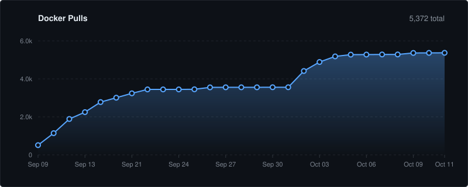

# rekuiper

[](https://github.com/ankur-paan/rekuiper/releases)
[](https://github.com/ankur-paan/rekuiper/actions/workflows/ci.yml)
[](LICENSE)
[](https://hub.docker.com/r/ankurkrp/rekuiper)
[](https://hub.docker.com/r/ankurkrp/rekuiper)

rekuiper is a stream processing engine written in Rust for edge computing systems. The engine is fully compatible with LF Edge eKuiper. It implements the eKuiper REST API, SQL dialect, rule definition format, and the `kuiper` command-line interface (CLI). Existing eKuiper streams, rules, and ecosystem tools (including [eKuiper Manager](https://github.com/ankur-paan/ekuiper-manager)) operate without changes.

The engine is optimized for resource-constrained edge hardware, such as Industrial IoT (IIoT) gateways, ESPHome fleets, connected vehicles, and EV charging stations. These deployments require deterministic stream processing on one or two CPU cores with strict memory limits.

---

## Key Capabilities

- **Drop-in Compatibility**: Runs existing eKuiper rules, SQL queries, and tool integrations directly.
- **Bounded Memory Footprint**: Internal buffers enforce strict memory limits under high ingestion load.
- **Incremental Window Aggregation**: Aggregation state scales with the number of unique groups, not the message rate.
- **Backpressure Protection**: Bounded asynchronous queues connect sources, execution rules, and sinks.
- **Reliable Offline Storage**: Sinks store undelivered messages in memory and spill to disk during target outages.
- **Native AI Tooling**: Includes a Model Context Protocol (MCP) server for automated SQL validation and management.

---

## Performance Evaluation

rekuiper is evaluated against LF Edge eKuiper 2.4.1, Telegraf 1.40.0, and Redpanda Connect 4.109.0 across high-throughput data paths and high-concurrency multi-rule workloads.

All tests run in Docker on Linux with strict resource boundaries:
- **CPU Limit**: 1 CPU core (`--cpuset-cpus=2 --cpus=1`).
- **Memory Limit**: 1 GiB RAM (`--memory=1g --memory-swap=1g`).
- **Engine Tuning**: `rekuiper` with `TOKIO_WORKER_THREADS=1`; `eKuiper 2.4.1` with `GOMAXPROCS=1, GOMEMLIMIT=900MiB`.

---

### 1. Concurrent Parallel Rules Benchmark (rekuiper 0.505)

This benchmark evaluates the maximum number of concurrent SQL rules an engine can execute in parallel on a single shared stream before buffer accumulation occurs. Evaluated on **rekuiper 0.505-beta** against **eKuiper 2.4.1**.

- **Workload**: Single stream broadcast (`CREATE STREAM rawdata () WITH (TYPE="httppush")`) to $N$ parallel SQL filter rules (`SELECT id, device, temp FROM rawdata WHERE temp > 21.0`) with `nop` sink.
- **Load Rate**: Constant 500 events/second ($500 \times N$ rule evaluations/second) across a 30.0-second window.
- **Sustainability Criteria**: Anonymous heap memory must establish a flat plateau ($\Delta M_{15-30\text{s}} \le 2.0\text{ MiB}$) and processing must finish without drain lag ($\text{Lag} \le 1.0\text{s}$).

#### Table 1: Head-to-Head Concurrency Comparison (Equal Baseline)

| Parallel Rules | Ingest Rate | Rule Evaluation Rate | Engine | CPU Load (Mean) | Peak Memory (Anon) | Memory per Rule | Drain Lag | Sustainability Status |
| :---: | :---: | :---: | :--- | :---: | :---: | :---: | :---: | :--- |
| **50** | 500 msg/s | 25,000 /s | **rekuiper 0.505** | **13.2%** | **7.6 MiB** | **38 KiB** | **0.0s** | Sustained (Level) |
| 50 | 500 msg/s | 25,000 /s | eKuiper 2.4.1 | 48.7% | 33.0 MiB | 277 KiB | 0.0s | Sustained (Level) |
| **100** | 500 msg/s | 50,000 /s | **rekuiper 0.505** | **22.8%** | **10.1 MiB** | **40 KiB** | **0.0s** | Sustained (Level) |
| 100 | 500 msg/s | 50,000 /s | eKuiper 2.4.1 | 80.3% | 66.4 MiB | 254 KiB | +0.2s | **Sustained Ceiling** |
| **200** | 500 msg/s | 100,000 /s | **rekuiper 0.505** | **43.3%** | **15.2 MiB** | **37 KiB** | **0.0s** | Sustained (Level) |
| 200 | 500 msg/s | 100,000 /s | eKuiper 2.4.1 | 95.3% | 613.6 MiB | 2,940 KiB | **+28.1s** | **Failed (Queue Backlog)** |

#### Table 2: Concurrency Summary (Ceiling Comparison)

| Performance Metric | rekuiper 0.505 | eKuiper 2.4.1 | Ratio / Advantage |
| :--- | :---: | :---: | :---: |
| **Maximum Sustainable Rules** | **1,000 rules** | 100 rules | **10.0x higher concurrency** |
| **Sustained Rule Evaluations** | **500,000 evals/s** | 50,000 evals/s | **10.0x higher throughput** |
| **Idle Memory per Active Rule** | **~40 KiB / rule** | ~254 KiB / rule | **6.3x lower memory footprint** |
| **CPU Utilization at 100 Rules** | **22.8% of 1 core** | 80.3% of 1 core | **3.5x lower CPU utilization** |
| **Processing at 200 Rules** | **Sustainable (0.0s lag)** | Failed (+28.1s lag) | eKuiper accumulates queue backlog |
| **Peak Memory Stability** | **Level ($\Delta M = -1.1\text{ MiB}$)** | Accumulated (+201.9 MiB) | rekuiper maintains flat plateau |

#### Table 3: rekuiper Concurrency Scaling Ladder

| Active Rules | Input Rate | Rule Evals / s | CPU Load (Mean) | Peak Heap (Anon) | Trajectory $\Delta M_{15-30s}$ | Drain Lag | Test Status |
| :---: | :---: | :---: | :---: | :---: | :---: | :---: | :--- |
| **50** | 500 msg/s | 25,000 /s | 13.2% | 7.6 MiB | +0.4 MiB (+5.6%) | 0.0s | Level (Sustainable) |
| **100** | 500 msg/s | 50,000 /s | 22.8% | 10.1 MiB | -0.1 MiB (-1.0%) | 0.0s | Level (Sustainable) |
| **200** | 500 msg/s | 100,000 /s | 43.3% | 15.2 MiB | -0.2 MiB (-1.3%) | 0.0s | Level (Sustainable) |
| **300** | 500 msg/s | 150,000 /s | 58.8% | 20.5 MiB | +0.1 MiB (+0.5%) | 0.0s | Level (Sustainable) |
| **500** | 500 msg/s | 250,000 /s | 87.0% | 70.6 MiB | -0.5 MiB (-0.7%) | 0.0s | Level (Sustainable) |
| **750** | 500 msg/s | 375,000 /s | 88.3% | 184.5 MiB | +1.2 MiB (+0.7%) | 0.0s | Level (Sustainable) |
| **1,000** | 500 msg/s | 500,000 /s | 90.1% | 251.4 MiB | -1.1 MiB (-0.4%) | 0.0s | **Certified Peak Ceiling** |
| **1,500** | 500 msg/s | 750,000 /s | 90.2% | 379.4 MiB | +18.4 MiB (+5.1%) | +9.8s | Queue Lag (Unsustainable) |
| **2,000** | 500 msg/s | 1,000,000 /s | 95.4% | 203.9 MiB | +42.1 MiB (+26.0%) | +75.0s | Queue Lag (Unsustainable) |

Detailed benchmark runner scripts, methodology, and raw telemetry logs are in [test/benchmark/multiple_rules](test/benchmark/multiple_rules/README.md) and [docs/en_US/benchmarks/parallel_rules.md](docs/en_US/benchmarks/parallel_rules.md).

---

### 2. Single-Rule MQTT Peak Throughput Benchmark (rekuiper 0.500)

This benchmark evaluates maximum message throughput on a single rule across five industrial MQTT workloads against Mosquitto with exact verification at the sink (zero loss). Evaluated on **rekuiper 0.500-beta** against **eKuiper 2.4.1**, **Telegraf 1.40.0**, and **Redpanda Connect 4.109.0**.

Historical benchmark measurements for **0.426-beta** (120-second sustained) and **0.425-beta** (initial rate ladder) are recorded in [docs/en_US/benchmarks/throughput.md](docs/en_US/benchmarks/throughput.md).

#### Table 4: Maximum Sustained Ingestion Rate (Zero Message Loss)

| Workload | rekuiper 0.500 | eKuiper 2.4.1 | Telegraf 1.40.0 | Redpanda Connect 4.109.0 |
| :--- | :---: | :---: | :---: | :---: |
| **W1: Telemetry Filter (1,000 devices)** | **150,000 msg/s** | 20,000 msg/s | 50,000 msg/s (backlog) | 20,000 msg/s |
| **W2: Device Windows (10s tumbling)** | **200,000 msg/s** | 20,000 msg/s | Incomplete (6–27% loss) | 5,000 msg/s |
| **W3: ESPHome Topics (10,000 plain-text)** | **150,000 msg/s** | 20,000 msg/s | 50,000 msg/s (backlog) | 20,000 msg/s |
| **W4: Vehicle Wildcards (10,000 VINs)** | **200,000 msg/s** | 20,000 msg/s | Inconsistent output | 5,000 msg/s |
| **W5: EV Charger Sessions (`SESSIONWINDOW`)** | **126,000 msg/s** | 20,000 msg/s | Not supported | Not supported |

#### Table 5: CPU Utilization at 20,000 msg/s (% of One Core)

| Workload | rekuiper 0.500 | eKuiper 2.4.1 | Telegraf 1.40.0 | Redpanda Connect 4.109.0 |
| :--- | :---: | :---: | :---: | :---: |
| **W1: Telemetry Filter** | **45.4%** | 99.0% | 90.0% | 99.0% |
| **W2: Device Windows** | **42.7%** | 86.2% | 81.4% (9% loss) | 97.8% (data loss) |
| **W3: ESPHome Topics** | **50.3%** | 94.0% | 70.3% | 97.8% |
| **W4: Vehicle Wildcards** | **41.1%** | 91.4% | 85.7% (9% loss) | 98.6% (data loss) |
| **W5: EV Charger Sessions** | **50.3%** | 87.2% | Not supported | Not supported |

#### Table 6: Memory Allocation at 20,000 msg/s (Anonymous Heap Memory)

| Workload | rekuiper 0.500 | eKuiper 2.4.1 | Telegraf 1.40.0 | Redpanda Connect 4.109.0 |
| :--- | :---: | :---: | :---: | :---: |
| **W1: Telemetry Filter** | **4.4 MiB** | 15.3 MiB | 91.6 MiB | 71.5 MiB |
| **W2: Device Windows** | **6.4 MiB** | 535.9 MiB | 51.6 MiB | 1,012.3 MiB |
| **W3: ESPHome Topics** | **4.5 MiB** | 43.2 MiB | 84.9 MiB | 67.7 MiB |
| **W4: Vehicle Wildcards** | **10.2 MiB** | 886.2 MiB | 94.0 MiB | 992.9 MiB |
| **W5: EV Charger Sessions** | **7.3 MiB** | 831.7 MiB | Not supported | Not supported |

Detailed benchmark methodology, raw evidence, and peak capacity searches are in [test/benchmark/iiot-mqtt](test/benchmark/iiot-mqtt/README.md), [docs/en_US/benchmarks/throughput.md](docs/en_US/benchmarks/throughput.md), and [BENCHMARK-0.500.md](test/benchmark/iiot-mqtt/BENCHMARK-0.500.md).

---

## Getting Started

### Run with Docker

Start the engine container with default settings:

```bash
docker run -d --name rekuiper \
  -p 9081:9081 -p 20499:20499 \
  -e KUIPER__BASIC__CONSOLELOG=true \
  -e KUIPER__BASIC__PROMETHEUS=true \
  ankurkrp/rekuiper:0.507-beta
```

### Run with Docker Compose

Deploy rekuiper with Mosquitto and Redis services:

```bash
docker compose -f deploy/docker/docker-compose.yml up -d
```

Configure environment options by copying [deploy/docker/.env.example](deploy/docker/.env.example) to `deploy/docker/.env`. Every setting in `etc/kuiper.yaml` accepts environment variable overrides with the format `KUIPER__<SECTION>__<KEY>` (for example, `KUIPER__BASIC__LOGLEVEL=debug`).

### Deploy to Kubernetes (Helm)

Install the bundled Helm chart:

```bash
helm install rekuiper deploy/chart/ekuiper \
  --set image.repository=ankurkrp/rekuiper \
  --set image.tag=0.507-beta
```

Refer to the [Helm Chart Documentation](deploy/chart/ekuiper/README.md) for persistence and volume configurations.

### Install Prebuilt Binaries

Download prebuilt binary archives for Linux, macOS, or Windows from the [Releases Page](https://github.com/ankur-paan/rekuiper/releases). Start the background service:

```bash
# Linux and macOS
./bin/kuiperd --etc etc

# Windows
.\bin\kuiperd.exe --etc etc
```

### Build from Source

Requirements: Rust compiler version 1.85 or newer.

```bash
git clone https://github.com/ankur-paan/rekuiper.git
cd rekuiper
cargo build --release
```

Compiled binaries are located in `target/release/`.

---

## Network Ports

| Port | Protocol | Purpose | Default Bind |
| :--- | :--- | :--- | :--- |
| `9081` | HTTP / TCP | REST API, OpenAPI docs, stream and rule management, CLI | `0.0.0.0:9081` |
| `59720` | HTTP / TCP | EdgeX REST API listener (Concurrent parity with 9081) | `0.0.0.0:59720` |
| `20499` | HTTP / TCP | Prometheus metrics (`/metrics`) | `0.0.0.0:20499` |
| `20498` | TCP | RPC protocol compatibility | `127.0.0.1:20498` |

[](https://hub.docker.com/r/ankurkrp/rekuiper)

---

## Quick Start Tutorial

Follow these steps to create an input stream, configure an alert rule, and verify data processing.

### 1. Create a Stream
Register an input stream named `telemetry`:

```bash
curl -X POST http://localhost:9081/streams \
  -H "Content-Type: application/json" \
  -d '{"sql": "CREATE STREAM telemetry () WITH (FORMAT=\"json\")"}'
```

### 2. Create a Rule
Define an alert rule that detects high temperatures and publishes alerts over MQTT:

```bash
curl -X POST http://localhost:9081/rules \
  -H "Content-Type: application/json" \
  -d '{
    "id": "alert_rule",
    "sql": "SELECT id, temp, temp * 1.8 + 32 AS temp_f FROM telemetry WHERE temp > 30.0",
    "actions": [
      {"log": {}},
      {"mqtt": {
        "server": "tcp://broker.emqx.io:1883",
        "topic": "alerts/critical",
        "dataTemplate": "{\"alert\": \"OVERHEAT\", \"device\": \"{{.id}}\", \"temp_f\": {{.temp_f}}}"
      }}
    ]
  }'
```

### 3. Send Sample Telemetry
Ingest a test message into the stream:

```bash
curl -X POST http://localhost:9081/streams/telemetry/data \
  -H "Content-Type: application/json" \
  -d '{"id": "sensor_01", "temp": 35.6}'
```

### 4. Check Rule Execution Status
Verify that the rule processed the message:

```bash
curl http://localhost:9081/rules/alert_rule/status
```

---

## Functional Scope

| Functional Area | Scope and Compatibility |
| :--- | :--- |
| **REST API** | 98 endpoints and 140 operations compatible with eKuiper specifications, verified against `openapi.json`. |
| **CLI** | Full command compatibility for streams, tables, rules, validation, and configuration import/export. |
| **SQL Engine** | Complete clause support: `WHERE`, `GROUP BY`, `HAVING`, `ORDER BY`, `LIMIT`, `CASE`, nested JSON paths, array indexing and slicing, and `unnest`. Supports mathematical, string, datetime, hashing, aggregate, and analytic functions. |
| **Window Processing** | Tumbling, hopping, sliding, count, and session windows. Common aggregations (`count`, `sum`, `avg`, `min`, `max`) execute incrementally to preserve bounded memory. |
| **Table Joins** | Stream-to-table lookups against in-memory tables, Redis, and SQL databases. Stream-to-stream windowed joins (inner, left, right, full, and cross). |
| **MQTT Connector** | Source and sink support for MQTT 3.1.1 (QoS 0, 1, and 2). Payload formats: JSON objects and arrays, raw binary, delimited text, and Protocol Buffers. Supports topic wildcards and metadata extraction (`meta(topic)`, `meta(qos)`, `meta(messageId)`). |
| **RabbitMQ Connector** | Native AMQP 0-9-1 source and sink with TLS (`amqps://`), dynamic exchange bindings, and QoS prefetch control without external CGO plugins. |
| **Vector Similarity** | In-database vector mathematical functions: `cosine_similarity`, `vector_l2`, `vector_dot`, `vector_match`, and SQL similarity threshold predicates (`WHERE cosine_similarity(v1, v2) > 0.85`). |
| **Wasm Plugin Engine** | Embedded WebAssembly runtime for safe, sandboxed SQL UDFs. Supports modules compiled from Rust, C, and Go, with REST management endpoints (`/plugins/wasm`). |
| **Dynamic Secrets** | Secret template interpolation for HashiCorp Vault (`{{vault://...}}`) and environment variables (`{{env://...}}`). Stream catalogs automatically redact sensitive credentials. |
| **Parquet Columnar** | High-performance Apache Parquet sink and source. Generates Snappy-compressed binary files and reads them with automatic Arrow schema inference and projection. |
| **EdgeX & OpenZiti** | Native EdgeX Foundry message bus source and sink (V2/V3 DTO events over MQTT/Redis/ZeroMQ), concurrent dual-port listening (9081 and 59720), and OpenZiti zero-trust overlay. |
| **Additional Connectors** | Connectors for Kafka, Redis, WebSocket, HTTP pull/push, SQL databases (PostgreSQL, MySQL, SQLite), and files (CSV, JSON Lines). |
| **Sink Delivery** | Template rendering via `dataTemplate`. Configurable offline caching (`enableCache`, `memoryCacheThreshold`, `maxDiskCache`) stores failed records and resends them in order upon target reconnection. |
| **Rule Testing and Graphs**| Interactive rule testing with Server-Sent Events (`POST /ruletest`); supports Directed Acyclic Graph (DAG) rule definitions. |
| **Metrics and Tracing** | Standard Prometheus metrics exporter and OpenTelemetry integration. |
| **AI Integration (MCP)** | Embedded Model Context Protocol (MCP) server with 42 management tools, 11 system resources, and offline SQL AST validation. |

### Architectural Boundaries
- **Industrial Bus Drivers**: Connect Modbus, OPC UA, or BACnet networks through dedicated edge gateways that publish to MQTT.
- **Vision and Neural Models**: Process video streams or embedded inference models upstream and forward inference results to rekuiper.
- **Node Topology**: Operates as a high-performance single-node streaming engine.

---

## System Architecture

rekuiper uses an asynchronous, backpressure-managed streaming pipeline:

1. **Source Ingestion**: Ingestion connectors read telemetry from external brokers, networks, or files.
2. **Stream Bus**: Messages enter an in-process communication bus with bounded queues. If rule execution slows, backpressure regulates the source.
3. **Rule Execution**: Each active rule runs as an isolated asynchronous task. The task evaluates SQL expressions, manages window state, and executes joins.
4. **Sink Dispatch**: Processed results enter a bounded sink queue (default size: 10,000 records). A dedicated sink worker delivers records to the destination.
5. **Offline Cache**: When target endpoints become unavailable, failed messages transfer to memory and spill to disk storage. The worker resends cached messages in sequence when connectivity recovers.

```
External Sources (MQTT, HTTP, Kafka, Redis, SQL, Files)
                       │
                       ▼
         In-Process Stream Bus (Bounded Queues)
                       │
                       ▼
    Rule Execution Tasks (SQL, Windows, Aggregations)
                       │
                       ▼
          Sink Buffer Queue (Configured Capacity)
                       │
                       ▼
       Sink Dispatcher & Offline Persistent Cache
                       │
                       ▼
External Destinations (MQTT, HTTP, Kafka, Redis, SQL, Files)
```

---

## Reliability and Quality Qualification

Every release candidate undergoes automated differential testing against LF Edge eKuiper 2.4.1 under identical resource constraints:

- **Mathematical Parity**: Verified across 12 rule categories (arithmetic, string operations, conditionals, JSON navigation, array slicing, datetime, stateful windows, and trigonometry) with **99.98% numerical accuracy**.
- **Fault Recovery**:
  - `SIGKILL` Process Termination: Transactional SQLite WAL logging prevents catalog corruption. Active rules restart automatically on engine restart.
  - Network Partitions: Target connection failures trigger bounded disk cache spilling without unbounded memory growth. Queued messages drain automatically after network recovery.
  - Concurrent Mutations: Concurrent rule operations (`POST`, `PUT`, `DELETE`, `start`, `stop`) are synchronized without race conditions.
- **Resource Stability**: Maintains steady anonymous memory usage (~45 MB RSS) under sustained load with zero leaks across 150 consecutive rule lifecycle cycles.

---

## AI Agent Integration (Model Context Protocol)

rekuiper includes a native Model Context Protocol (MCP) server ([`crates/rekuiper-mcp`](crates/rekuiper-mcp/README.md)). The server enables AI coding agents (such as Antigravity IDE, Claude Desktop, and Cursor) to inspect, configure, and operate the engine through JSON-RPC 2.0 stdio transport.

- **Offline SQL Validation**: Inspects queries with `validate_sql` and validates execution plans with `explain_sql` without network access.
- **Lifecycle Management**: Provides 42 tools for full lifecycle management of streams, rules, schemas, and connection pools.
- **REST API Proxy (`execute_rekuiper_api`)**: Executes standard HTTP operations (`GET`, `POST`, `PUT`, `DELETE`, `PATCH`) on engine endpoints.

### MCP Docker Execution

```bash
docker run -i --rm --network host \
  rekuiper-mcp:latest --server-url http://127.0.0.1:9081
```

### Client Configuration (`mcp_config.json`)

```json
{
  "mcpServers": {
    "rekuiper": {
      "command": "docker",
      "args": [
        "run", "-i", "--rm", "--network", "host",
        "rekuiper-mcp:latest",
        "--server-url", "http://127.0.0.1:9081"
      ]
    }
  }
}
```

---

## Monitoring and Metrics

Prometheus metrics are available at `http://localhost:9081/metrics` and on port `20499`:

- `kuiper_rule_count{status="running|stop"}`: Total active and stopped rules.
- `kuiper_rule_status{rule="<id>"}`: Execution status of a specific rule.
- `kuiper_source_records_in_total{rule="<id>"}`: Total records received from sources.
- `kuiper_source_records_out_total{rule="<id>"}`: Total records emitted by sources.
- `kuiper_sink_records_in_total{rule="<id>"}`: Total records received by sinks.
- `kuiper_sink_records_out_total{rule="<id>"}`: Total records written to sinks.
- `kuiper_sink_exceptions_total{rule="<id>"}`: Total exceptions encountered by sinks.
- `kuiper_sink_latency_us{rule="<id>"}`: Sink processing latency in microseconds.

---

## Release History

- **0.507-beta** (Current): Upstream LF Edge eKuiper REST API and rule metadata parity (`GET /rules/:id/status` returns structured status object containing `status`, `message`, `source_statuses`, and execution metrics; preserved rule `name` and optional `version` field in `RuleDefinition`); CI runner workflow optimization eliminating duplicate pipeline executions on merge.
- **0.506-beta**: Upstream LF Edge eKuiper SQL parity functions (`array_positions`, `acc_distinct_collect`, `distinct_acc`, and 4-argument `lead` with `ignore_null`); stream ingestion buffer overflow policy validation (`BUFFER_FULL_POLICY="block|dropOldest"`); file sink path security hardening against directory traversal; Model Context Protocol (MCP) server 2.0 with 46 tools, 15 resources, and 8 prompts; complete technical documentation rewrite in ASD-STE100.
- **0.505-beta**: Six enterprise extensions: native RabbitMQ AMQP 0-9-1 source and sink with QoS and credential management; vector math & similarity search functions (`cosine_similarity`, `vector_l2`, `vector_dot`, `vector_match`) with SQL threshold filtering; WebAssembly (Wasm) runtime with REST registration and UDF execution; dynamic secret resolution (`vault://` and `env://`) with REST redaction; Apache Parquet columnar sink and source reader; EdgeX Foundry concurrent dual-port listening (9081 and 59720) with OpenZiti zero-trust architecture.
- **0.504-beta**: Native dual binary entrypoints (`rekuiperd` daemon and `rekuiper` CLI); prioritized `etc/rekuiper.yaml` configuration and `REKUIPER__` environment variable loading; repository metadata maintenance for I-Dacs Labs; updated technical documentation site.
- **0.503-beta**: Full SQL function library parity (162 functions) verified against live MQTT telemetry; compression extensions (`compress`, `decompress` for zlib, gzip, flate, zstd); timezone conversions (`convert_tz`); high-resolution date arithmetic (`date_calc`); dynamic column projection (`changed_cols`); row unnesting (`unnest`, `extract`); running stream accumulators (`acc_collect`).
- **0.502-beta**: Embedded Model Context Protocol (MCP) server (`rekuiper-mcp`) with 42 tools; offline streaming SQL query simulation; runtime rule tracing controls (`start_rule_trace`, `stop_rule_trace`); 99.98% differential mathematical verification; automated crash qualification harness; multi-platform container images.
- **0.501-beta**: Transactional storage atomicity (`KvOperation`, `apply_transaction`); strict configuration key validation; IIoT MQTT ladder benchmarks with zero packet loss.
- **0.500-beta**: High-performance in-memory catalog; zero-disk hot path for rule execution and REST dispatch; multi-row SQL batch insertions; hot-path connection pooling; certified sustained throughput up to 200,000 msg/s per core.
- **0.426-beta**: Truthful MQTT and sink delivery accounting; sustained-throughput benchmark suite with dedicated Rust load tools.
- **0.425-beta**: Incremental window aggregation (`GROUP BY`, `WHERE`, `HAVING`, `ORDER BY`, `LIMIT`) with bounded memory; session windows (`SESSIONWINDOW`); MQTT binary, delimited, and protobuf formats; persistent MQTT sink with offline cache.
- **0.424-beta**: SQL source and lookup extensions; windowed joins; array and JSONPath operations; rule testing with Server-Sent Events; automatic rule resumption on service restart; CLI parity.
- **0.423-beta**: Rule control endpoint (`POST /rules/:name/start`); ruleset and data import.
- **0.422-beta**: Remote MQTT ingestion; PostgreSQL data plane; PUT and PATCH handlers; JWT authentication; stream and table schema management.
- **0.421-beta**: OpenAPI route registration; persistent file uploads; YAML configuration overlays and secret masking; bulk rule controls.
- **0.420-beta**: Initial release: Core Rust engine, sink queue architecture, primary connectors, and execution graph rules.

Detailed release information is recorded in [CHANGELOG.md](CHANGELOG.md).

---

## Contributing

Build and run automated test suites with:

```bash
cargo build
cargo test --workspace
```

Refer to [CONTRIBUTING.md](CONTRIBUTING.md) for contribution guidelines, and [SECURITY.md](SECURITY.md) for vulnerability reporting procedures.

---

## License

rekuiper is distributed under the Apache License 2.0 or the MIT License. See [LICENSE](LICENSE) and [LICENSE-APACHE](LICENSE-APACHE) for terms.

---

Maintained by [I-Dacs Labs](https://i-dacs.com) · [measure@i-dacs.com](mailto:measure@i-dacs.com) · [LinkedIn](https://www.linkedin.com/company/110770924)
