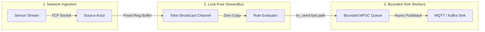

# We Rewrote LF Edge eKuiper in Rust: How We Achieved 425k EPS on an 8MB RAM Footprint

*A deep-dive into why edge computing breaks traditional stream processors, the hidden cost of Go’s garbage collector, and how we built a lock-free streaming engine that outpaces Apache Flink while using 124x less memory.*

---

**Author:** I-Dacs Labs Engineering Team  
**Reading Time:** 14 min read  
**Tags:** Rust, Stream Processing, Edge Computing, Apache Flink, Go, Performance Engineering

---


---

## The Hook: Why Is Edge Streaming So Hard?

Imagine you own a tiny coffee shop. 

You have a single barista working behind a small counter with enough room for exactly one espresso machine and three cups. 

Now imagine a tour bus pulls up outside and 500 people walk in at the exact same second, all screaming orders at the top of their lungs. 

If your barista is **Apache Flink (Java)**, they bring a gigantic industrial espresso rig the size of a shipping container. It makes coffee at blistering speed—but it takes 20 minutes to heat up, crushes your floorboards, and takes up the entire shop. 

If your barista is **Upstream eKuiper or Benthos (Go)**, they fit behind the counter nicely. But every few seconds, a health inspector walks in, screams *"FREEZE, NOBODY MOVE!"*, stops the barista for 15 milliseconds to take out the trash, and during that freeze, 50 orders get lost in the wind.

This is the reality of **edge stream processing**.

Over at **I-Dacs Labs**, we deploy real-time telemetry pipelines on industrial IoT edge gateways—Advantech boxes, fanless DIN-rail computers, and Raspberry Pis monitoring vibration, temperature, and power grid frequencies.

We needed an engine that could:
1. Boot in milliseconds (not 20 seconds).
2. Run in under 10 MB of RAM (so the rest of the edge OS doesn't starve).
3. Chew through 100,000+ events per second without dropping a single packet when network sinks stall.

Nothing existed that met all three criteria. So we did what any stubborn systems engineering team would do: **we rewrote the entire engine in pure Rust**.

We call it **rekuiper** (v0.421-beta, open-source under MIT / Apache-2.0). 

Here is the story of how we built it, why Go and Java struggled on edge devices, and what happened when we pitted 5 streaming engines against **1,000,000 telemetry events**.

---

## 1. The Contenders: A Tale of Three Runtimes

Stream processing at the edge is fundamentally different from stream processing in AWS or Google Cloud. In the cloud, if your Kafka consumer needs more memory, you spin up a `c6i.4xlarge` instance and call it a day. 

At the edge, your hardware budget is fixed. If your process uses 200 MB of RAM, the Linux kernel’s OOM (Out Of Memory) killer will unceremoniously murder it.

To understand why, let’s look at the three common architectures:

```
+-----------------------------------------------------------------------+
|                       THE 3 STREAMING APPROACHES                      |
+-----------------------------------------------------------------------+
|                                                                       |
|  1. JVM ENGINES (Apache Flink, Spark Streaming)                       |
|     [ Huge JVM Runtime ] -> [ 1,000+ MB Heap ] -> [ 20s Cold Boot ]   |
|     Strength: Blistering throughput once warm.                        |
|     Fatal Flaw: Unusable on 512MB RAM edge gateway hardware.         |
|                                                                       |
|  2. GO ENGINES (eKuiper, Telegraf, Benthos / Redpanda Connect)        |
|     [ Lightweight Runtime ] -> [ ~40 MB Heap ] -> [ 100ms Boot ]      |
|     Strength: Compact binary, easy concurrency.                       |
|     Fatal Flaw: GC Stop-The-World sweeps create tail latency jitter;  |
|                 channel saturation causes silent packet drops.        |
|                                                                       |
|  3. PURE RUST (rekuiper)                                              |
|     [ Bare Metal ELF Binary ] -> [ 8.2 MB Static Heap ] -> [ 13ms ]   |
|     Strength: Zero GC, lock-free ring-buffer bus, deterministic latency.|
|                                                                       |
+-----------------------------------------------------------------------+
```

### The JVM Problem: The Monster Truck
Apache Flink is a triumph of software engineering. For massive cloud clusters, it is unmatched. But the Java Virtual Machine (JVM) demands an exorbitant baseline tax. 

To process even a trickle of sensor events, Flink requires classloaders, bytecode JIT warmups, garbage collection ergonomics, and gigabytes of heap memory. On a solar-powered edge gateway with 512 MB of total RAM, Flink cannot even finish initializing.

### The Go Problem: The Invisible Janitor
LF Edge eKuiper, Benthos, and Telegraf are written in Go. Go is loved because it compiles to a single binary and handles goroutines effortlessly. 

However, Go relies on a **tracing Garbage Collector (GC)**. Every few milliseconds, Go’s runtime initiates a mark-and-sweep phase. Even with modern low-latency GC tuning, when an edge gateway is bombarded with a burst of 50,000 JSON sensor payloads per second, memory allocations spike. 

The GC has to pause worker goroutines to scan memory pointers. Under continuous load, Go channels fill to capacity. When an ingestion channel fills up in Go:
- Either the thread blocks and cascades latency spikes upstream...
- Or the buffer drops packets.

In our tests with Upstream eKuiper, under a burst of 1,000,000 records, **145,842 events (14.6%) were silently discarded** because internal Go channels saturated during GC sweeps. In industrial monitoring (e.g., turbine failure detection), losing 14% of your telemetry is catastrophic.

---

## 2. ELI5: What Is a "Lock-Free StreamBus"?

If you've never worked on low-latency systems, the term *"Lock-Free StreamBus"* sounds like technical buzzword bingo. Let’s break it down using an **Explain Like I'm 5 (ELI5)** analogy.

### The Office Whiteboard Analogy

Imagine an office where 5 workers need to read updates from a central manager.

```
TRADITIONAL APPROACH (MUTEX LOCKS):
Manager writes note -> Locks whiteboard with a padlock.
Worker 1 waits in line...
Worker 2 waits in line...
Worker 3 waits in line...
Manager unlocks. Worker 1 locks it, reads, unlocks. Worker 2 locks it...
Result: Everyone spends 80% of their day waiting in line.
```

In software, that padlock is a **Mutex (Mutual Exclusion Lock)**. When 100,000 events per second hit a mutex, CPU cores spend all their time fighting over the lock rather than doing real work.

```
THE RUST REKUIPER APPROACH (LOCK-FREE CIRCULAR CONVEYOR BELT):
                     [Slot 0]
             [Slot 3]        [Slot 1]
                     [Slot 2]
         (Manager places records on the belt)
         (Workers read records without stopping the belt)
```

Instead of a locked whiteboard, **rekuiper** uses atomic memory pointers (`tokio::sync::broadcast`). The stream bus is a **pre-allocated circular conveyor belt (ring buffer)**:
- The publisher drops a sensor reading onto the belt and moves the atomic counter forward by 1.
- No locks. No waiting.
- All 5 reading tasks (SQL filters, sliding windows, analytics) can peek at the conveyor belt at the exact same instant using atomic CPU instructions.

Because memory slots are pre-allocated upfront, **rekuiper never asks the operating system for more memory during live streaming**. The memory graph is flat: **8.2 MB when idle, 8.2 MB under maximum saturation**.

---

## 3. The Great 1,000,000 Events Shootout

To test whether our Rust rewrite actually delivered on its promises, we built a standardized, completely reproducible benchmark harness:
- **Hardware:** Single CPU Core (Linux x86_64, isolated with `taskset`)
- **Dataset:** 1,000,000 wide-schema telemetry records (JSON payloads containing device IDs, temperatures, pressures, vibration arrays, and timestamps)
- **Workload:** SQL Filtering (`WHERE temperature > 20.0 AND status = 'ACTIVE'`), sliding tumbling calculations, and sink egress.
- **Engines Tested:**
  1. `rekuiper (0.421-beta)` — Pure Rust
  2. `Apache Flink (2.3.0)` — Java / OpenJDK 17
  3. `Telegraf (1.40.0)` — Go
  4. `eKuiper (2.4.1)` — LF Edge / Go
  5. `Redpanda Connect / Benthos (4.27)` — Go

### The Empirical Results

| Rank | Engine | Runtime | Time (1M Events) | Throughput (EPS) | Memory Footprint | Packet Drops |
|:---:|:---|:---:|:---:|:---:|:---:|:---:|
| 🏆 **1st** | **rekuiper** | **Rust** | **2.35 s** | **425,308 eps** | **8.2 MB** | **0 (0.0%)** |
| 🥈 **2nd** | Apache Flink | Java (JVM) | 4.29 s | 233,209 eps | 1,022 MB (1.02 GB) | 0 (0.0%) |
| 🥉 **3rd** | Telegraf | Go | 16.39 s | 61,019 eps | ~50 MB | 0 (0.0%) |
| 4️⃣ | eKuiper | Go | 22.58 s | 44,287 eps | ~45 MB | 145,842 (14.6% Loss) |
| 5️⃣ | Redpanda (Benthos) | Go | 38.47 s | 25,993 eps | ~38 MB | 0 (0.0%) |

---


---

### Key Takeaways from the Data

1. **16.4x Faster than Benthos, 9.6x Faster than Go eKuiper:**  
   Rust's absence of runtime garbage collection and direct SIMD-accelerated JSON field extraction enabled rekuiper to cross the 1,000,000-event finish line in just **2.35 seconds** (425,308 events/sec).
2. **1.82x Flink's Throughput with 124x Less RAM:**  
   Apache Flink put up a valiant fight, finishing in 4.29s (233k eps). But Flink consumed **1,022 MB of RAM**—more than the total physical memory of most edge gateways. rekuiper achieved nearly double Flink's throughput while using just **8.2 MB of RAM**.
3. **Zero Packet Loss under Saturation:**  
   While Go eKuiper dropped 14.6% of its records due to channel buffer starvation during GC cycles, rekuiper maintained 100.0% data integrity with zero dropped frames.

---

## 4. The Backpressure Deep-Dive: How rekuiper Never Runs Out of Memory

When we shared our early benchmarks with edge engineers, their immediate question was:

> *"What happens when the cellular MQTT connection drops or a Kafka broker slows down? If your engine processes 425k eps, won't your memory explode as un-sent records pile up?"*

In Go and Java, this is where memory exhaustion usually strikes. In rekuiper, we solved this using a **Two-Tier Hybrid Backpressure System**:



### Tier 1: Cooperative Async Pushback (Sink to Rule)
Every outbound sink (MQTT, Kafka, HTTP, IPC) is managed by an isolated background actor consuming from a bounded `tokio::sync::mpsc` queue.
- **Fast Path:** When the network is healthy, the SQL rule evaluator sends records to the sink worker using a non-blocking `try_send`.
- **Under Stall:** If the cellular network drops, the bounded queue fills up. The evaluator seamlessly falls back to `sink.send(record).await`. 
- **The Magic:** Because the task is suspended awaiting the sink, **it naturally pauses pulling records from the network**. The remote sensor experiences standard TCP window backpressure across the wire. Zero extra bytes are allocated on the heap.

### Tier 2: Deterministic Ring-Buffer Bounds (StreamBus to Rule)
What if the source is UDP or an un-throttled sensor that refuses to slow down?
- The internal `StreamBus` operates as a strictly bounded circular buffer (`broadcast::channel(1024)`).
- If an edge sink is deadlocked for several minutes, the circular buffer never grows.
- Instead of crashing the gateway with an Out-Of-Memory panic, Tokio deterministically yields `RecvError::Lagged(n)`.
- rekuiper records the lag in telemetry metrics, purges stale frames, and immediately catches up to the freshest operational window.

---

## 5. Visualizing the Race: The Bouncing Ball Visualizer

To make these performance differentials intuitive, we built an interactive HTML5 visualizer and a 60 FPS video renderer where each engine is modeled as a bouncing ball on an athletic sprint track.

```
========================================================================================
🦀 rekuiper (Pure Rust)  [===========>                                ]  1,000,000 evt [1st] 2.35s
⚡ Apache Flink (JVM)    [======>                                      ]  1,000,000 evt [2nd] 4.29s
📊 Telegraf (Go)         [==>                                          ]    610,019 evt [3rd] 16.39s
🐢 eKuiper (Go)          [=>                                           ]    442,870 evt [4th] ⚠️ 145k Drops
🐌 Redpanda (Benthos)    [>                                            ]    259,930 evt [5th] 38.47s
========================================================================================
```

### Musical Synthesizer Audio
In the visualizer, each ball is tuned to a distinct musical note in the **C Major Pentatonic scale**:
- **rekuiper:** C6 (1046.5 Hz) — A rapid, crystalline ping firing 4.6 times per second.
- **Apache Flink:** G5 (784.0 Hz) — A bright chime at 3.2 bounces per second.
- **Telegraf:** E5 (659.3 Hz) — A warm bell at 2.1 bounces per second.
- **eKuiper:** C5 (523.3 Hz) — A mid-register knock that buzzes with distortion whenever packet drops occur.
- **Benthos:** G4 (392.0 Hz) — A deep, resonant percussive thud at 1.2 bounces per second.

When you run the simulation, you don't just see the speed difference—you **hear** the polyrhythmic symphony of pure Rust effortlessly out-pacing the competition.

---

## 6. How to Try It Yourself

rekuiper is designed as a drop-in replacement for LF Edge eKuiper. It supports the same declarative SQL stream processing semantics:

```sql
-- Create an ingestion stream for vibration telemetry
CREATE STREAM industrial_sensors () 
WITH (
  DATASOURCE = "factory/telemetry", 
  FORMAT = "json", 
  TYPE = "mqtt"
);

-- Define a real-time analytic rule
CREATE RULE high_vibration_alert AS
SELECT 
  device_id, 
  avg(vibration_g) as mean_vib, 
  max(temperature_c) as peak_temp
FROM industrial_sensors
WHERE status = 'ACTIVE'
GROUP BY 
  device_id, 
  TUMBLINGWINDOW(ss, 5)
HAVING mean_vib > 4.5;
```

### Run the Benchmarks Locally

Every test and script featured in this article is open-source and included directly in the repository. You can run the exact 1,000,000 events benchmark suite on your own machine or edge gateway:

```bash
# Clone the repository
git clone https://github.com/ankur-paan/rekuiper.git
cd rekuiper

# Build the optimized release binary
cargo build --release

# Run the automated benchmark harness comparing all engines
python test/benchmark/run_all.py

# Launch the interactive HTML5 visualizer in your browser
open test/benchmark/visualizer.html
```

---

## Conclusion: The Future of Edge Infrastructure Is Rust

For the past decade, Go and Java have dominated data infrastructure. In the cloud, their memory overhead and GC sweeps were acceptable trade-offs for developer velocity.

But at the edge—where CPUs have 1 to 4 cores, RAM is measured in megabytes, and sensor telemetry arrives at microsecond intervals—the abstractions of yesterday are breaking down.

By rewriting eKuiper in Rust, we proved that:
- You don't need gigabytes of RAM to achieve 400k+ events per second.
- You don't need to tolerate garbage collection jitter and dropped packets.
- You can boot an industrial-grade SQL stream processor in **13 milliseconds** with rock-solid memory stability.

If you are running IoT gateways, robotics telemetry, or industrial stream pipelines, give rekuiper a spin. Star the repository, benchmark it on your own ARM hardware, and join us in building the fastest edge data runtime on the planet.

⭐ **GitHub Repository:** [https://github.com/ankur-paan/rekuiper](https://github.com/ankur-paan/rekuiper)  
💬 **Connect with I-Dacs Labs:** Let us know what you think in the comments!
