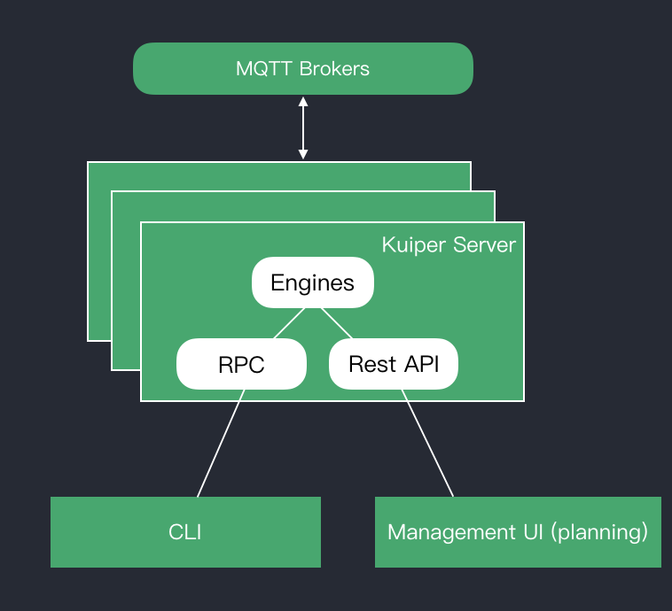

# Command Line Tool

The rekuiper CLI (command line interface) tool provides streams and rules management.

The rekuiper CLI acts as a client to the rekuiper server. The rekuiper server runs the engine that executes the stream or rule queries. This includes processing stream or rule definitions, managing rule status, and io.

*rekuiper CLI Architecture*

- [Streams](streams.md)
- [Rules](rules.md)
- [Plugins](plugins.md)
