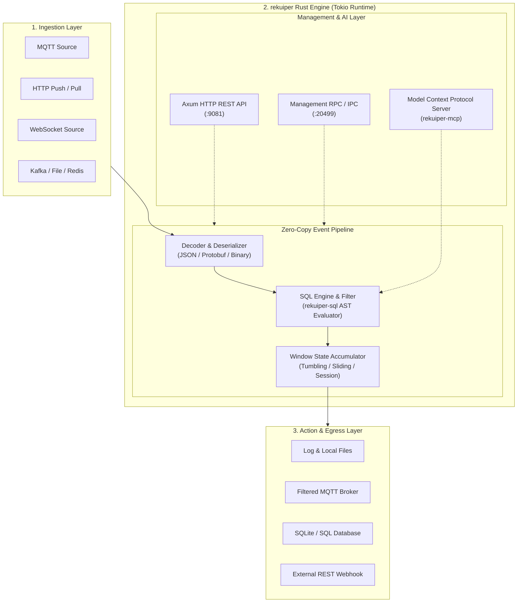
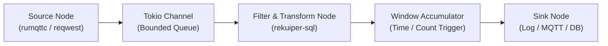

# rekuiper Architecture & Design

**rekuiper** is a high-performance, edge-first stream processing engine written in **Rust**. It provides an ultra-lightweight, zero-GC runtime that executes continuous SQL queries over unbounded event streams on resource-constrained devices (such as Raspberry Pis, IIoT gateways, edge IPCs, and embedded vehicle controllers).

---

## 1. High-Level Architecture

At its heart, rekuiper operates as an asynchronous, event-driven pipeline:

### The Life of an Event

1. **Ingest**: A sensor publishes a telemetry payload over MQTT or HTTP. The connector receives bytes, decodes them (JSON, Protobuf, or custom formats), and emits an immutable `StreamRecord`.
2. **Evaluate**: The record flows through the `rekuiper-sql` execution graph. Pre-filters (`WHERE`) drop irrelevant events before heavy computation. Projections (`SELECT`) compute transformations and mathematical expressions.
3. **Aggregate**: If windowing is configured (e.g. `10s TUMBLINGWINDOW`), records accumulate into an in-memory window buffer. When the window closes or triggers, aggregate functions (`AVG`, `MAX`, `COUNT`, `SUM`) evaluate.
4. **Emit**: The resulting payload is dispatched concurrently to one or more configured sinks (`log`, `mqtt`, `rest`, `redis`, `sqlite`).

---

## 2. Why Rust for Edge Streaming?

Edge devices operate under strict physical constraints: battery limits, thermal limits, slow Flash storage, and shared single/dual-core CPUs. 

| Problem in Traditional Engines | How rekuiper Solves It with Rust |
| :--- | :--- |
| **Garbage Collection (GC) Jitter** | Traditional Go or Java runtimes pause application threads to collect garbage. During sensor bursts, GC pauses cause memory spikes and packet drops. **Rust has zero garbage collection**: memory is freed deterministically the exact moment it goes out of scope. |
| **Bloated Memory Footprint** | Runtimes that allocate dynamically for every event require 50–500 MiB of RAM. rekuiper runs standard workloads in **under 5 MiB of RAM**, leaving 99% of device memory for system processes. |
| **Data Races & Memory Leaks** | Rust's borrow checker guarantees thread safety and eliminates data races at compile time. |
| **Single Static Binary** | rekuiper compiles into a standalone binary with no runtime dependencies, virtual machines, or external package managers. |

---

## 3. Supported vs. Unsupported Capabilities

rekuiper is designed as a drop-in replacement for eKuiper's operational interfaces, but adopts a clean, modern design for extensions and performance.

### Fully Supported Features (100% Drop-in Parity)

- **SQL Dialect & Operators**: Arithmetic (`+`, `-`, `*`, `/`, `%`), logical (`AND`, `OR`, `NOT`), comparison (`=`, `!=`, `<`, `>`, `LIKE`, `BETWEEN`, `IN`), and JSON path operators.
- **Built-in Functions**: Comprehensive math, string, aggregate, analytics, datetime, and JSON manipulation functions.
- **Window Types**: Tumbling windows, hopping windows, sliding windows, session windows, and count windows.
- **Data Definition Language (DDL)**: `CREATE STREAM`, `DROP STREAM`, `CREATE TABLE` (with SQLite, File, Memory backends).
- **Network Ports**:
  - `9081`: HTTP REST API, SSE event streams, Web management interface.
  - `20498`: NanoIPC / Edge IPC socket.
  - `20499`: CLI management RPC socket.
- **Management Interfaces**: Full compatibility with the official `kuiper` CLI and the [eKuiper Manager Web UI](https://github.com/ankur-paan/ekuiper-manager).
- **Rule Lifecycle**: Dynamic start, stop, restart, pause, topological execution graph inspection, runtime metrics, and distributed tracing.

### Extra Capabilities Unique to rekuiper

1. **Native Model Context Protocol (MCP) Server**:
   The embedded `rekuiper-mcp` server exposes the entire engine surface to LLM coding agents (Cursor, Claude, Antigravity, Copilot). AI agents can inspect schemas, validate SQL offline without network round-trips, and simulate rules in-memory.
2. **7.5x – 10x Higher Throughput**:
   Sustains **150,000 to 200,000 messages/second** on a single CPU core without dropping packets or creating memory backlogs.
3. **Sub-5 MiB Memory Footprint**:
   Anonymous engine memory remains flat under continuous maximum load.

### Unsupported Features & Future Roadmap

- **Legacy Go C-Shared (`.so`) Native Plugins**:
  Legacy eKuiper supported compiling dynamic `.so` plugins using Go's internal `plugin` package. Because rekuiper is built entirely in Rust, **Go dynamic `.so` plugins are unsupported in the current version and in the near future**.
  - **Modern Extensibility Path**: Instead of fragile C-shared libraries tied to specific compiler versions, rekuiper is focusing on safer, portable extensibility via **WebAssembly (Wasm)**, **External gRPC/REST services**, and **Python portable plugins**.

---

## 4. Rule Execution Engine & Topology

Every rule submitted to rekuiper is planned into a Directed Acyclic Graph (DAG) of asynchronous tasks coordinated by Tokio:

- **Backpressure & Bounded Buffers**: Channels between processing stages are strictly bounded to prevent out-of-memory crashes if a downstream sink (such as a remote cloud endpoint) slows down.
- **State Management**: Rule states (aggregations, counters, window buffers) can be checkpointed and restored automatically upon restart.
- **Observability**: Every node records execution counters, throughput metrics, and latency profiles exposed via Prometheus (`/metrics`) and distributed tracing (`/rules/:name/trace/start`).
