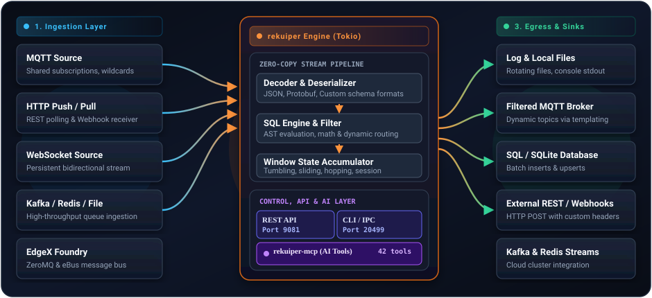
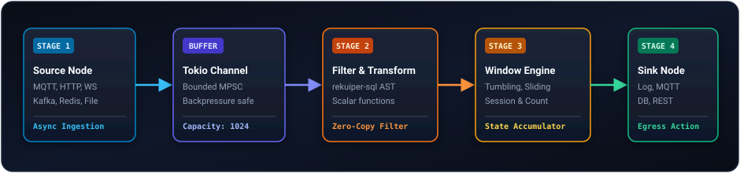

# Architecture & Design

rekuiper is a stream processing engine written in Rust. It runs continuous SQL queries over event streams on edge hardware such as Raspberry Pis, industrial PCs, and vehicle controllers.

---

## 1. High-Level Architecture

rekuiper operates as an asynchronous event-driven pipeline:

### Event Lifecycle

1. **Ingest**: A sensor publishes telemetry over MQTT or HTTP. The connector receives bytes, decodes the payload (JSON, Protobuf, or raw binary), and emits an immutable `StreamRecord`.
2. **Evaluate**: The record passes through the `rekuiper-sql` execution tree. `WHERE` filters drop non-matching events early. Projections (`SELECT`) compute required fields and expressions.
3. **Aggregate**: When windowing is used (such as a 10-second tumbling window), records accumulate in an in-memory buffer. When the window triggers, aggregate functions (`AVG`, `MAX`, `COUNT`, `SUM`) evaluate.
4. **Emit**: The result is sent concurrently to configured sinks (`log`, `mqtt`, `rest`, `redis`, `sqlite`).

---

## 2. Why Rust on the Edge?

Edge hardware runs under practical limits: small power budgets, slow flash storage, and shared low-power CPU cores.

| Challenge in Traditional Engines | How rekuiper Addresses It |
| :--- | :--- |
| **Garbage Collection Pauses** | Runtimes with garbage collection pause worker threads during memory sweeps. When telemetry bursts arrive, GC pauses can cause queue pile-ups or dropped packets. Rust does not use garbage collection; memory is freed deterministically when it goes out of scope. |
| **Memory Footprint** | Frameworks that allocate objects per message often need 50 to 500 MiB of RAM. rekuiper handles standard workloads in under 5 MiB of RAM, leaving memory available for other edge processes. |
| **Concurrency Safety** | Rust compile-time checks prevent data races and undefined memory access across worker threads. |
| **Deployment Simplicity** | rekuiper compiles into a standalone binary with no runtime dependencies or virtual machines. |

---

## 3. Supported vs Unsupported Features

rekuiper maintains wire and API compatibility with eKuiper while replacing the internal execution engine.

### Fully Supported Features

- **SQL Dialect & Operators**: Arithmetic (`+`, `-`, `*`, `/`, `%`), logical (`AND`, `OR`, `NOT`), comparison (`=`, `!=`, `<`, `>`, `LIKE`, `BETWEEN`, `IN`), and JSON path expressions.
- **Built-in Functions**: Math, string, aggregate, analytics, datetime, and JSON manipulation functions.
- **Window Types**: Tumbling, hopping, sliding, session, and count windows.
- **Data Definition Language (DDL)**: `CREATE STREAM`, `DROP STREAM`, `CREATE TABLE` (with SQLite, File, and Memory backends).
- **Network Ports**:
  - `9081`: HTTP REST API, SSE event streams, Web UI backend.
  - `20498`: NanoIPC socket for local connector streaming.
  - `20499`: CLI management RPC socket.
- **Management**: Works with the official `kuiper` CLI and [eKuiper Manager](https://github.com/ankur-paan/ekuiper-manager).
- **Rule Lifecycle**: Start, stop, restart, pause, topological execution plan inspection, metrics, and tracing.

### Extra Capabilities in rekuiper

1. **Native Model Context Protocol (MCP) Server**:
   The `rekuiper-mcp` binary allows AI tools (Cursor, Claude, Antigravity) to inspect schemas, validate SQL offline, and test rules over standard MCP stdio.
2. **Throughput**:
   Processes 150,000 to 200,000 messages per second on a single CPU core without dropping packets.
3. **Low Memory Use**:
   Memory usage remains flat under continuous load.

### Unsupported Features and Roadmap

- **Legacy Go C-Shared (`.so`) Native Plugins**:
  Legacy eKuiper used Go's internal `plugin` package to load dynamic `.so` files compiled against exact Go toolchains. Because rekuiper is written in Rust, Go dynamic `.so` plugins are unsupported in the current version and in the near future.
- **Future Plugin Roadmap**:
  For custom extensions, rekuiper focuses on WebAssembly (Wasm) modules, external gRPC and REST services, and Python portable plugins.

---

## 4. Execution Graph & Topology

Rules compile into a Directed Acyclic Graph (DAG) executed as asynchronous tasks on Tokio:

- **Bounded Buffers**: Stage-to-stage channels are bounded to provide backpressure if downstream sinks slow down.
- **State Checkpoints**: Rule states and window accumulators can persist across restarts.
- **Observability**: Every stage records metrics accessible through Prometheus (`/metrics`) and tracing endpoints.
