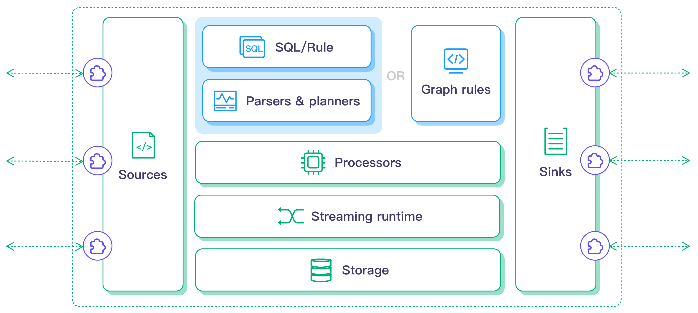

# Architecture and Design

rekuiper is a lightweight stream processing engine for edge computing, written in Rust. The engine is designed for resource-constrained edge gateways and devices.

rekuiper implements the REST API, SQL dialect, rule format, and `kuiper` CLI of LF Edge eKuiper. Existing eKuiper streams, rules, and management tools operate without modification.

## Core Architectural Principles

rekuiper uses these architectural design principles:

- **Bounded Memory**: Bounded channels connect sources, operators, and sinks. Backpressure prevents out-of-memory errors during high-volume data bursts.
- **Incremental Window Aggregation**: Window state scales with group count rather than message count. This design minimizes memory allocation under sustained load.
- **Zero Garbage Collection**: The Rust runtime provides predictable latency without garbage collection pauses or dropped packets.
- **Offline Sink Cache**: When downstream targets disconnect, sinks buffer messages to local storage rather than dropping records.
- **Static Binary Deployment**: The engine compiles to a single binary with no external runtime dependencies.

## Computing Components

In rekuiper, a stream processing job is represented as a rule. A rule consists of three primary components:

1. **Source**: Ingests continuous telemetry streams from protocols such as MQTT, HTTP, WebSockets, or files.
2. **SQL Processor**: Parses queries, evaluates filters, executes window aggregations, and projects output fields.
3. **Sink**: Transmits processed results to target brokers, local databases, or log files.

Rules execute continuously. The engine pulls data from sources, calculates SQL logic, and sends results to configured sinks.

## Detailed Component Documentation

Refer to these documents for component details:

- [Rules](./rules.md)
- [Sources](./sources/overview.md)
- [Sinks](./sinks.md)
- [SQL Queries](./sql.md)
- [Extensions](./extensions.md)
