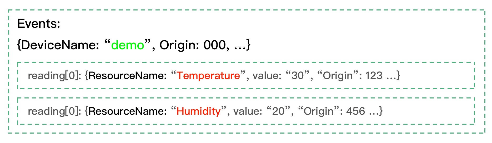

# Extract EdgeX Message Bus Metadata Using the Meta Function

When EdgeX Foundry publishes device readings to the message bus, events include metadata such as creation timestamps, device identifiers, and correlation tags. This guide describes how to extract event and reading metadata using the rekuiper `meta()` function.

## EdgeX Message Bus Data Model

EdgeX Foundry packages device data into hierarchical `Event` structures containing metadata and an array of `Reading` objects:

- **Event Structure**:
  - `ID`: Event identifier.
  - `DeviceName`: Name of the originating device.
  - `ProfileName`: Associated device profile name.
  - `SourceName`: Source command or event name.
  - `Origin`: Nanosecond timestamp recorded at creation.
  - `Tags`: Key-value metadata tags.
  - `Readings`: Array of sensor values:
    - `Id`: Reading identifier.
    - `Origin`: Reading timestamp.
    - `DeviceName`: Sensor device name.
    - `ResourceName`: Sensor metric name (for example: `temperature`).
    - `ProfileName`: Metric profile name.
    - `ValueType`: Data type identifier.
    - `Value`: Sensor reading value.

### Schema Changes in EdgeX v2

When migrating from EdgeX v1:
1. EdgeX v2 removes the `Pushed`, `Created`, and `Modified` metadata fields.
2. The `Device` field is renamed to `DeviceName` in both events and readings.
3. The `Name` field of readings is renamed to `ResourceName`.

## EdgeX Metadata Resolution in rekuiper

rekuiper ingests EdgeX bus events and maps top-level sensor values directly to stream columns. The engine preserves event and reading metadata inside an internal tuple accessible through `meta()`.

1. Define an EdgeX stream named `events`:


2. When devices publish events to the message bus:
   - Metric values (`temperature`, `humidity`) become queryable columns.
   - Event and reading headers become metadata attributes.



3. Query columns and extract metadata attributes in SQL:


### Extracting Event-Level Metadata

Pass the field name directly into `meta()`:

- `meta(deviceName)`: Returns `DeviceName` from the `Event` header.
- `meta(origin)`: Returns `Origin` creation timestamp from the `Event` header.

### Extracting Reading-Level Metadata

Extract reading metadata using the arrow syntax: `reading_name -> property`:

- `meta(temperature -> origin)`: Returns `Origin` for the `temperature` reading.
- `meta(humidity -> id)`: Returns reading `Id` for the `humidity` reading.

### Assigning Column Aliases in SELECT Clauses

When extracting multiple metadata fields in the `SELECT` clause, assign explicit column aliases using `AS` to prevent field name collisions:

```sql
SELECT
  temperature,
  humidity,
  meta(id) AS eid,
  meta(origin) AS eo,
  meta(temperature->id) AS tid,
  meta(temperature->origin) AS torigin,
  meta(Humidity->deviceName) AS hdevice,
  meta(Humidity->profileName) AS hprofile
FROM demo
WHERE meta(deviceName) = "demo2"
```

## Available Metadata Keys

### Event Metadata Fields

`id`, `deviceName`, `profileName`, `sourceName`, `origin`, `tags`, `correlationid`.

### Reading Metadata Fields

`id`, `deviceName`, `profileName`, `origin`, `valueType`.
