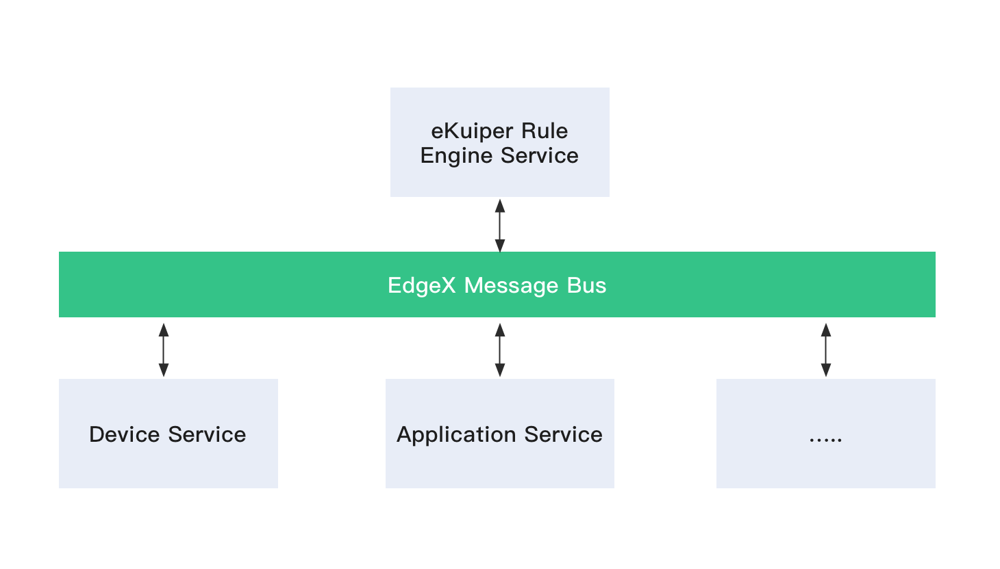

# EdgeX Rule Engine Tutorial

This tutorial describes how to integrate rekuiper with EdgeX Foundry to process real-time telemetry events from the EdgeX message bus.

## Integration Architecture

In EdgeX Foundry, microservices communicate through an internal message bus (such as MQTT or ZeroMQ). rekuiper connects directly to this message bus to process streaming data:

- **Source**: Ingests `Event` and `Reading` payloads from EdgeX message bus topics.
- **SQL Engine**: Filters, transforms, enriches, and computes aggregates over streaming data.
- **Sink**: Routes processed alerts and summaries to downstream brokers, databases, REST endpoints, or back to the EdgeX message bus.



### Automated Data Type Mapping

EdgeX payloads describe schema attributes and data types inside event headers. Therefore, you do not need to define explicit column schemas when creating an EdgeX stream. rekuiper automatically maps EdgeX data types to SQL types at runtime. For conversion details, refer to the [EdgeX Source Guide](../guide/sources/builtin/edgex.md).

## EdgeX Version Compatibility

- **EdgeX v4 Support**: Since eKuiper version 2.1.0, the default message bus is MQTT. Redis message bus support is deprecated.
- **EdgeX v3 Support**: Supported in eKuiper version 1.11.
- **EdgeX v2 Support**: Supported in eKuiper version 1.2.1. The `Core contract Service` requirement and `serviceServer` configuration are removed. Refer to [EdgeX Metadata Changes](./edgex_meta.md#schema-changes-in-edgex-v2).

## Walkthrough: Process Sensor Telemetry

This walkthrough uses the EdgeX `device-virtual` service to generate sample telemetry and process readings using rekuiper.

### 1. Start EdgeX in Docker

Download Docker Compose descriptors from the EdgeX repository and start the containers:

```shell
docker-compose -f ./docker-compose-no-secty.yml up -d --build
```

Verify that all services are running:

```shell
docker ps
```

### 2. Configure Shared Connections

To reuse broker credentials across sources and sinks, inject environment variables into the rules engine service in `docker-compose.yml`:

```yaml
environment:
  CONNECTION__EDGEX__MQTTMSGBUS__OPTIONAL__CLIENTID: kuiper-rules-engine
  CONNECTION__EDGEX__MQTTMSGBUS__OPTIONAL__KEEPALIVE: "500"
  CONNECTION__EDGEX__MQTTMSGBUS__PORT: "1883"
  CONNECTION__EDGEX__MQTTMSGBUS__PROTOCOL: tcp
  CONNECTION__EDGEX__MQTTMSGBUS__SERVER: edgex-mqtt-broker
  CONNECTION__EDGEX__MQTTMSGBUS__TYPE: mqtt
```

Refer to [Connection Reusability](../guide/sinks/builtin/edgex.md#connection-reuse-publish-example).

### 3. Create an EdgeX Stream

> [!NOTE]
> In EdgeX container deployments, the rekuiper REST API listens on port `59720` instead of the default port `9081`.

#### Option A: Create via REST API

```shell
curl -X POST \
  http://localhost:59720/streams \
  -H 'Content-Type: application/json' \
  -d '{
  "sql": "create stream demo() WITH (FORMAT=\"JSON\", TYPE=\"edgex\")"
}'
```

#### Option B: Create via CLI

Enter the container shell:

```shell
docker exec -it edgex-kuiper /bin/sh
```

Execute the creation command:

```shell
bin/kuiper create stream demo '() WITH (FORMAT="JSON", TYPE="edgex")'
```

Default message bus parameters reside in `etc/sources/edgex.yaml`:

```yaml
default:
  protocol: tcp
  server: edgex-mqtt-broker
  port: 1883
  topic: edgex/rules-events
  type: mqtt
  messageType: event
```

### 4. Create and Deploy a Processing Rule

Create a rule that routes all incoming events to an MQTT topic and writes execution traces to the log:

#### Option A: Deploy via REST API

```shell
curl -X POST \
  http://localhost:59720/rules \
  -H 'Content-Type: application/json' \
  -d '{
  "id": "rule1",
  "sql": "SELECT * FROM demo",
  "actions": [
    {
      "mqtt": {
        "server": "tcp://127.0.0.1:1883",
        "topic": "result",
        "clientId": "demo_001"
      }
    },
    {
      "log": {}
    }
  ]
}'
```

#### Option B: Deploy via CLI

Create `rule.txt`:

```json
{
  "sql": "SELECT * from demo",
  "actions": [
    {
      "mqtt": {
        "server": "tcp://127.0.0.1:1883",
        "topic": "result",
        "clientId": "demo_001"
      }
    },
    {
      "log": {}
    }
  ]
}
```

Deploy the rule file:

```shell
bin/kuiper create rule rule1 -f rule.txt
```

### 5. Monitor Output and Inspect Rule Status

Subscribe to the MQTT output topic using `mosquitto_sub`:

```shell
mosquitto_sub -h 127.0.0.1 -t result
```

Inspect the container logs:

```shell
docker logs -f edgex-kuiper
```

Query rule runtime metrics from the CLI:

```shell
bin/kuiper getstatus rule rule1
```

Response sample:

```json
{
  "source_demo_0_records_in_total": 29,
  "source_demo_0_records_out_total": 29,
  "source_demo_0_exceptions_total": 0,
  "source_demo_0_process_latency_ms": 0,
  "sink_mqtt_0_0_records_in_total": 21,
  "sink_mqtt_0_0_records_out_total": 21,
  "sink_mqtt_0_0_exceptions_total": 0,
  "sink_mqtt_0_0_process_latency_ms": 0
}
```

## Cross References

- [Management Web UI](../operation/manager-ui/overview.md)
- [EdgeX Source Configuration](../guide/sources/builtin/edgex.md)
- [EdgeX Metadata Functions](edgex_meta.md)
- [EdgeX Message Bus Sink](../guide/sinks/builtin/edgex.md)
- [Actuate EdgeX Devices Tutorial](edgex_rule_engine_command.md)
