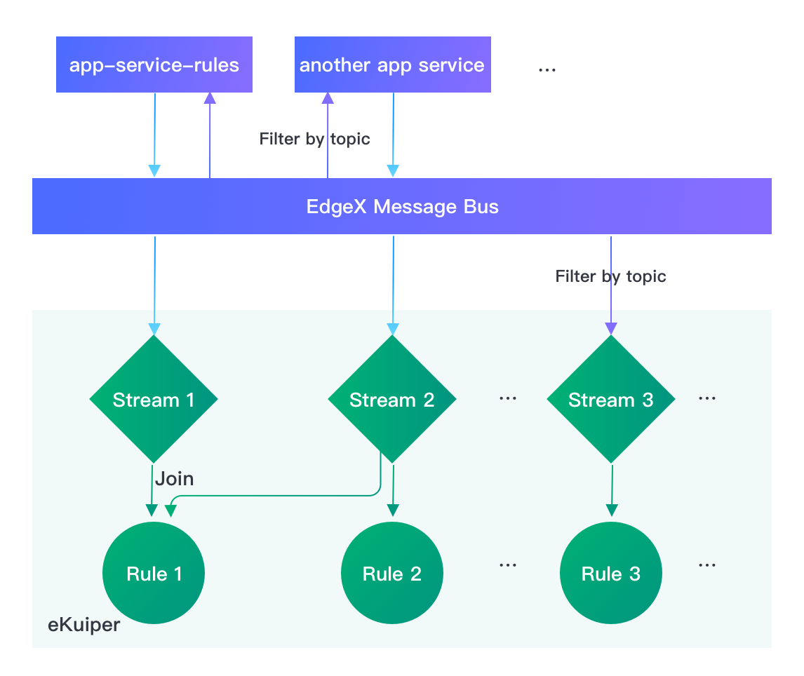

# Configure Data Flows from EdgeX to rekuiper

rekuiper ingests data from EdgeX Foundry through stream definitions. The [EdgeX Source Guide](../guide/sources/builtin/edgex.md) defines properties that control how data flows from EdgeX into rekuiper. This tutorial demonstrates common architectural patterns and shows how to configure sources for each flow.

## Common Ingestion Architectures

There are two primary data flow architectures between EdgeX and rekuiper:

1. **Ingestion via EdgeX Application Service**: Downstream of Core Data, an application service transforms, filters, and formats records before publishing them to rekuiper.
2. **Direct Ingestion via EdgeX Message Bus**: rekuiper subscribes directly to the EdgeX message bus to process raw telemetry with minimum latency.



Both architectures exchange data through the message bus. The application service model enables upstream data enrichment and compression. The direct bus model bypasses intermediary services to minimize CPU overhead.

Two primary parameters control the connection model: `topic` and `messageType`.

## Ingest from an Application Service

In the standard EdgeX Docker Compose deployment, the `app-service-rules` container acts as the upstream provider. It publishes telemetry to topic `rules-events`.

The rekuiper rules engine configures matching parameters using environment variables:

```yaml
rulesengine:
  environment:
    EDGEX__DEFAULT__TOPIC: rules-events
```

When you define an EdgeX stream using default configurations, rekuiper consumes records from `app-service-rules` automatically.

### Connect to a Custom Application Service

To connect to a custom application service:
1. Set the publish topic on the application service using `TRIGGER_EDGEXMESSAGEBUS_PUBLISHHOST_PUBLISHTOPIC`.
2. Configure `EDGEX__DEFAULT__TOPIC` on `rulesengine` to match the custom topic name:

```yaml
app-service-rules:
  environment:
    TRIGGER_EDGEXMESSAGEBUS_PUBLISHHOST_PUBLISHTOPIC: new-rules-events

rulesengine:
  environment:
    EDGEX__DEFAULT__TOPIC: new-rules-events
```

## Connect Directly to the EdgeX Message Bus

To bypass the application service, configure rekuiper to subscribe directly to EdgeX Core Data topics and set `messageType` to `request`.

For example, to filter data from `Random-Integer-Device`:

```yaml
rulesengine:
  environment:
    EDGEX__DEFAULT__TOPIC: edgex/events/#/Random-Integer-Device/#
    EDGEX__DEFAULT__MESSAGETYPE: request
```

Create a stream using default settings:

```sql
CREATE STREAM edgeXAll() WITH (FORMAT="JSON", TYPE="edgex")
```

The engine receives only records that match the device topic pattern.

## Manage Multiple EdgeX Streams

In production environments, rules frequently target specific devices, profiles, or metric types. You can define multiple configuration profiles in `etc/sources/edgex.yaml`:

```yaml
default:
  protocol: tcp
  server: localhost
  port: 1883
  topic: rules-events
  type: mqtt
  messageType: event

device_conf:
  topic: edgex/events/#/Random-Integer-Device/#
  messageType: request

another_app_service_conf:
  topic: new-rules-events
  messageType: event

int8_conf:
  topic: edgex/events/#/Random-Integer-Device/Int8
  messageType: request
```

Bind distinct streams to specific configuration profiles using `CONF_KEY`:

```sql
-- Ingests all events via the default profile
CREATE STREAM edgexAll() WITH (FORMAT="JSON", TYPE="edgex");

-- Ingests only Int8 readings using the int8_conf profile
CREATE STREAM edgexInt8(int8 bigint) WITH (FORMAT="JSON", TYPE="edgex", CONF_KEY="int8_conf");
```

### Shared Source Instances

By default, each active rule instantiates a private source connector instance. To eliminate duplicate subscriptions and reduce memory overhead, configure the source as a shared instance using `SHARED="true"`:

```sql
CREATE STREAM edgexAll() WITH (FORMAT="JSON", TYPE="edgex", SHARED="true");
```

Multiple rules that reference `edgexAll` share a single message bus subscription thread.

## Cross References

- [EdgeX Source Guide](../guide/sources/builtin/edgex.md)
- [EdgeX Rules Engine Tutorial](edgex_rule_engine_tutorial.md)
- [Extract EdgeX Metadata Guide](edgex_meta.md)
