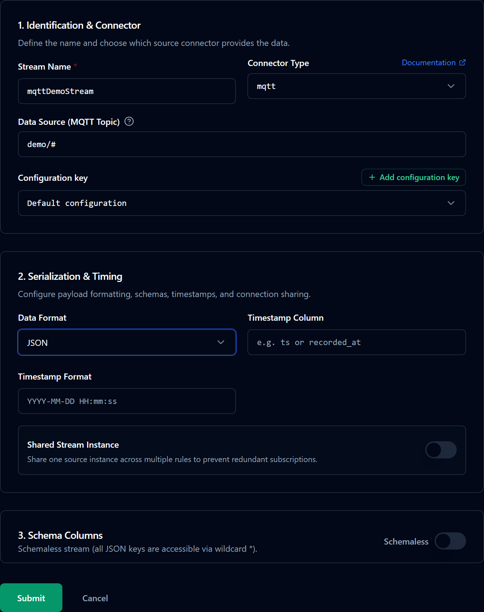
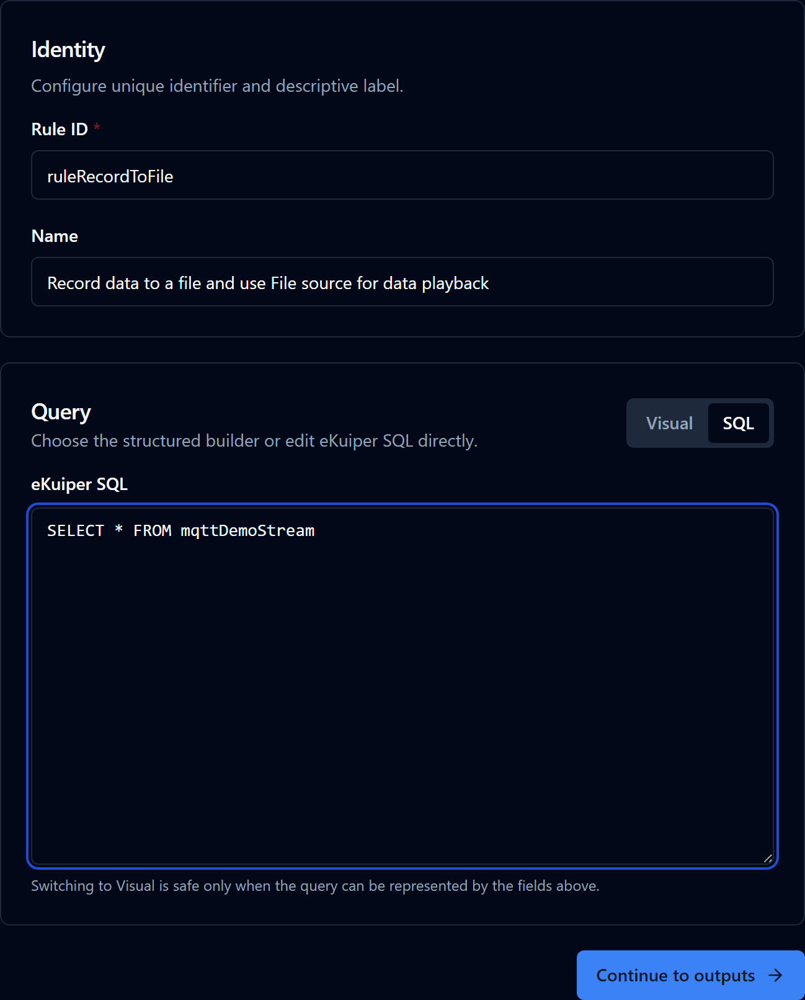
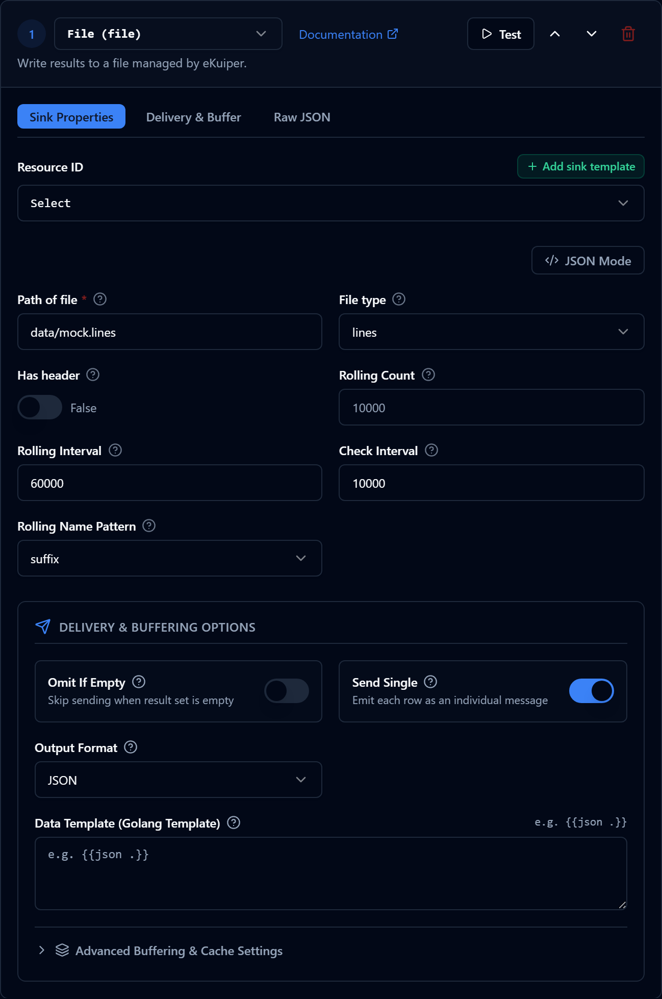
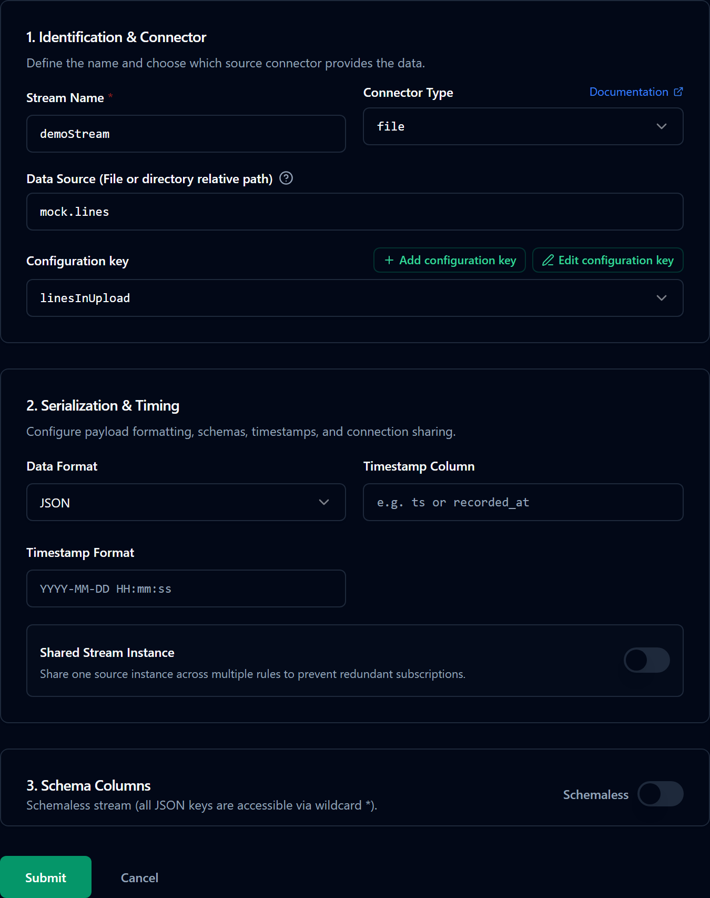
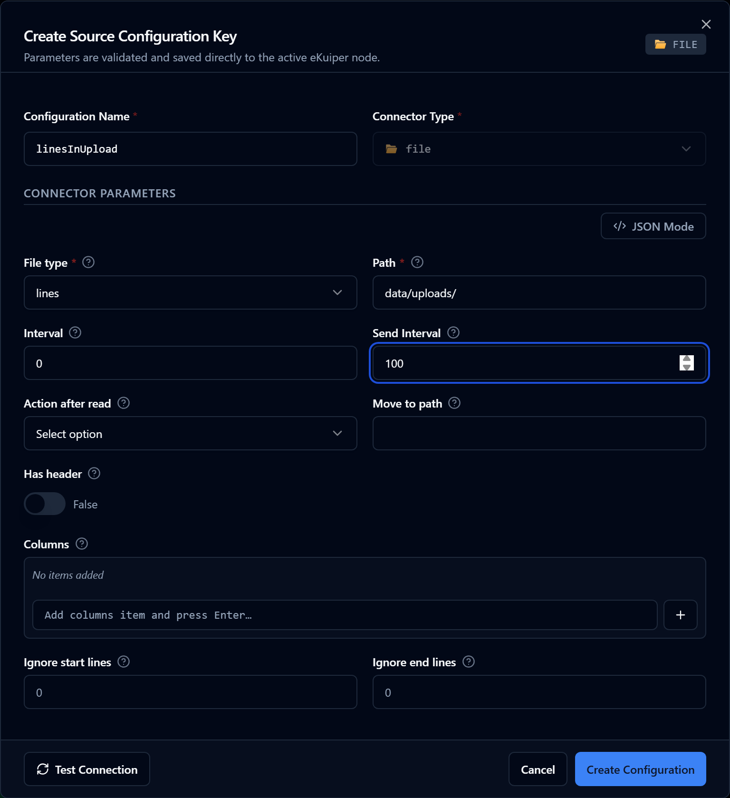
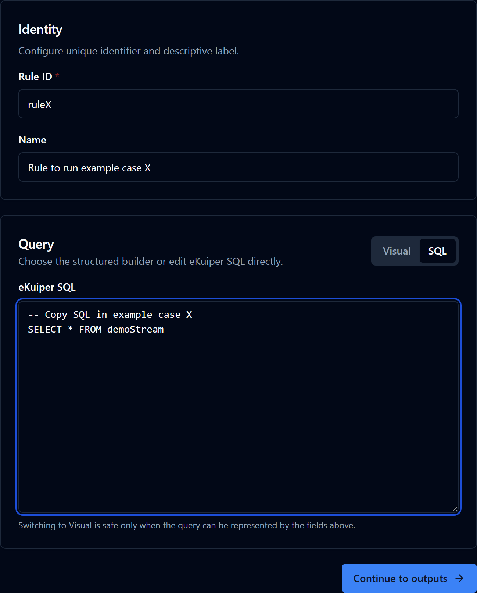
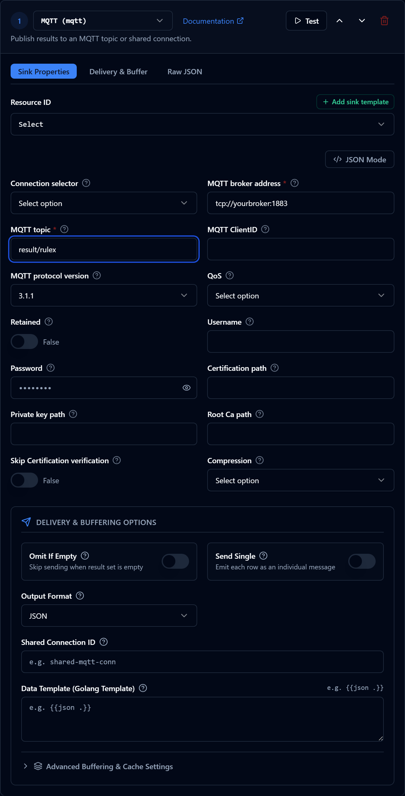

# Step-by-Step Guide: Navigating rekuiper with the Management Console UI

This document describes how to run the cookbook examples with rekuiper. Before you run the examples, [install rekuiper](../installation.md).

You can define rules with SQL in the example scenarios. You can manage and execute rules with the rekuiper manager UI, the REST API, or the command-line interface.

## Data Preparation

Each example includes sample input data. You can also supply custom data. If you have active data sources, you can record live data to a file through a rekuiper rule and replay that file in the examples.

### Record Data

rekuiper supports diverse source protocols and provides a File sink. You can save live stream data to a local file through a rule. For example, you can record MQTT data with the rekuiper manager UI. Before you begin, [install and configure the rekuiper manager](../installation.md#running-ekuiper-with-management-console).

1. **Create Data Source**: In the management console, click **Source** to open the stream management page. Click **Create Stream**. Set the stream name to `mqttDemoStream`. Select stream type `mqtt`. Set the data source (MQTT topic) to `demo/#`. If you require custom connection parameters, click **Add configuration key**. Click **OK** to save the stream. The stream subscribes to MQTT wildcard topic `demo/#`.

   

2. **Create and Run the Rule**: In the navigation bar, click **Rules**. Click **Create rule**. Enter the Rule ID, Rule Name, and SQL statement.

   

   Under **Actions**, click **Add** to configure the sink. Select sink type `file`. Set **Path of file** to `data/mock.lines`, set **File type** to `lines`, and set **Check Interval** to `10000`. The sink writes incoming messages to `data/mock.lines`.

   

   Click **OK** to save the rule. On the rule list page, verify that the rule status shows **Running**. Click the status badge to confirm that the rule receives and processes messages.

3. **Inspect Data**: The rule writes output lines to `data/mock.lines`. The file stores one JSON string per line. You can view or modify the file in any text editor.

## Run Examples

For testing and debugging, use a File source as input. When the example executes successfully, replace the File source with your production source.

Most cookbook examples follow these conventions:

- The rule reads from a File source stream named `demoStream`. This setup lets you replay recorded test data easily.
- The rule publishes results to an MQTT sink topic: <code v-pre>result/{{ruleId}}</code>.

Follow these steps to run an example in the management console:

1. **Prepare Data**: Copy sample data from the example page into a text file, or [record live data](#record-data).
2. **Upload Data**: In the management console, click **Configuration**. Open the **Files Management** tab. Click **Create File** and upload your data file (such as `mock.lines`).
3. **Create File Stream**: In the navigation bar, click **Source**. Click **Create stream**. Set the stream name to `demoStream`. Select stream type `file`. Set the data source to the uploaded file name.

   

   Click **Add configuration key**. Set **File path** to the path of the uploaded file.

   

   Click **OK** to create the stream.

4. **Subscribe to Result Topic**: Open an MQTT client such as [MQTTX](https://mqttx.app/). Subscribe to the topic <code v-pre>result/{{ruleId}}</code> to view rule output.
5. **Create Rule**: In the navigation bar, click **Rules**. Click **Create rule**. Enter the Rule ID, Rule Name, and the SQL query from the specific example page.

   

   Under **Actions**, click **Add**. Select sink type `mqtt`. Set the topic to <code v-pre>result/{{ruleId}}</code>.

   

   Click **OK** to save the rule. In the rule list, verify that the rule status displays **Running**. Click the status badge to verify message reception and processing.

6. **Inspect Output**: View the rule results in your MQTT client.

## Summary

This document describes how to execute cookbook examples with the rekuiper manager UI. You can also use the REST API or the CLI to deploy streams and rules. You can adjust the example SQL queries to test custom processing logic.
