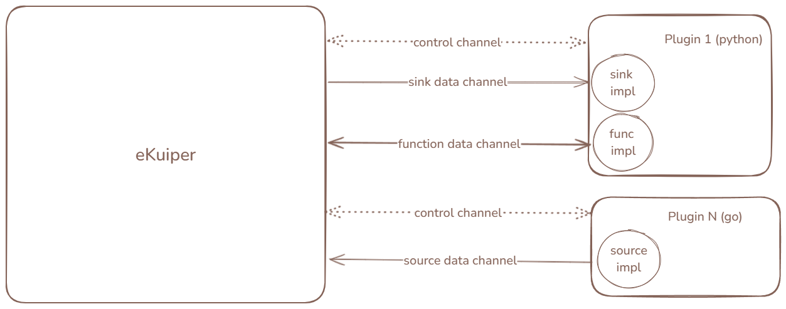

# Portable Plugins

Portable plugins provide an out-of-process extension mechanism that supports multiple programming languages. Like native plugins, portable plugins support custom source, sink, and function extensions.

## Architecture

Portable plugins execute as independent processes outside the main rekuiper process:



- **Inter-Process Communication**: The plugin process communicates with the engine through nanomsg IPC sockets.
- **Process Lifecycle**: The engine starts plugin processes upon installation or system startup and maintains a control channel. When a rule uses an extension symbol, the engine establishes dedicated data channels.
- **Hot Updates**: Nanomsg channels support automatic reconnection. When you update a plugin binary, the new process connects to existing channels without requiring rule restarts.

## Development

Developing a portable plugin involves three steps:

1. Implement extension symbols (sources, sinks, functions) using a supported SDK.
2. Implement the main entry program to serve the symbols.
3. Package the executable and metadata into a zip archive.

rekuiper provides dedicated SDKs:
- [Go SDK](go_sdk.md)
- [Python SDK](python_sdk.md)

### Debugging with the Test Server

You can test portable plugins in isolation by using the standalone test server under `tools/plugin_test_server`:

1. Configure `testingPlugin` to match your plugin metadata.
2. Start the test server.
3. Launch your plugin process in debug mode and complete the handshake.
4. Test symbol lifecycle operations through the REST API:

   ```shell
   curl -X POST http://localhost:33333/symbol/start \
     -H "Content-Type: application/json" \
     -d '{
       "symbolName": "pyjson",
       "meta": {
         "ruleId": "rule1",
         "opId": "op1",
         "instanceId": 1
       },
       "pluginType": "source",
       "config": {}
     }'
   ```

## Packaging

Package plugin files into a zip archive with this structure:

- `{pluginName}.json`: Metadata descriptor matching the plugin name.
- Executable binary or script.
- Subdirectories: `sources/`, `sinks/`, and `functions/` containing symbol metadata.
- Optional scripts (such as `install.sh`) and dependencies.

Example metadata descriptor `{pluginName}.json`:

```json
{
  "version": "v1.0.0",
  "language": "go",
  "executable": "mirror",
  "sources": [
    "random"
  ],
  "sinks": [
    "file"
  ],
  "functions": [
    "echo"
  ]
}
```

For Python plugins using Conda environments, specify the environment properties:

```json
{
  "version": "v1.0.0",
  "language": "python",
  "executable": "pysam.py",
  "virtualEnvType": "conda",
  "env": "myenv"
}
```

## Management

- **File System Autoload**: Place uncompressed plugin directories under `plugins/portables/{pluginName}` and configurations under `etc/`.
- **API Management**: Install and monitor plugins through the [REST API](../../api/restapi/plugins.md) or the [CLI](../../api/cli/plugins.md).

## Limitations

- **Context Methods**: State storage and shared connection APIs are not available for portable plugins.
- **Validation**: Function arguments cannot be validated against the SQL AST prior to execution. Sinks receive pre-encoded JSON byte payloads.
