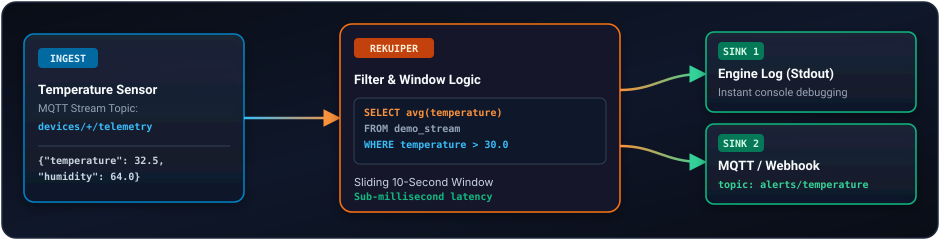

# Getting Started with rekuiper

This guide walks you through setting up **rekuiper** and building your first end-to-end edge stream processing pipeline using the REST API, the `kuiper` CLI, and the web-based management dashboard.

---

## 1. Overview of the Scenario

Let's consider a common edge scenario:
An industrial sensor publishes temperature and humidity readings every second. We want to:
1. Ingest telemetry events continuously.
2. Filter for anomalous temperature events (e.g., `temperature > 30.0`°C).
3. Compute a moving average over a sliding 10-second window.
4. Route alerts to a local log or target MQTT broker without buffering or latency spikes.



---

## 2. Prerequisites & Running rekuiper

Start rekuiper using Docker:

```shell
docker run -d \
  --name rekuiper \
  -p 9081:9081 \
  -p 20498:20498 \
  -p 20499:20499 \
  ankurkrp/rekuiper:0.504-beta
```

Check that the server is up:

```shell
curl http://localhost:9081/ping
# Response: pong
```

---

## 3. Method A: Managing via REST API

The HTTP REST API is the primary interface used by automation scripts, CI/CD, and visual management tools.

### Step 1: Create a Stream

Define a stream called `sensor_stream` consuming from the `sensor/data` MQTT topic (or HTTP push):

```shell
curl -X POST http://localhost:9081/streams \
  -H "Content-Type: application/json" \
  -d '{
    "sql": "CREATE STREAM sensor_stream (temperature float, humidity bigint) WITH (DATASOURCE=\"sensor/data\", FORMAT=\"JSON\")"
  }'
```

### Step 2: Create a Streaming Rule

Deploy a rule that computes average temperature over a 10-second tumbling window:

```shell
curl -X POST http://localhost:9081/rules \
  -H "Content-Type: application/json" \
  -d '{
    "id": "temp_monitor_rule",
    "sql": "SELECT avg(temperature) as avg_temp, max(temperature) as max_temp FROM sensor_stream GROUP BY TumblingWindow(ss, 10) HAVING avg_temp > 30.0",
    "actions": [
      {
        "log": {}
      }
    ]
  }'
```

### Step 3: Inject Test Data

Push sample events into the stream:

```shell
curl -X POST http://localhost:9081/streams/sensor_stream/data \
  -H "Content-Type: application/json" \
  -d '{"temperature": 32.5, "humidity": 65}'

curl -X POST http://localhost:9081/streams/sensor_stream/data \
  -H "Content-Type: application/json" \
  -d '{"temperature": 35.0, "humidity": 68}'
```

### Step 4: Monitor Rule Execution

Check runtime execution metrics:

```shell
curl http://localhost:9081/rules/temp_monitor_rule/status
```

---

## 4. Method B: Managing via `kuiper` CLI

rekuiper includes full compatibility with the `kuiper` command-line tool.

You can execute CLI commands directly inside the running container:

```shell
# Open an interactive shell inside the container
docker exec -it rekuiper /bin/sh

# List existing streams
bin/kuiper show streams

# Create a stream
bin/kuiper create stream cli_demo '(temperature float, humidity bigint) WITH (DATASOURCE="cli_demo", FORMAT="JSON")'

# Submit an ad-hoc query
bin/kuiper query
```

Inside the interactive query prompt:
```sql
kuiper > SELECT * FROM cli_demo WHERE temperature > 30.0;
Query was submit successfully.
```

---

## 5. Method C: Managing via Web Console (eKuiper Manager)

To manage streams, test rules, and monitor topology graphs visually:

```shell
docker run -d \
  --name ekuiper-manager \
  -p 9082:9082 \
  -e DEFAULT_EKUIPER_ENDPOINT="http://localhost:9081" \
  ankur-paan/ekuiper-manager:latest
```

1. Navigate to `http://localhost:9082` in your browser.
2. In the service management list, connect to `http://localhost:9081`.
3. Use the visual rule editor to design streams, configure SQL queries with autocomplete, and inspect live throughput charts.

---

## 6. Next Steps

- Explore [SQL Reference & Built-in Functions](../sqls/overview.md)
- Configure [Persistent Connections](../guide/connections/overview.md)
- Learn about [Production Deployment & Configuration](../installation.md)
- Integrate with [AI Agents via MCP](https://github.com/ankur-paan/rekuiper/tree/main/crates/rekuiper-mcp)
