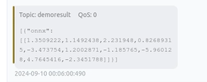
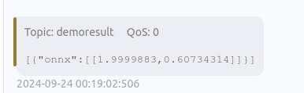

# Execute ONNX Models with the Function Plugin

[Open Neural Network Exchange (ONNX)](https://onnx.ai/get-started.html) is an open format designed for machine learning models. It enables different machine learning frameworks to store model data and share inference formats.

By integrating rekuiper and ONNX, you can upload pre-trained ONNX models and invoke them in SQL rules to analyze streaming data. This tutorial demonstrates how to load and execute pre-trained ONNX models.

## Prerequisites

### Download Models

To run the ONNX runtime interpreter, obtain a pre-trained model file. Refer to the [ONNX tutorials](https://github.com/onnx/tutorials#converting-to-onnx-format) for instructions on model export.

This tutorial uses two demonstration models:

- The [sum_and_difference](https://github.com/yalue/onnxruntime_go_examples/tree/master/sum_and_difference) model.
- The [MNIST-12](https://github.com/onnx/models/tree/ddbbd1274c8387e3745778705810c340dea3d8c7/validated/vision/classification/mnist) handwritten digit recognition model.

### Start rekuiper

You can execute rules by using the REST API or the management web interface. Refer to the [eKuiper manager repository](https://hub.docker.com/r/emqx/ekuiper-manager) for container deployment details.

### Install the ONNX Plugin

Install the ONNX native function plugin before running model inference. For plugin build and installation instructions, refer to [Function Extensions](../../extension/native/develop/function.md).

## Execute the MNIST-12 Model

Download the [MNIST-12 model file](https://github.com/onnx/models/blob/ddbbd1274c8387e3745778705810c340dea3d8c7/validated/vision/classification/mnist/model/mnist-12.onnx) to recognize digits in images. Configure an MQTT broker and an MQTT stream source to transmit data to the rule and publish inference results.

### Configure the MQTT Source

The model requires an input array of floating-point numbers. Define the stream schema accordingly:

```http
POST /streams
Content-Type: application/json

{
  "sql": "CREATE STREAM onnxPubImg (data array(float)) WITH (DATASOURCE=\"onnxPubImg\", FORMAT=\"json\")"
}
```

### Upload the Model

Upload the model file through the management web console, or copy the file directly to the `${build_output}/data/uploads` directory.


### Invoke the Model in SQL

After installing the ONNX plugin, invoke the `onnx` function in your SQL queries. Pass the model name as the first argument and the input field as the second argument:


Rule definition:

```json
{
  "id": "ruleOnnx",
  "sql": "SELECT onnx(\"mnist\", data) FROM onnxPubImg",
  "actions": [
    {
      "log": {},
      "mqtt": {
        "server": "tcp://127.0.0.1:1883",
        "topic": "demoresult"
      }
    }
  ]
}
```

### Verify Results

The model outputs predicted probabilities for each digit:



The following Go code sample sends preprocessed test images to the `onnxPubImg` topic:

```go
func TestPic(t *testing.T) {
    const TOPIC = "onnxPubImg"

    images := []string{
        "img.png",
    }
    opts := mqtt.NewClientOptions().AddBroker("tcp://localhost:1883")
    client := mqtt.NewClient(opts)
    if token := client.Connect(); token.Wait() && token.Error() != nil {
        panic(token.Error())
    }
    for _, image := range images {
        fmt.Println("Publishing " + image)
        inputImage, err := NewProcessedImage(image, false)
        if err != nil {
            fmt.Println(err)
            continue
        }
        payloadF32 := inputImage.GetNetworkInput()
        data := make([]any, len(payloadF32))
        for i := 0; i < len(data); i++ {
            data[i] = payloadF32[i]
        }
        payloadUnMarshal := MqttPayLoadFloat32Slice{
            Data: payloadF32,
        }
        payload, err := json.Marshal(payloadUnMarshal)
        if err != nil {
            fmt.Println(err)
            continue
        }
        if token := client.Publish(TOPIC, 2, true, payload); token.Wait() && token.Error() != nil {
            fmt.Println(token.Error())
        } else {
            fmt.Println("Published " + image)
        }
        time.Sleep(1 * time.Second)
    }
    client.Disconnect(0)
}
```

## Execute the Sum_and_difference Model

Download the [sum_and_difference model file](https://github.com/yalue/onnxruntime_go_examples/blob/master/sum_and_difference/sum_and_difference.onnx). The model estimates the sum and the maximum difference of the input numbers. For example, for input `[0.2, 0.3, 0.6, 0.9]`, the estimated sum is `2.0` and the maximum difference is `0.7`.

### Upload the Model

Upload the model file through the management console or copy it to `${build_output}/data/uploads`.


### Invoke the Model

Invoke the `onnx` function in the SQL query:

```http
POST /rules
Content-Type: application/json

{
  "id": "ruleSum",
  "sql": "SELECT onnx(\"sum_and_difference\", data) FROM sum_diff_stream",
  "actions": [
    {
      "log": {},
      "mqtt": {
        "server": "tcp://127.0.0.1:1883",
        "topic": "demoresult"
      }
    }
  ]
}
```

### Verify Inference Output

Publish test data through your MQTT client:

```json
{
  "data": [
    0.2,
    0.3,
    0.6,
    0.9
  ]
}
```

The rule returns the calculated sum and maximum difference:

```json
[
  {
    "onnx": [
      [
        1.9999883,
        0.60734314
      ]
    ]
  }
]
```



## Summary

The ONNX plugin allows you to execute machine learning models directly in SQL rules without writing custom code. This integration supports models trained in popular frameworks, including PyTorch and TensorFlow.
