# Execute TensorFlow Lite Models with the Function Plugin

[TensorFlow Lite](https://www.tensorflow.org/lite/guide) provides tools to execute machine learning models on mobile, embedded, and IoT devices with low latency and small binary sizes.

By integrating rekuiper and TensorFlow Lite, you can upload pre-trained models and invoke them in SQL rules to analyze data streams. This tutorial demonstrates how to load and execute pre-trained TensorFlow Lite models.

## Prerequisites

### Download Models

To execute model inference, download a trained model file. Refer to the [TensorFlow Lite converter documentation](https://www.tensorflow.org/lite/convert) for conversion instructions.

This tutorial uses two pre-trained models:

- The [sin model](https://github.com/mattn/go-tflite/tree/master/_example/sin).
- The [MobileNet V1 model](https://tfhub.dev/tensorflow/lite-model/mobilenet_v1_1.0_224/1/default/1).

### Start rekuiper

You can use the release Docker image `lfedge/ekuiper:1.8.0-slim` and the web manager image `emqx/ekuiper-manager:1.8.0`. Refer to the [eKuiper manager repository](https://hub.docker.com/r/emqx/ekuiper-manager) for setup instructions.

### Install the TensorFlow Lite Plugin

Download and install the precompiled TensorFlow Lite plugin through the management console:

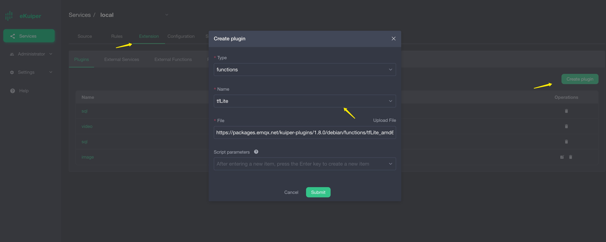
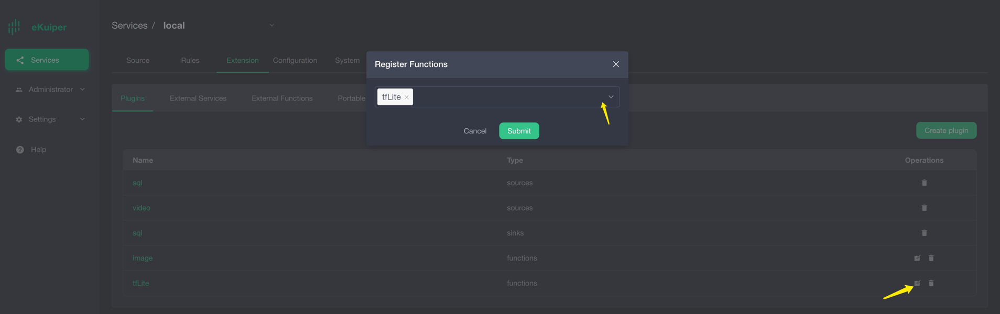

## Sine Model Setup

Download the [sin model file](https://github.com/mattn/go-tflite/blob/master/_example/sin/sin_model.tflite). The model computes the sine value of the input number. For example, for input `1.57` (approximately $\pi / 2$), the result is approximately `1.0`.

Configure an MQTT broker and an MQTT stream source to transmit input data and receive inference results.

### Configure the MQTT Source

The model requires a byte array as input. Define the stream schema so the source formats data into binary bytes:

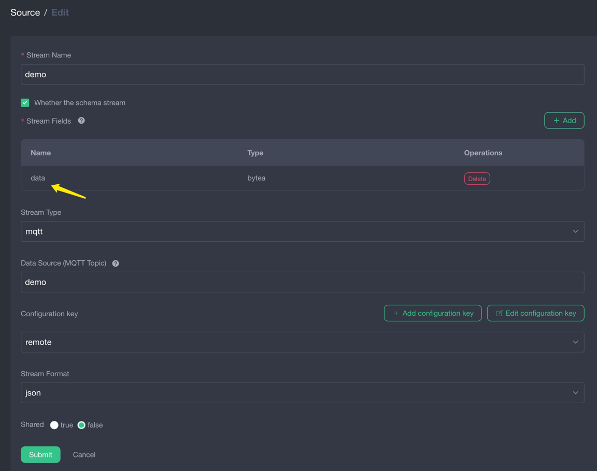

### Upload the Model

Upload the model file through the management console:

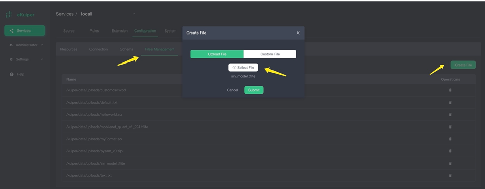

### Invoke the Model in SQL

After installing the plugin, invoke the model in SQL queries. Pass the model name as the first argument and the input field as the second argument:

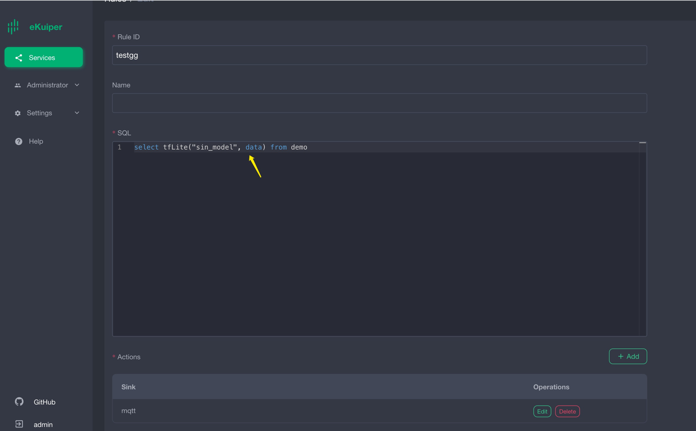

### Verify Results

When the input value is `1.57`, the rule outputs a value close to `1.0`:

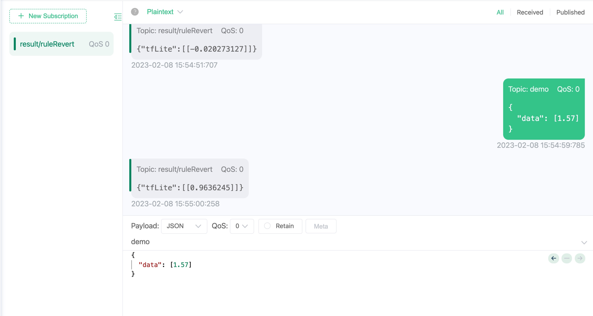

## MobileNet V1 Model Setup

Download the [MobileNet V1 model file](https://tfhub.dev/tensorflow/lite-model/mobilenet_v1_1.0_224/1/default/1). The model accepts an input image of 224x224 pixels and returns an array of 1001 floating-point confidence scores.

Use the video source plugin to capture frames from a live video stream, and publish inference outputs to an MQTT broker.

### Install and Configure the Video Source

The video source pulls data from a live video feed and extracts image frames. Use `https://gcwbcdks.v.kcdnvip.com/gcwbcd/cdrmipanda_1/index.m3u8` as the live broadcast URL:

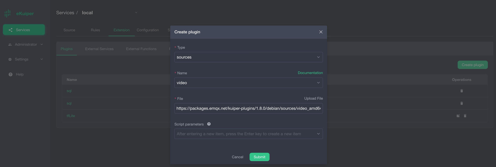
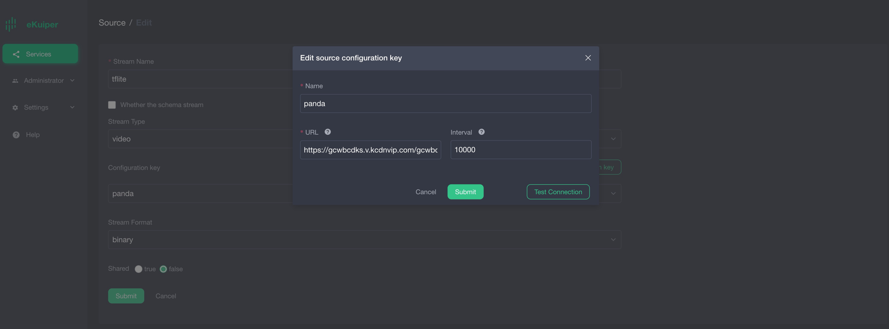

> [!NOTE]
> Select `binary` as the stream format.

### Install the Image Function Plugin

The model requires images sized to 224x224 pixels. Install the `image` function plugin to resize incoming video frames:

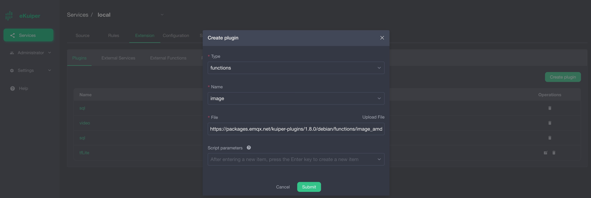
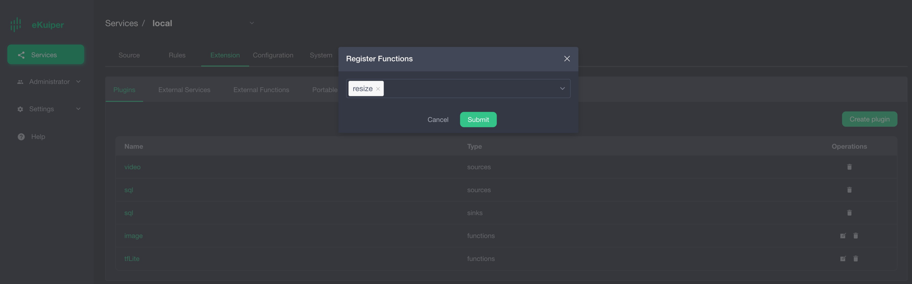

### Upload the Model

Upload the model file through the management console:

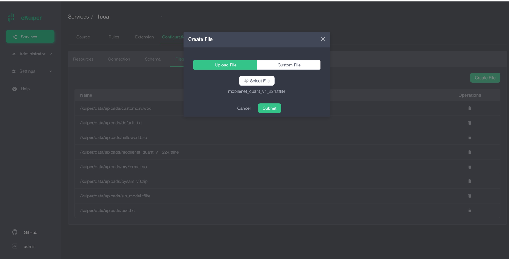

### Invoke the Model in SQL

Invoke the model in your query, passing the resized image data as the input parameter:

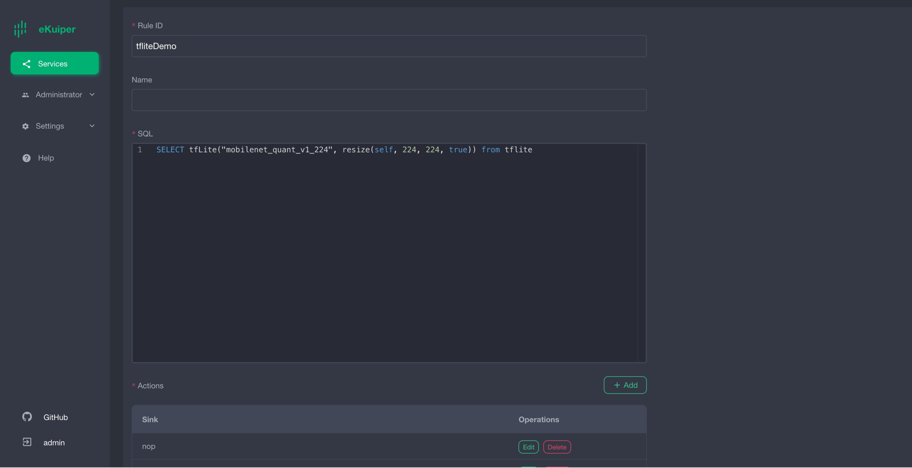

### Verify Results

The model outputs a Base64-encoded byte array containing 1001 classification elements:

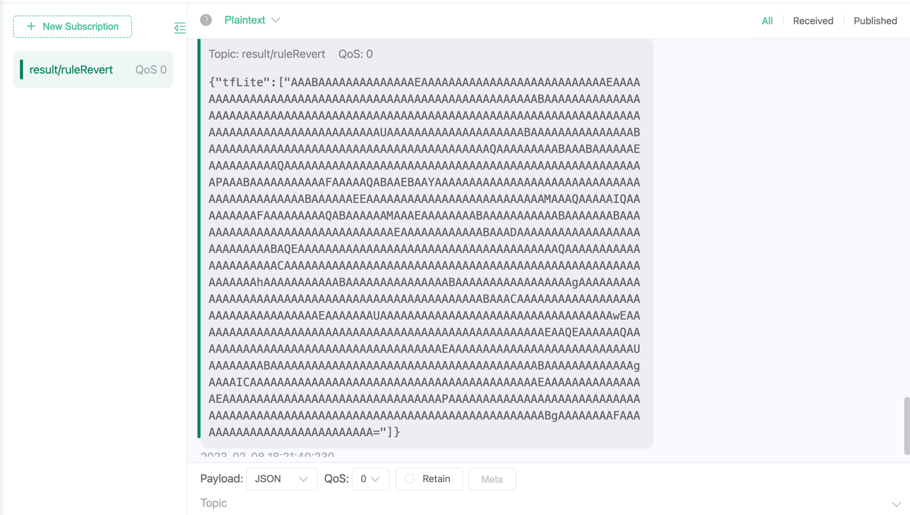

Each element corresponds to an item in the [MobileNet classification labels list](https://github.com/lf-edge/ekuiper/blob/master/extensions/functions/labelImage/etc/labels.txt). Higher values indicate higher prediction confidence:


The following Go code demonstrates how to parse output scores and select the label with the highest confidence:

```go
package demo

import (
    "bufio"
    "os"
    "sort"
)

func loadLabels() ([]string, error) {
    labels := []string{}
    f, err := os.Open("./labels.txt")
    if err != nil {
        return nil, err
    }
    defer f.Close()
    scanner := bufio.NewScanner(f)
    for scanner.Scan() {
        labels = append(labels, scanner.Text())
    }
    return labels, nil
}

type result struct {
    score float64
    index int
}

func bestMatchLabel(keyValue map[string]interface{}) (string, bool) {
    labels, _ := loadLabels()
    resultArray := keyValue["tfLite"].([]interface{})
    outputArray := resultArray[0].([]byte)
    outputSize := len(outputArray)

    var results []result
    for i := 0; i < outputSize; i++ {
        score := float64(outputArray[i]) / 255.0
        if score < 0.2 {
            continue
        }
        results = append(results, result{score: score, index: i})
    }
    sort.Slice(results, func(i, j int) bool {
        return results[i].score > results[j].score
    })
    if len(results) > 0 {
        return labels[results[0].index], true
    } else {
        return "", true
    }
}
```

## Summary

The precompiled TensorFlow Lite plugin enables direct model execution in streaming queries without writing custom inference code.
