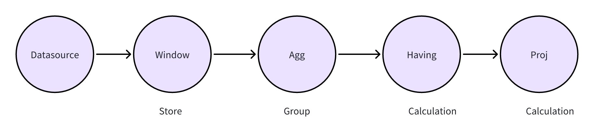
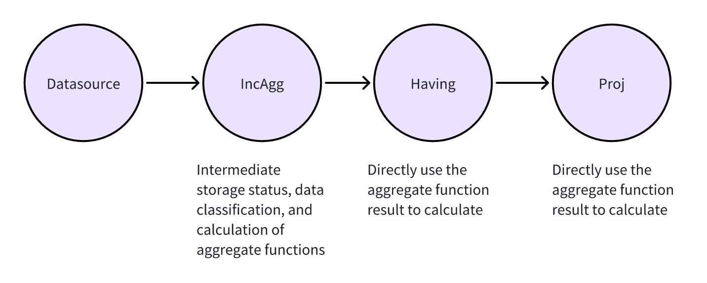
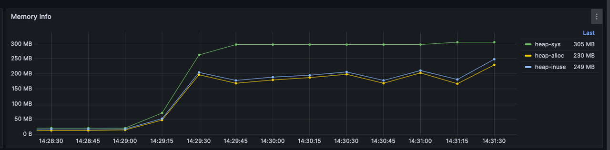
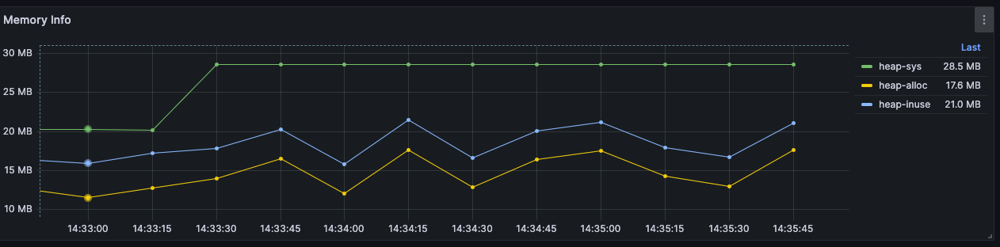

# Incremental Computation

## Background

In standard stream processing, aggregate operations split streaming data into windows, store events in memory, and calculate results when the window closes. Consider this example SQL query:

```sql
SELECT avg(a) FROM stream GROUP BY tumblingWindow(ss, 10), b;
```

In the standard execution model, rekuiper separates aggregation into three operators:

```txt
Window Operator -> Group By Operator -> Project Operator
```

The `Window` operator accumulates stream records. The `Group By` operator groups records by key. The `Project` operator calculates final aggregate values.

This approach works for all aggregation functions, but has two limitations:

1. Large windows consume high amounts of memory.
2. The runtime does not use the streaming capabilities of aggregations.

For functions such as `avg`, the runtime does not need to wait for all window data before calculation. The runtime can update two intermediate states (`sum` and `count`) for each incoming record. When the window closes, rekuiper calculates the average as `sum / count`.

## How Incremental Computation Works

Review the standard query plan for this SQL query:

```sql
SELECT sum(b) FROM demo GROUP BY tumblingWindow(ss, 10), c HAVING avg(a) > 0;
```

```sql
{"op":"ProjectPlan_0","info":"Fields:[ Call:{ name:sum, args:[demo.b] } ]"}
        {"op":"HavingPlan_1","info":"Condition:{ binaryExpr:{ Call:{ name:avg, args:[demo.a] } > 0 } }, "}
                        {"op":"AggregatePlan_2","info":"Dimension:{ demo.c }"}
                                        {"op":"WindowPlan_3","info":"{ length:10, windowType:TUMBLING_WINDOW, limit: 0 }"}
                                                        {"op":"DataSourcePlan_4","info":"StreamName: demo, StreamFields:[ a, b, c ]"}
```



### Operator Consolidation

To implement incremental computation, rekuiper combines storage, grouping, and calculation into a single operator: `IncAggWindow`.

As records arrive, the engine transfers them directly to `IncAggWindow`. Within each window, the operator classifies records by group-by keys in real time. The operator updates intermediate aggregates immediately and saves the state.

The runtime discards the original raw events. Subsequent `Having` and `Project` operators do not recalculate aggregates. They read the precalculated values directly.



When you enable incremental computing, rekuiper generates the following optimized query plan:

```sql
{"op":"ProjectPlan_0","info":"Fields:[ Call:{ name:bypass, args:[$$default.inc_agg_col_1] } ]"}
        {"op":"HavingPlan_1","info":"Condition:{ binaryExpr:{ Call:{ name:bypass, args:[$$default.inc_agg_col_2] } > 0 } }, "}
                        {"op":"IncAggWindowPlan_2","info":"wType:TUMBLING_WINDOW, Dimension:[demo.c], funcs:[Call:{ name:inc_sum, args:[demo.b] }->inc_agg_col_1,Call:{ name:inc_avg, args:[demo.a] }->inc_agg_col_2]"} {"op":"DataSourcePlan_3","info":"StreamName: demo, StreamFields:[ a, b, c, inc_agg_col_1, inc_agg_col_2 ]"}
```

## Enable Incremental Computation

Consider a rule that calculates an event count within a window:

```json
{
  "id": "rule",
  "sql": "SELECT count(*) FROM demo GROUP BY countwindow(4)",
  "actions": [
    {
      "log": {}
    }
  ],
  "options": {}
}
```

View the query plan through the [Explain API](../../api/restapi/rules.md#query-rule-plan):

```txt
{"op":"ProjectPlan_0","info":"Fields:[ Call:{ name:count, args:[*] } ]"}
    {"op":"WindowPlan_1","info":"{ length:4, windowType:COUNT_WINDOW, limit: 0 }"}
            {"op":"DataSourcePlan_2","info":"StreamName: demo"}
```

In this plan, rekuiper buffers all events in memory until the window closes.

To enable incremental computation, set `options.planOptimizeStrategy.enableIncrementalWindow` to `true`:

```json
{
  "id": "rule",
  "sql": "SELECT count(*) FROM demo GROUP BY countwindow(4)",
  "actions": [
    {
      "log": {}
    }
  ],
  "options": {
    "planOptimizeStrategy": {
      "enableIncrementalWindow": true
    }
  }
}
```

Inspect the updated query plan:

```txt
{"op":"ProjectPlan_0","info":"Fields:[ Call:{ name:bypass, args:[$$default.inc_agg_col_1] } ]"}
    {"op":"IncAggWindowPlan_1","info":"wType:COUNT_WINDOW, funcs:[Call:{ name:inc_count, args:[*] }->inc_agg_col_1]"}
            {"op":"DataSourcePlan_2","info":"StreamName: demo, StreamFields:[ inc_agg_col_1 ]"}
```

The planner replaces `WindowPlan` with `IncAggWindowPlan`. The operator calculates data upon arrival and eliminates event caching in memory.

## Unsupported Scenarios

If an aggregate function does not support incremental calculation, rekuiper maintains standard windowing.

Consider this rule with `stddev`:

```json
{
  "id": "rule",
  "sql": "SELECT count(*), stddev(a) FROM demo GROUP BY countwindow(4)",
  "actions": [
    {
      "log": {}
    }
  ],
  "options": {
    "planOptimizeStrategy": {
      "enableIncrementalWindow": true
    }
  }
}
```

Inspect the query plan:

```txt
{"op":"ProjectPlan_0","info":"Fields:[ Call:{ name:count, args:[*] }, Call:{ name:stddev, args:[demo.a] } ]"}
    {"op":"WindowPlan_1","info":"{ length:4, windowType:COUNT_WINDOW, limit: 0 }"}
            {"op":"DataSourcePlan_2","info":"StreamName: demo"}
```

Because `stddev` does not support incremental state updates, the engine runs the standard `WindowPlan`.

## Memory Usage Comparison

This benchmark compares memory usage under identical data loads.

Example rule configuration:

```json
{
  "id": "rule1",
  "sql": "SELECT sum(b) FROM demo GROUP BY tumblingWindow(ss, 10) HAVING avg(a) > 0;",
  "options": {
    "planOptimizeStrategy": {
      "enableIncrementalWindow": true
    }
  },
  "actions": [
    {
      "log": {}
    }
  ]
}
```

### Incremental Computation Disabled



### Incremental Computation Enabled


