# Process Protocol Buffers Data

rekuiper connects external systems through source and sink connectors using protocols such as MQTT and HTTP. rekuiper supports serialization formats including JSON, Protocol Buffers (Protobuf), and binary streams. Protocol Buffers provides language-neutral, platform-neutral binary serialization with compact payload size and fast processing speed.

This tutorial explains how to register Protobuf schemas, decode incoming binary messages in sources, and encode output messages in sinks. You can perform these steps using the management web interface (refer to the [UI Tutorial](../../operation/manager-ui/overview.md)), the [REST API](../../api/restapi/overview.md), or the [command-line interface](../../api/cli/overview.md).

## Prerequisites

Prepare the following components before you begin:

- An MQTT broker reachable at `tcp://127.0.0.1:1883` (such as Eclipse Mosquitto). When running rekuiper in Docker, configure the broker address through the environment variable `MQTT_SOURCE__DEFAULT__SERVER="tcp://127.0.0.1:1883"`.
- An MQTT client tool such as [MQTT X](https://mqttx.app/).

## Schema Registry

Protobuf requires a schema definition. Message definitions specify the fields used during encoding and decoding.

The following schema defines a `Book` message containing a `title` string and an integer `price`:

```protobuf
message Book {
  required string title = 1;
  required int32 price = 2;
}
```

Follow these steps to register the schema:

1. In the management console, select **Configuration -> Schema** and click **Create Schema**.

   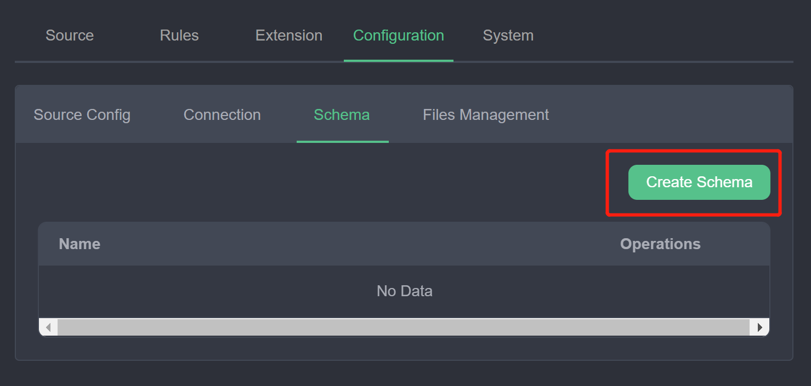

2. Enter the schema parameters:
   - **Schema Type**: `protobuf`.
   - **Schema Name**: A unique identifier (for example, `schema1`).
   - **Schema Content**: Select **Content** and paste the `.proto` text definition into the editor.

   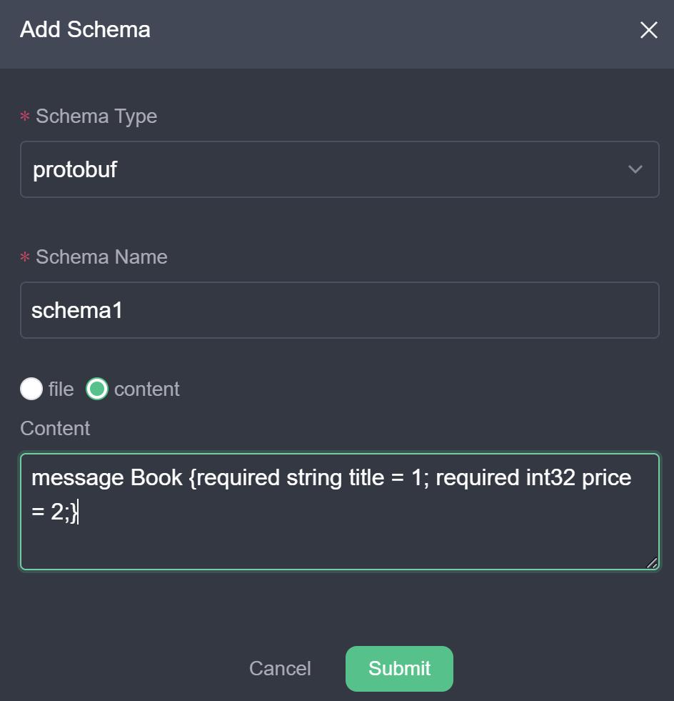

3. Click **Submit**. The new schema appears in the schema list:

   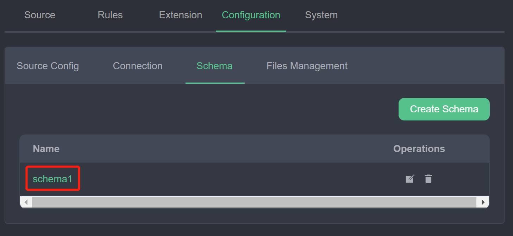

The registered schema `schema1` defines the `Book` message type for use in source and sink configurations.

## Read Protobuf Data

This section demonstrates how to ingest and decode Protobuf binary messages from an MQTT topic:

1. Create a data stream: In the management console, select **Source -> Stream** and click **Create Stream**.
2. Configure stream parameters:
   - **Stream Name**: `protoDemo`.
   - **Source Type**: `mqtt`.
   - **Data Source**: `protoDemo`.
   - **Stream Format**: `protobuf`.
   - **Schema**: `schema1`.
   - **Schema Message**: `Book`.

   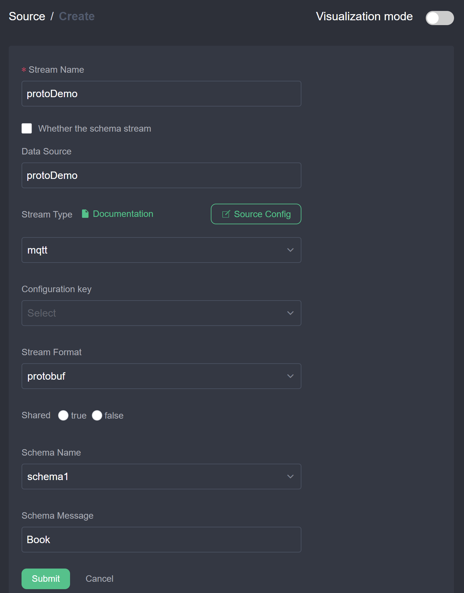

3. Create a processing rule: Select **Rules** and click **New Rule**. Switch to text mode and enter the rule configuration:

   ```json
   {
      "id": "ruleDecode",
      "sql": "SELECT * FROM protoDemo",
      "actions": [{
        "mqtt": {
          "server": "tcp://127.0.0.1:1883",
          "topic": "result/protobuf",
          "sendSingle": true
        }
      }]
   }
   ```

   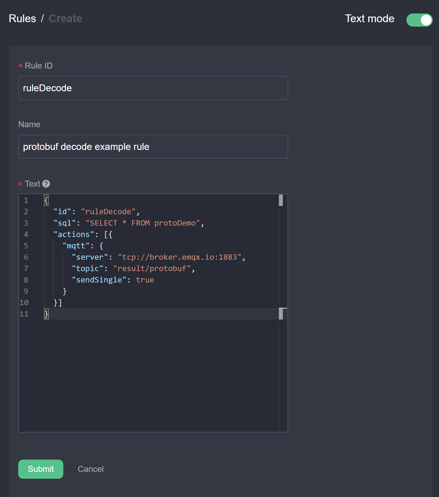

4. Verify data decoding:
   1. Connect MQTT X to `tcp://127.0.0.1:1883`.
   2. Subscribe to the output topic `result/protobuf`.
   3. Publish binary Hex data encoded according to the `Book` schema to topic `protoDemo`: `0a1073747265616d696e672073797374656d107b`.

      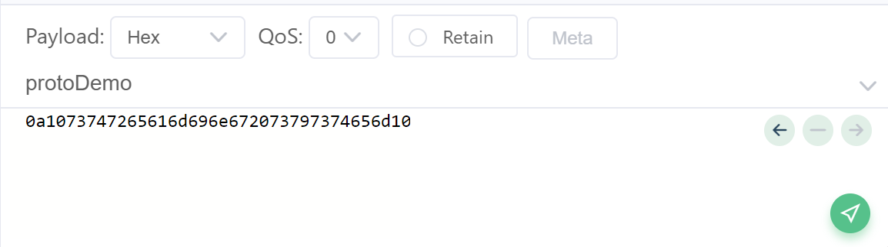

   4. Verify that the client receives the decoded JSON object on `result/protobuf`:

      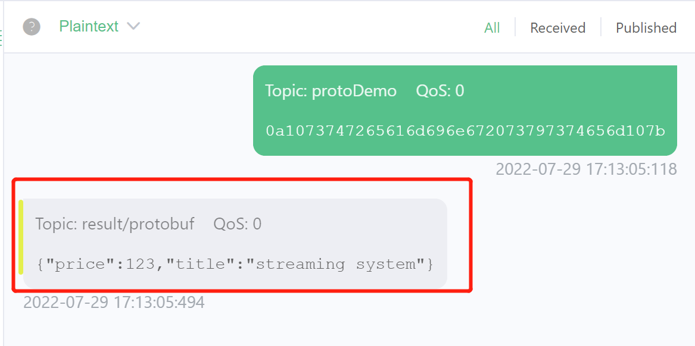

## Write Protobuf Data

This section demonstrates reading JSON records, processing data, and publishing binary Protobuf payloads to an MQTT broker to minimize transmission bandwidth:

1. Create an input stream: Select **Source -> Stream** and click **Create Stream**. Create a stream using JSON format subscribed to the `demo` topic.

   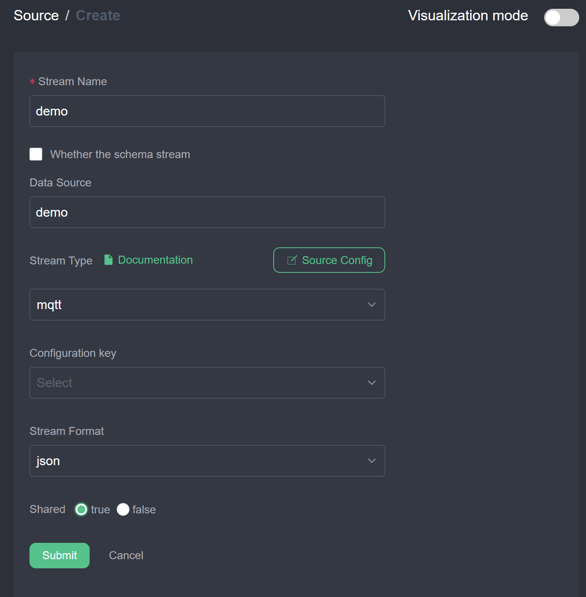

2. Create an output rule:
   1. Click **New Rule**, set Rule ID and Name, and enter query SQL: `SELECT * FROM demo`.
   2. Add an MQTT action configured for Protobuf serialization:
      - **Server**: Cloud broker address.
      - **Topic**: `result/protobufOut`.
      - **Send Single**: `true`.
      - **Format**: `protobuf`.
      - **Schema**: `schema1`.
      - **Schema Message**: `Book`.

      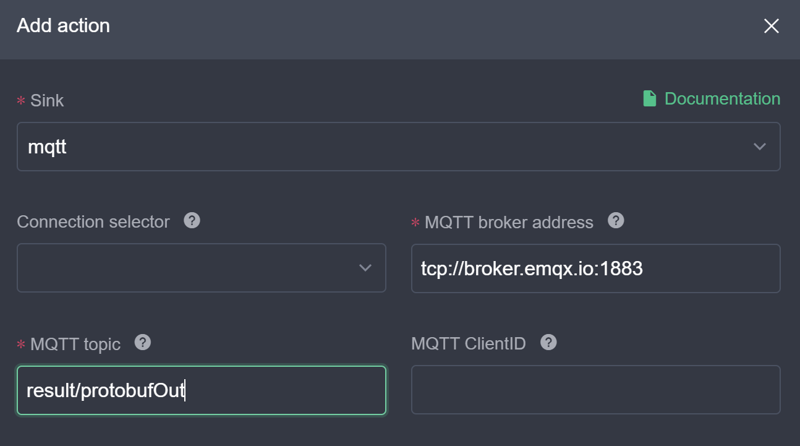
      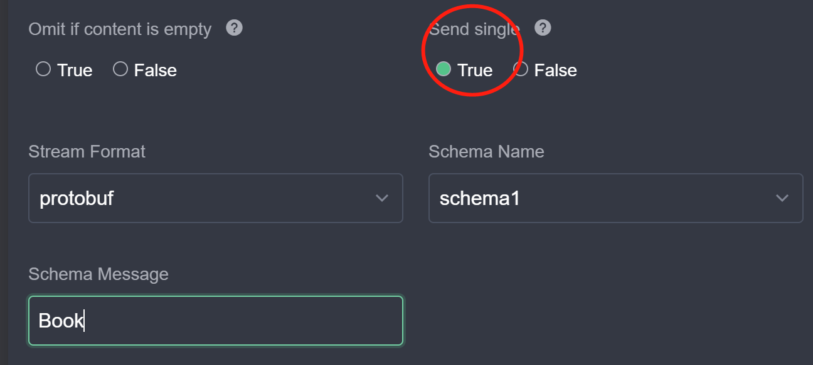

   3. Click **Submit** to activate the rule.

3. Verify binary output:
   - Subscribe to topic `result/protobufOut` in MQTT X.
   - Publish JSON records to `demo`.
   - Verify that the subscriber receives binary Protobuf payloads.

   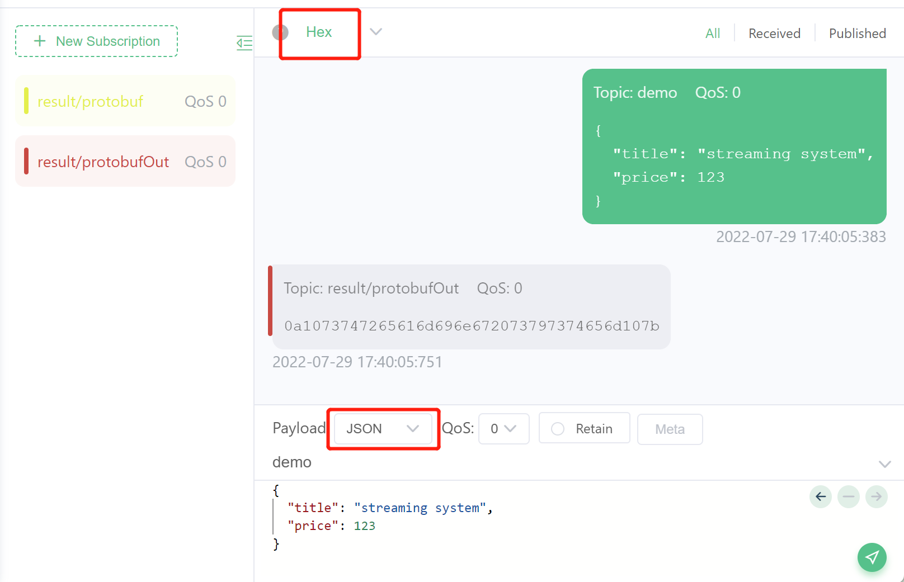

## Summary

rekuiper supports Protobuf serialization across all source and sink connectors. Define your schema in the Schema Registry, and reference the schema in stream and action definitions to encode and decode binary payloads.

## Further Reading

- [Codecs and Serialization](./serialization.md)
- [Schema Management REST API](../../api/restapi/schemas.md)
- [Schema Management CLI](../../api/cli/schemas.md)
