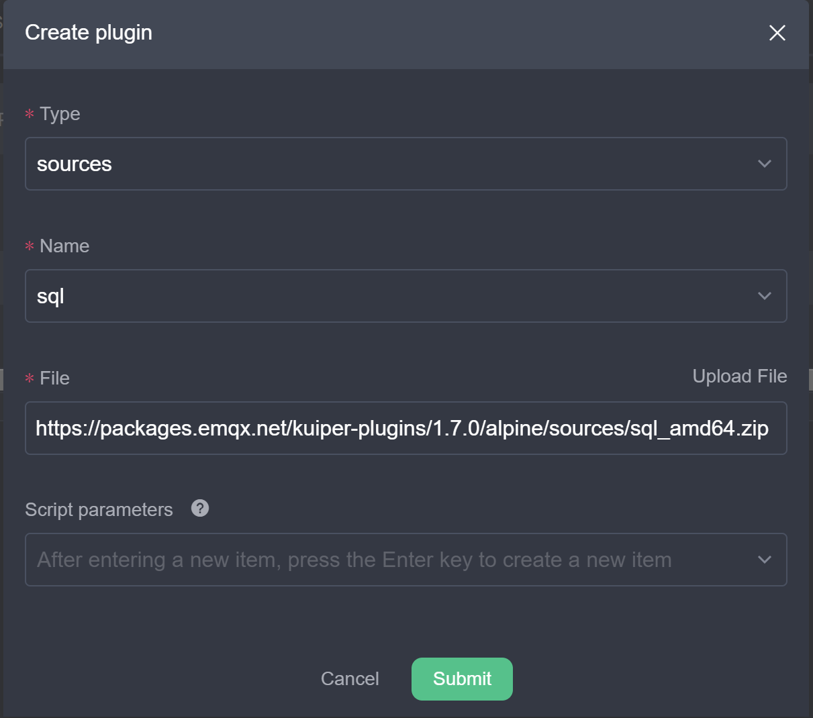

# Lookup Table Scenarios

In real-time stream processing, static reference data supplements dynamic streaming events. For example, device metadata (such as names, models, and locations) resides in a relational database, while real-time sensor measurements arrive in a continuous stream. Queries join the streaming data with external batch records to produce complete datasets.

Scan tables store small datasets in memory for fast querying. When datasets are large, or when multiple rules must access the same persistent data store, use **Lookup Tables**. Lookup tables bind directly to external systems such as Redis or SQL databases.

## Scenario 1: Dynamic Alerting

Alerting rules frequently evaluate streaming measurements against fixed thresholds. In complex edge deployments, alert thresholds change dynamically based on dimensions such as device model or operational phase.

### Scenario Inputs

This scenario uses two data inputs:

1. **Event data stream**: Real-time telemetry sent over MQTT to topic `scene1/data`.
2. **Alert threshold data**: Threshold values per device type, stored in Redis database `0`.

### Create Stream and Lookup Table

Create the data stream and the lookup table with the REST API:

1. **Create the data stream**:

   ```json
   {"sql":"CREATE STREAM demoStream() WITH (DATASOURCE=\"scene1/data\", FORMAT=\"json\", TYPE=\"mqtt\")"}
   ```

2. **Create the lookup table**:

   ```json
   {"sql":"CREATE TABLE alertTable() WITH (DATASOURCE=\"0\", TYPE=\"redis\", KIND=\"lookup\")"}
   ```

   To use a different backend storage system, replace `TYPE="redis"` with the corresponding source type, such as `sql`.

### Update the Lookup Table Dynamically

You can update alert thresholds through external applications or through rekuiper rules using updatable sinks. This section creates a rule that writes updates to the Redis lookup table.

Rule requirements for updatable sinks: The rule output must include an action command field (such as `action: "upsert"` or `action: "delete"`), a primary key field, and the updated values.

1. **Create the MQTT command stream**:

   ```json
   {"sql": "CREATE STREAM alertStream() WITH (DATASOURCE=\"scene1/alert\", FORMAT=\"json\", TYPE=\"mqtt\")"}
   ```

2. **Create the threshold update rule**:

   The rule reads command events from `alertStream` and updates Redis through the Redis sink:

   ```json
   {
     "id": "ruleUpdateAlert",
     "sql": "SELECT * FROM alertStream",
     "actions": [
       {
         "redis": {
           "addr": "127.0.0.1:6379",
           "dataType": "string",
           "field": "id",
           "rowkindField": "action",
           "sendSingle": true
         }
       }
     ]
   }
   ```

   In this configuration, `field` specifies the key column (`id`), and `rowkindField` specifies the operation command (`action`).

3. **Publish update commands to `scene1/alert`**:

   ```text
   {"action": "upsert", "id": 1, "alarm": 50}
   {"action": "upsert", "id": 2, "alarm": 80}
   {"action": "upsert", "id": 3, "alarm": 20}
   {"action": "upsert", "id": 4, "alarm": 50}
   {"action": "delete", "id": 4}
   {"action": "upsert", "id": 1, "alarm": 55}
   ```

   The rule processes incoming commands and updates the Redis database in real time.

### Create the Dynamic Alert Rule

Connect the telemetry stream to the lookup table to evaluate incoming measurements against current threshold values:

```json
{
  "id": "ruleAlert",
  "sql": "SELECT device, value FROM demoStream INNER JOIN alertTable ON demoStream.deviceKind = alertTable.id WHERE demoStream.value > alertTable.alarm",
  "actions": [
    {
      "mqtt": {
        "server": "tcp://myhost:1883",
        "topic": "rule/alert",
        "sendSingle": true
      }
    }
  ]
}
```

The rule joins `demoStream.deviceKind` to `alertTable.id`. The query retrieves `alarm` from Redis and compares `demoStream.value` against `alertTable.alarm`. When a value exceeds the threshold, the rule sends an alert payload to `rule/alert`.

Test the rule by publishing telemetry records to `scene1/data`:

```text
{"device": "device1", "deviceKind": 1, "value": 54}
{"device": "device12", "deviceKind": 2, "value": 54}
{"device": "device22", "deviceKind": 3, "value": 54}
{"device": "device2", "deviceKind": 1, "value": 54}
```

## Scenario 2: Data Enrichment

Streaming records carry high-frequency telemetry, but omit static metadata to conserve network bandwidth. Applications join the stream with database records to append missing metadata, such as device models or plant locations.

### Install and Configure the SQL Plugin

This scenario uses MySQL as the external storage backend for the lookup table. Install the SQL source plugin before creating the rule.

In the rekuiper management console, navigate to the extension management tab and install the SQL source plugin:



1. Start a MySQL instance.
2. Create the `devices` table with columns `id`, `name`, and `deviceKind`. Insert sample records.
3. Configure the SQL source connection in the rekuiper configuration file. Because SQL queries have network latency, configure cache settings to optimize lookup performance:

   ```yaml
   lookup:
     cache: true
     cacheTtl: 600
     cacheMissingKey: true
   ```

### Scenario Inputs

This scenario uses two inputs:

1. **Event data stream**: Real-time events sent to MQTT topic `scene2/data`.
2. **Device metadata table**: Static device attributes stored in MySQL table `devices`.

### Create Stream and Lookup Table

1. **Create the data stream**:

   ```json
   {"sql": "CREATE STREAM demoStream2() WITH (DATASOURCE=\"scene2/data\", FORMAT=\"json\", TYPE=\"mqtt\")"}
   ```

2. **Create the lookup table**:

   ```json
   {"sql": "CREATE TABLE deviceTable() WITH (DATASOURCE=\"devices\", CONF_KEY=\"mysql\", TYPE=\"sql\", KIND=\"lookup\")"}
   ```

### Create the Enrichment Rule

Create a rule that joins the MQTT stream with the MySQL lookup table:

```json
{
  "id": "ruleLookup",
  "sql": "SELECT * FROM demoStream2 INNER JOIN deviceTable ON demoStream2.deviceId = deviceTable.id",
  "actions": [
    {
      "mqtt": {
        "server": "tcp://myhost:1883",
        "topic": "rule/lookup",
        "sendSingle": true
      }
    }
  ]
}
```

The query matches `demoStream2.deviceId` with `deviceTable.id`. The rule appends database metadata to the incoming event and publishes the enriched record to `rule/lookup`.

## Summary

This tutorial demonstrated stream-batch hybrid processing using Redis and MySQL lookup tables. Lookup tables combine real-time event streams with external reference data to enable dynamic alerting and data enrichment.
