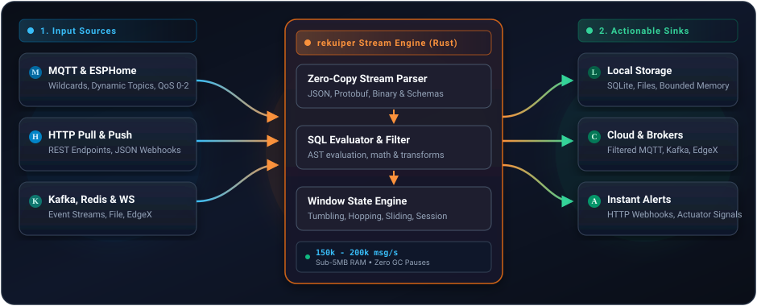

# rekuiper

> High-performance stream processing engine for edge devices, written in Rust.

[](https://github.com/ankur-paan/rekuiper/releases)
[](https://github.com/ankur-paan/rekuiper/actions/workflows/ci.yml)
[](https://github.com/ankur-paan/rekuiper/blob/main/LICENSE)
[](https://hub.docker.com/r/ankurkrp/rekuiper)

rekuiper is a stream processing engine for edge devices, written in Rust. It implements eKuiper's REST API, SQL dialect, rule format, and `kuiper` CLI, so existing eKuiper streams, rules, and tools (including [eKuiper Manager](https://github.com/ankur-paan/ekuiper-manager)) work against it without changes.

We built it for IIoT gateways, ESPHome fleets, vehicles, and EV chargers: small machines that take in MQTT, HTTP, or WebSocket telemetry and need to filter, aggregate, and forward it reliably on one or two cores.

---

## How It Works

rekuiper processes live telemetry on the local machine before sending data upstream:


1. **Ingest**: Read continuous sensor streams via standard protocols (MQTT, HTTP, WebSockets, Kafka, Files).
2. **Process**: Filter noise, compute moving averages, and correlate events across time windows with SQL.
3. **Route**: Forward clean anomalies, aggregated metrics, or control commands directly to local databases, brokers, or webhook endpoints.

---

## Why rekuiper?

| Feature | rekuiper (Rust) | eKuiper (Go) | Details |
| :--- | :--- | :--- | :--- |
| **Throughput** | **150k to 200k msg/s** | 20k msg/s | 7.5x to 10x higher throughput on a single CPU core |
| **Memory Footprint** | **4.4 to 6.4 MiB** | 15 to 536 MiB | Stays small under load, suitable for low-memory edge devices |
| **Garbage Collection** | **Zero GC** | GC pauses (Go runtime) | Predictable execution without GC pauses or dropped packets |
| **Binary Deployment** | **Single static binary** | Dynamic Go runtime | Single binary with no external runtime dependencies |
| **Compatibility** | **Wire-compatible** | Reference implementation | Works with existing eKuiper REST API, SQL syntax, and CLI |
| **AI Integration** | **Native MCP Server** | Not available | Allows AI assistants (Cursor, Claude, Antigravity) to query and manage rules |

---

## Performance

We benchmark rekuiper against eKuiper 2.4.1, Telegraf 1.40.0, and Redpanda Connect 4.109.0 on five MQTT workloads. Each engine runs on one CPU core with 1 GiB memory against the same Mosquitto broker. Correctness is verified at the sink.

* **Highest tested rate with exact, loss-free results:**
  * Telemetry filter (1,000 devices): **150k msg/s** (eKuiper: 20k msg/s)
  * 10-second window per device: **200k msg/s** (eKuiper: 20k msg/s)
  * ESPHome (10,000 topics, `meta(topic)`): **150k msg/s** (eKuiper: 20k msg/s)
  * EV charger sessions (`SESSIONWINDOW`): **126k msg/s** (eKuiper: 20k msg/s)

* **Resource usage at 20,000 msg/s:**
  * CPU utilization: **41% to 50%** of one core (eKuiper: 86% to 99%)
  * Memory footprint: **4.4 to 6.4 MiB** (eKuiper: 15 to 536 MiB)

---

## Quickstart

Run rekuiper in Docker:

```shell
docker run -d \
  --name rekuiper \
  -p 9081:9081 \
  -p 20498:20498 \
  -p 20499:20499 \
  ankurkrp/rekuiper:0.503-beta
```

Check health:

```shell
curl http://localhost:9081/ping
# Response: pong
```

Create a data stream:

```shell
curl -X POST http://localhost:9081/streams \
  -H "Content-Type: application/json" \
  -d '{"sql": "CREATE STREAM demo () WITH (DATASOURCE=\"demo\", FORMAT=\"JSON\")"}'
```

Create a rule to log events when temperature exceeds 30:

```shell
curl -X POST http://localhost:9081/rules \
  -H "Content-Type: application/json" \
  -d '{
    "id": "rule_temp_alert",
    "sql": "SELECT temperature, humidity FROM demo WHERE temperature > 30",
    "actions": [{ "log": {} }]
  }'
```

Send test data:

```shell
curl -X POST http://localhost:9081/streams/demo/data \
  -H "Content-Type: application/json" \
  -d '{"temperature": 34.5, "humidity": 60.2}'
```

Check rule status:

```shell
curl http://localhost:9081/rules/rule_temp_alert/status
```

---

## Key Capabilities

* **Stream SQL**: Filter, project, join, and aggregate live data streams with tumbling, hopping, sliding, count, and session windows.
* **Connectors**:
  * **Sources**: MQTT, HTTP (Pull and Push), WebSockets, File, Memory, Redis, Kafka, Simulator, SQL.
  * **Sinks**: MQTT, HTTP/REST, Log, File, Memory, Redis, Kafka, WebSockets, Nop, SQL.
* **Model Context Protocol (MCP)**: Native `rekuiper-mcp` server allows AI coding assistants to validate SQL queries offline, test rule events, and inspect streaming topologies.
* **Web UI**: Compatible with [eKuiper Manager](https://github.com/ankur-paan/ekuiper-manager) for visual stream, rule, and connector setup.

---

## Documentation

* [Architecture & Rust Design](./concepts/ekuiper.md)
* [Getting Started Guide](./getting_started/getting_started.md)
* [Installation & Deployment](./installation.md)
* [SQL Reference & Functions](./sqls/overview.md)
* [Source & Sink Connectors](./guide/sources/overview.md)
* [REST API Reference](./api/restapi/overview.md)
* [kuiper CLI Reference](./api/cli/overview.md)
* [Model Context Protocol (MCP)](./mcp/overview.md)
