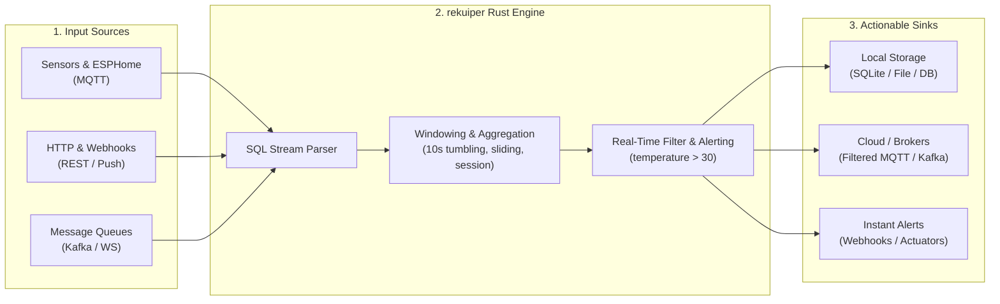

# rekuiper

> **High-Performance Stream Processing Engine for Edge Devices in Rust**

[](https://github.com/ankur-paan/rekuiper/releases)
[](https://github.com/ankur-paan/rekuiper/actions/workflows/ci.yml)
[](https://github.com/ankur-paan/rekuiper/blob/main/LICENSE)
[](https://hub.docker.com/r/ankurkrp/rekuiper)

**rekuiper** is a lightweight, ultra-fast streaming SQL engine written in Rust. It serves as a **100% drop-in replacement** for eKuiper's REST API, SQL dialect, rule specifications, and `kuiper` CLI. Existing eKuiper streams, rules, and visualization dashboards—including [eKuiper Manager](https://github.com/ankur-paan/ekuiper-manager)—run against rekuiper without modification.

Built specifically for resource-constrained environments—**IIoT gateways, ESPHome fleets, connected vehicles, and EV chargers**—rekuiper ingests high-frequency MQTT, HTTP, and WebSocket telemetry and filters, transforms, and routes it with sub-millisecond latency on a single CPU core.

---

## How It Works

Think of **rekuiper** as a high-speed traffic controller for IoT sensor data right on your device:



1. **Listen**: Ingest continuous sensor streams via standard protocols (MQTT, HTTP, WebSockets, Kafka, Files).
2. **Process**: Filter noise, calculate moving averages, and correlate events across time windows using familiar SQL syntax.
3. **Act**: Route clean anomalies, aggregated metrics, or control commands directly to local databases, cloud brokers, or webhook endpoints.

---

## Why rekuiper?

| Feature | rekuiper (Rust) | eKuiper (Go) | Why It Matters |
| :--- | :--- | :--- | :--- |
| **Throughput** | **150k – 200k msg/s** | 20k msg/s | **7.5x – 10x higher throughput** on a single CPU core |
| **Memory Footprint** | **4.4 – 6.4 MiB** | 15 – 536 MiB | Never runs out of memory on low-cost edge gateways |
| **Garbage Collection** | **Zero GC** (Deterministic) | GC Pauses (Go runtime) | Eliminates latency spikes and dropped sensor packets |
| **Binary Deployment** | **Single static binary** | Dynamic Go runtime | Minimal attack surface; zero external dependencies |
| **Compatibility** | **100% Wire-Compatible** | Upstream Reference | Drop-in replacement for REST API, SQL syntax, and CLI |
| **AI Integration** | **Native MCP Server** | Not Available | AI assistants (Cursor, Claude, Antigravity) can manage rules |

---

## Performance Highlights

In audited benchmark ladders comparing engines on a single CPU core with 1 GiB RAM against an identical Mosquitto broker:

* **Highest Tested Rate with Exact, Loss-Free Result:**
  * **Telemetry filter (1,000 devices):** rekuiper reaches **150k msg/s** (eKuiper caps at 20k msg/s).
  * **10-second window per device:** rekuiper reaches **200k msg/s** (eKuiper caps at 20k msg/s).
  * **ESPHome (10,000 topics, `meta(topic)`):** rekuiper reaches **150k msg/s** (eKuiper caps at 20k msg/s).
  * **EV charger sessions (`SESSIONWINDOW`):** rekuiper reaches **126k msg/s** (eKuiper caps at 20k msg/s).

* **Resource Usage at 20,000 msg/s:**
  * **CPU utilization:** **41% – 50%** of one core (eKuiper: 86% – 99%).
  * **Memory footprint:** **4.4 – 6.4 MiB** (eKuiper: 15 – 536 MiB).

---

## 5-Minute Quickstart

Run rekuiper in a single Docker command with standard network ports exposed:

```shell
docker run -d \
  --name rekuiper \
  -p 9081:9081 \
  -p 20498:20498 \
  -p 20499:20499 \
  ankurkrp/rekuiper:0.502-beta
```

Check health:

```shell
curl http://localhost:9081/ping
# Response: pong
```

Create your first data stream:

```shell
curl -X POST http://localhost:9081/streams \
  -H "Content-Type: application/json" \
  -d '{"sql": "CREATE STREAM demo () WITH (DATASOURCE=\"demo\", FORMAT=\"JSON\")"}'
```

Create a rule to log events when temperature exceeds 30°C:

```shell
curl -X POST http://localhost:9081/rules \
  -H "Content-Type: application/json" \
  -d '{
    "id": "rule_temp_alert",
    "sql": "SELECT temperature, humidity FROM demo WHERE temperature > 30",
    "actions": [{ "log": {} }]
  }'
```

Push test telemetry directly:

```shell
curl -X POST http://localhost:9081/streams/demo/data \
  -H "Content-Type: application/json" \
  -d '{"temperature": 34.5, "humidity": 60.2}'
```

Inspect rule execution metrics:

```shell
curl http://localhost:9081/rules/rule_temp_alert/status
```

---

## Key Capabilities

* **Standard SQL Stream Processing**: Filter, project, join, and aggregate live data streams with support for tumbling, hopping, sliding, count, and session windows.
* **Extensive Connector Ecosystem**:
  * **Sources**: MQTT, HTTP (Pull & Push), WebSockets, File, Memory, Redis, Kafka, Simulator, SQL.
  * **Sinks**: MQTT, HTTP/REST, Log, File, Memory, Redis, Kafka, WebSockets, Nop, SQL.
* **Model Context Protocol (MCP)**: Native `rekuiper-mcp` server enables AI coding assistants and autonomous agents to validate SQL queries offline, simulate rule events, and manage streaming topologies.
* **Web Management Dashboard**: Full compatibility with the open-source [eKuiper Manager](https://github.com/ankur-paan/ekuiper-manager) for visual stream, rule, and connector management.

---

## Explore the Documentation

* [Architecture & Rust Design](./concepts/ekuiper.md)
* [Getting Started Guide](./getting_started/getting_started.md)
* [Installation & Deployment](./installation.md)
* [SQL Reference & Functions](./sqls/overview.md)
* [Source & Sink Connectors](./guide/sources/overview.md)
* [REST API Reference](./api/restapi/overview.md)
* [kuiper CLI Reference](./api/cli/overview.md)
* [Model Context Protocol (MCP)](https://github.com/ankur-paan/rekuiper/tree/main/crates/rekuiper-mcp)
