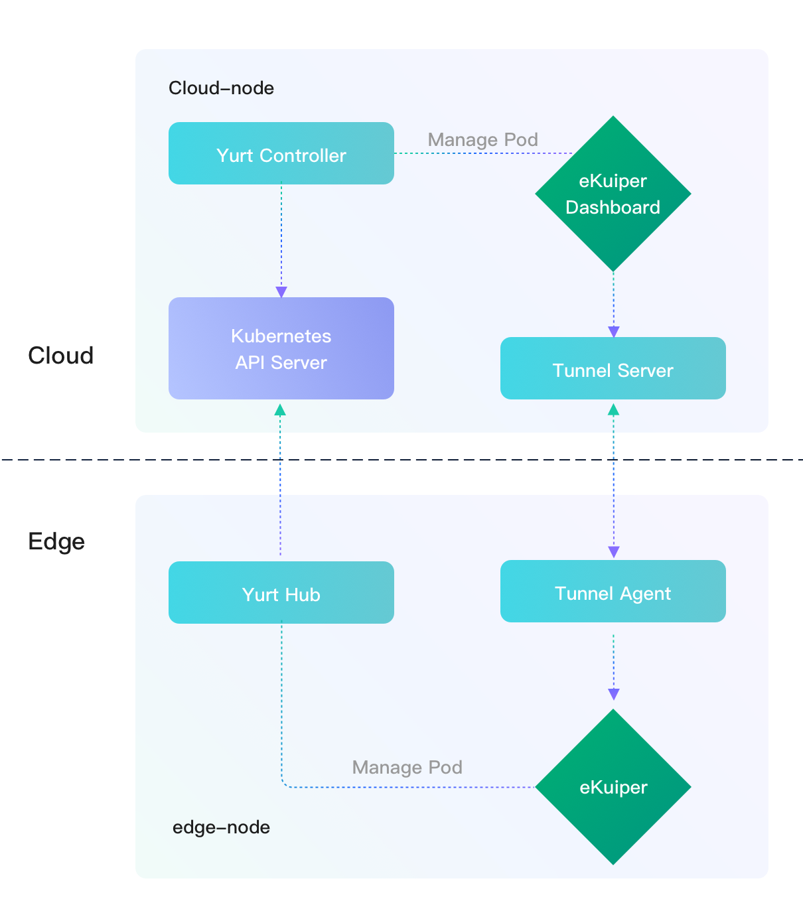
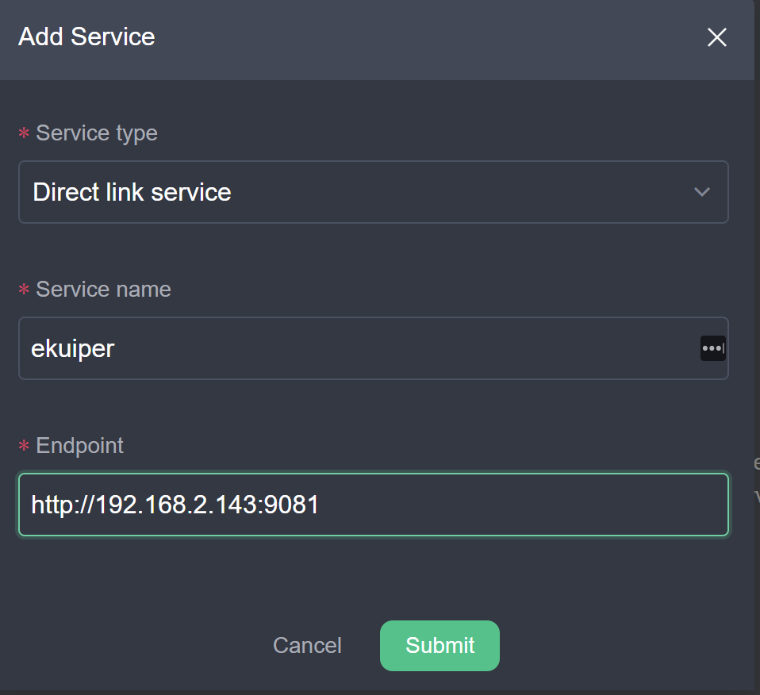
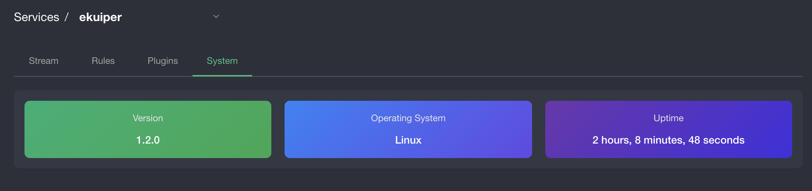

# Deploy and Manage rekuiper with OpenYurt

LF Edge rekuiper is lightweight IoT data analytics and streaming software that usually runs at the edge. A [manager dashboard](../../operation/manager-ui/overview.md) manages one or more rekuiper instances. The dashboard usually deploys on a cloud node to manage rekuiper instances across multiple edge nodes.

In many environments, the cloud node cannot access the edge node directly because of firewall or network security boundaries. This condition prevents direct cloud-to-edge management. [OpenYurt](https://github.com/openyurtio/openyurt) resolves this problem. OpenYurt extends native Kubernetes to support edge computing architectures. OpenYurt enables users to manage edge applications as if they run in the cloud infrastructure.

In this tutorial, you deploy rekuiper and the web dashboard in an OpenYurt cluster. You configure a Yurt tunnel to manage the edge instance from the cloud. The tutorial uses a two-node Kubernetes cluster. The rekuiper instance runs on the edge node. The manager dashboard runs on the cloud node.



## Prerequisites

Both the cloud node and the edge node require Kubernetes and its dependencies. The cloud node also requires OpenYurt and Helm to deploy rekuiper.

Ensure that the network configuration meets these requirements:
- The cloud node has an external IP address that the edge node can access.
- The edge node resides on an internal network that the cloud node cannot access directly.

### Install Components on the Cloud Node

1. Install `kubeadm` and a container runtime such as Docker Engine. Refer to the [official kubeadm installation documentation](https://kubernetes.io/docs/setup/production-environment/tools/kubeadm/install-kubeadm/) for details.
   
   ::: tip
   OpenYurt does not support Kubernetes versions greater than 1.20. Install version 1.20.x or earlier.
   :::

   On Debian or Ubuntu systems, install the packages with this command:

   ```shell
   sudo apt-get install -y kubelet=1.20.8-00 kubeadm=1.20.8-00 kubectl=1.20.8-00
   ```

2. [Install Golang](https://golang.org/doc/install) and [build OpenYurt](https://github.com/openyurtio/openyurt#getting-started).

3. [Install Helm](https://helm.sh/docs/intro/install/) to deploy rekuiper through Helm charts.

This tutorial uses the hostname `cloud-node` for the cloud host. If you use a different hostname, replace `cloud-node` in all commands.

### Install Components on the Edge Node

Install `kubeadm` on the edge node.

This tutorial uses the hostname `edge-node` for the edge host. If you use a different hostname, replace `edge-node` in all commands.

## Set Up the Kubernetes Cluster

Initialize the Kubernetes cluster with `kubeadm` and join the edge node to the cluster.

Assume the external IP address of the cloud node is `34.209.219.149`. Run this command on the cloud node:

```shell
sudo kubeadm init --control-plane-endpoint 34.209.219.149 --kubernetes-version stable-1.20
```

The output shows initialization details similar to this example:

```shell
[init] Using Kubernetes version: v1.20.8
...
Your Kubernetes control-plane has initialized successfully!

To start using your cluster, you need to run the following as a regular user:

  mkdir -p $HOME/.kube
  sudo cp -i /etc/kubernetes/admin.conf $HOME/.kube/config
  sudo chown $(id -u):$(id -g) $HOME/.kube/config

Alternatively, if you are the root user, you can run:

  export KUBECONFIG=/etc/kubernetes/admin.conf

You should now deploy a pod network to the cluster.
Run "kubectl apply -f [podnetwork].yaml" with one of the options listed at:
  https://kubernetes.io/docs/concepts/cluster-administration/addons/

You can now join any number of control-plane nodes by copying certificate authorities
and service account keys on each node and then running the following as root:

  kubeadm join 34.209.219.149:6443 --token i24p5i.nz1feykoggszwxpq \
    --discovery-token-ca-cert-hash sha256:3aacafdd44d1136808271ad4aafa34e5e9e3553f3b6f21f972d29b8093554325 \
    --control-plane

Then you can join any number of worker nodes by running the following on each as root:

kubeadm join 34.209.219.149:6443 --token i24p5i.nz1feykoggszwxpq \
    --discovery-token-ca-cert-hash sha256:3aacafdd44d1136808271ad4aafa34e5e9e3553f3b6f21f972d29b8093554325
```

The command sets the external IP address as the control plane endpoint so that the edge node can access it.

Configure `kubeconfig` according to the instructions in the command output. Copy the `kubeadm join` command for use on the edge node.

On the edge node, run the join command:

```shell
sudo kubeadm join 34.209.219.149:6443 --token i24p5i.nz1feykoggszwxpq \
    --discovery-token-ca-cert-hash sha256:3aacafdd44d1136808271ad4aafa34e5e9e3553f3b6f21f972d29b8093554325
```

Return to the cloud node and verify that both nodes appear in the cluster:

```shell
kubectl get nodes -o wide
```

Example output:

```shell
NAME         STATUS     ROLES                  AGE   VERSION   INTERNAL-IP     EXTERNAL-IP   OS-IMAGE             KERNEL-VERSION     CONTAINER-RUNTIME
cloud-node   NotReady   control-plane,master   17m   v1.20.8   172.31.6.118    <none>        Ubuntu 20.04.2 LTS   5.4.0-1045-aws     docker://20.10.7
edge-node    NotReady   <none>                 17s   v1.20.8   192.168.2.143   <none>        Ubuntu 20.04.2 LTS   5.4.0-77-generic   docker://20.10.7
```

If the node status displays `NotReady`, install a Kubernetes network add-on as described in the [Kubernetes add-on documentation](https://kubernetes.io/docs/concepts/cluster-administration/addons/). For example, install Weave Net:

```shell
kubectl apply -f "https://cloud.weave.works/k8s/net?k8s-version=$(kubectl version | base64 | tr -d '\n')"
```

Wait several minutes and run `kubectl get nodes -o wide`. Both nodes should transition to the `Ready` status.

### Configure Access to the Cloud Node

If the internal IP address of `cloud-node` is not accessible from the edge node, configure address forwarding. In many cloud environments such as AWS, the virtual machine does not assign the external IP directly to the network interface. You can add `iptables` rules to forward internal IP traffic to the external IP.

Assume the internal IP address of the cloud node is `172.31.0.236`. Run this command on the cloud node:

```shell
sudo iptables -t nat -A OUTPUT -d 172.31.0.236 -j DNAT --to-destination 34.209.219.149
```

Run this command on the edge node:

```shell
sudo iptables -t nat -A OUTPUT -d 172.31.0.236 -j DNAT --to-destination 34.209.219.149
```

Verify that the edge node can reach the address:

```shell
ping 172.31.0.236
```

## Deploy rekuiper on the Edge Node

Use the rekuiper Helm chart to deploy rekuiper on the edge node.

1. Clone the repository and navigate to the chart directory:

   ```shell
   git clone https://github.com/ankur-paan/rekuiper.git
   cd rekuiper/deploy/chart/ekuiper
   ```

2. Modify `template/StatefulSet.yaml` around line 38 to add `nodeName` and `hostNetwork`:

   ```yaml
   ...
   spec:
      nodeName: edge-node
      hostNetwork: true
      volumes:
           {{- if not .Values.persistence.enabled }}
   ...
   ```

   Replace `edge-node` with your actual edge node hostname if it differs.

3. Deploy rekuiper with Helm:

   ```shell
   helm install ekuiper .
   ```

4. Verify that the services run:

   ```shell
   kubectl get services
   ```

   Example output:

   ```shell
   NAME               TYPE        CLUSTER-IP       EXTERNAL-IP   PORT(S)              AGE
   ekuiper            ClusterIP   10.99.57.211     <none>        9081/TCP,20498/TCP   22h
   ekuiper-headless   ClusterIP   None             <none>        <none>               22h
   ```

5. Verify that the pod runs on `edge-node`:

   ```shell
   kubectl get pods -o wide
   ```

   Example output:

   ```shell
   NAME                        READY   STATUS    RESTARTS   AGE   IP           NODE           NOMINATED NODE   READINESS GATES
   ekuiper-0                   1/1     Running   0          22h   10.244.1.3   edge-node   <none>           <none>
   ```

6. The rekuiper REST service listens on port `9081`. Test the connection from the edge node, where `192.168.2.143` is the edge node intranet IP address:

   ```shell
   curl http://192.168.2.143:9081
   ```

   Example response:

   ```json
   {"version":"1.2.0","os":"linux","upTimeSeconds":81317}
   ```

## Deploy the Web Dashboard on the Cloud Node

Deploy the rekuiper dashboard on the cloud node by using `kubectl` with the [kmanager.yaml](https://github.com/lf-edge/ekuiper/blob/master/docs/en_US/tutorials/deploy/kmanager.yaml) manifest. The manifest defines a Deployment and a Service for the rekuiper manager web UI.

1. Verify that the container image tag in `kmanager.yaml` matches the rekuiper version:

   ```yaml
   ...
   containers:
      - name: kmanager
        image: ankur-paan/ekuiper-manager:latest
   ...
   ```

2. Apply the manifest:

   ```shell
   kubectl apply -f kmanager.yaml
   ```

3. Check the service status:

   ```shell
   kubectl get svc
   ```

   Example output:

   ```shell
   NAME               TYPE        CLUSTER-IP      EXTERNAL-IP   PORT(S)              AGE
   ekuiper            ClusterIP   10.99.57.211    <none>        9081/TCP,20498/TCP   120m
   ekuiper-headless   ClusterIP   None            <none>        <none>               120m
   kmanager-http      NodePort    10.99.154.153   <none>        9082:32555/TCP       15s
   kubernetes         ClusterIP   10.96.0.1       <none>        443/TCP              33h
   ```

4. The dashboard service listens on NodePort `32555`. Open `http://34.209.219.149:32555` in your browser. Log in with the default credentials: `admin` / `public`.

5. Register the edge rekuiper service in the dashboard:
   - Click **Add Service** and complete the form.

     

   - Click the service name `ekuiper` and open the **system** tab.
   - The connection fails and displays an error. The address `http://192.168.2.143:9081/` is an internal edge address that the cloud node cannot access directly.

The next section configures a Yurt tunnel to enable cloud-to-edge management.

## Set Up the Yurt Tunnel

OpenYurt provides a reverse tunnel for secure communication between the cloud and the edge node. Because the dashboard must reach port `9081` on the edge node, configure port forwarding in the Yurt tunnel.

1. On the cloud node, open `openyurt/config/setup/yurt-tunnel-server.yaml`. Under ConfigMap `yurt-tunnel-server-cfg`, set `dnat-ports-pair`:

   ```yaml
   apiVersion: v1
   kind: ConfigMap
   metadata:
     name: yurt-tunnel-server-cfg
     namespace: kube-system
   data:
     dnat-ports-pair: "9081=10264"
   ```

2. If the cloud node does not have a public IP directly on its interface, add `--cert-ips` with the external IP address:

   ```yaml
   ...
   args:
     - --bind-address=$(NODE_IP)
     - --insecure-bind-address=$(NODE_IP)
     - --proxy-strategy=destHost
     - --v=2
     - --cert-ips=34.209.219.149
   ...
   ```

3. Convert the Kubernetes cluster to an OpenYurt cluster:

   ```shell
   _output/bin/yurtctl convert --cloud-nodes cloud-node --provider kubeadm
   ```

4. Label the cloud node and deploy the tunnel server:

   ```shell
   kubectl label nodes cloud-node openyurt.io/is-edge-worker=false
   kubectl apply -f config/setup/yurt-tunnel-server.yaml
   ```

5. Label the edge node and deploy the tunnel agent:

   ```shell
   kubectl label nodes edge-node openyurt.io/is-edge-worker=true
   kubectl apply -f config/setup/yurt-tunnel-agent.yaml
   ```

6. After the server and agent pods run, return to the web dashboard in your browser. Click the service name `ekuiper` and open the **system** tab. The service status reports healthy:

   

You can now manage the edge rekuiper instance from the cloud dashboard. Refer to the [manager UI tutorial](../../operation/manager-ui/overview.md) to manage streams, rules, and plugins.

## Related Resources

- [eKuiper GitHub Repository](https://github.com/lf-edge/ekuiper/)
- [eKuiper Reference Guide](https://github.com/lf-edge/ekuiper/blob/edgex/docs/en_US/reference.md)
- [OpenYurt Tutorials](https://github.com/openyurtio/openyurt/tree/master/docs/tutorial)
- [eKuiper Manager UI Guide](../../operation/manager-ui/overview.md)
