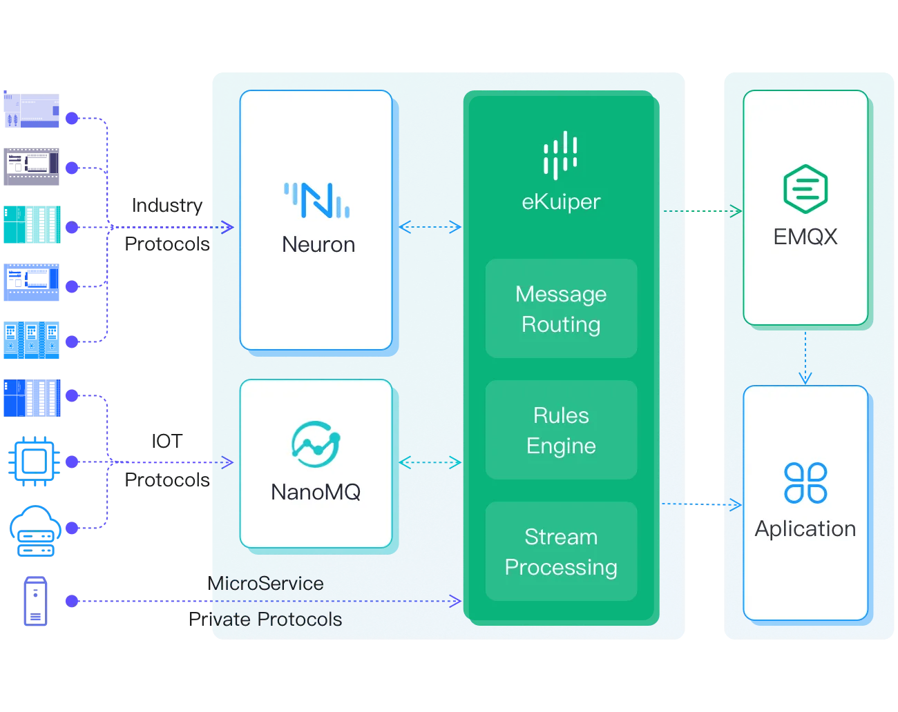

# Edge-to-Cloud Streaming

Edge-to-cloud architectures connect local stream processing with cloud storage, analytics platforms, and central message brokers. In industrial IoT (IIoT), connected vehicles (IoV), and smart infrastructure, processing streams at the edge reduces network bandwidth, ensures sub-millisecond local responses, and secures sensitive operational data.

## Architecture Overview

An edge-to-cloud topology contains these stages:

1. **Edge Ingestion**: Devices, PLCs, and sensors publish telemetry locally through industrial protocols (such as Modbus and OPC UA) or local brokers (such as Mosquitto and NanoMQ).
2. **Edge Stream Processing**: rekuiper ingests telemetry locally, executes SQL rules, filters noisy sensor data, calculates windowed aggregates, and detects anomalies.
3. **Upstream Forwarding**: The system forwards only relevant alerts, filtered anomalies, or aggregated metrics across WAN connections to central brokers or cloud platforms (such as Kafka, cloud MQTT brokers, or data lakes).
4. **Cloud Control and Feedback**: Central controllers transmit commands, configuration updates, or dynamic SQL rules back to edge instances through REST APIs or MQTT command topics.

## Supported Protocols and Brokers

rekuiper connects to standard MQTT 3.1.1 and MQTT 5.0 brokers and message systems:

- **Local Edge Brokers**: Mosquitto, NanoMQ, or local IPC sockets.
- **Central Cloud Brokers**: Open-source brokers (such as Mosquitto and EMQX), managed cloud IoT brokers (such as AWS IoT Core and Azure IoT Hub), or Apache Kafka clusters.
- **Industrial Gateways**: Protocol translators such as EdgeX Foundry for PLC and Modbus connectivity.
