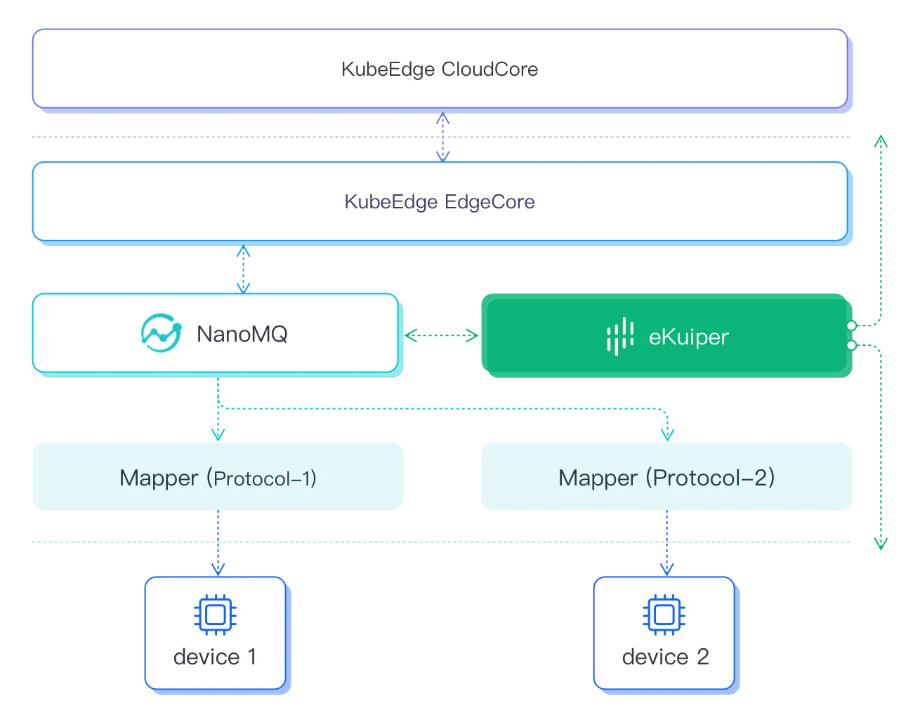

# Analytic Engine for KubeEdge

[KubeEdge](https://kubeedge.io/) is an open-source system that extends native containerized application orchestration to edge hosts.

As a Kubernetes-compliant platform, KubeEdge supports containerized deployment of rekuiper instances. Refer to the [installation guide](../../installation.md#install-via-helm--k8sk3s-) for instructions to install rekuiper in Kubernetes environments.

The edge layer of KubeEdge uses MQTT for communication between device twins and physical devices. To operate KubeEdge in dual MQTT mode or external broker mode, configure NanoMQ as the edge MQTT broker.

rekuiper ingests device telemetry directly from the MQTT broker. It provides stream processing and analytics capabilities for KubeEdge components to deliver low-latency computation at the edge.
