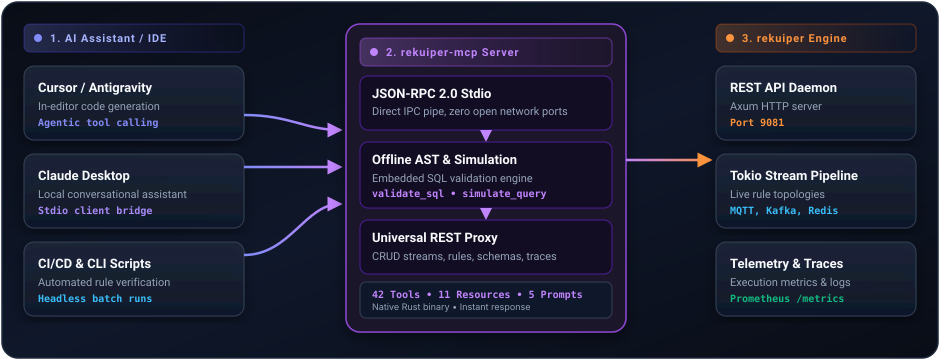

# Model Context Protocol (MCP) Server

rekuiper includes a native Rust [Model Context Protocol (MCP)](https://modelcontextprotocol.io/) server (`rekuiper-mcp`). It connects AI coding assistants and autonomous agents directly to the rekuiper stream processing engine over standard JSON-RPC 2.0 stdio transport.

Using `rekuiper-mcp`, assistants such as Antigravity IDE, Cursor, Claude Desktop, and Continue.dev can validate streaming SQL offline, simulate rule execution against mock event payloads, inspect execution DAGs, and manage live streams directly.

## Architecture

`rekuiper-mcp` acts as a protocol bridge between AI development environments and the rekuiper engine:



### Stdio Communication Discipline

The server transmits JSON-RPC frames exclusively through standard input (`stdin`) and standard output (`stdout`). All diagnostic logging, connection notices, and error messages route to standard error (`stderr`) to prevent protocol frame corruption.

## Client Setup and Configuration

Add `rekuiper-mcp` to your MCP client configuration file:

### 1. Antigravity IDE / Cursor (`mcp_config.json` or `.cursor/mcp.json`)

```json
{
  "mcpServers": {
    "rekuiper": {
      "command": "rekuiper-mcp",
      "args": [
        "--server-url",
        "http://127.0.0.1:9081"
      ],
      "env": {
        "RUST_LOG": "info"
      }
    }
  }
}
```

### 2. Claude Desktop (`claude_desktop_config.json`)

Path on macOS: `~/Library/Application Support/Claude/claude_desktop_config.json`  
Path on Windows: `%APPDATA%\Claude\claude_desktop_config.json`

```json
{
  "mcpServers": {
    "rekuiper": {
      "command": "/usr/local/bin/rekuiper-mcp",
      "args": [
        "--server-url",
        "http://127.0.0.1:9081"
      ]
    }
  }
}
```

### 3. Windows via WSL

When the rekuiper daemon runs inside WSL2 or Docker:

```json
{
  "mcpServers": {
    "rekuiper": {
      "command": "wsl",
      "args": [
        "/usr/local/bin/rekuiper-mcp",
        "--server-url",
        "http://127.0.0.1:9081"
      ]
    }
  }
}
```

## Tool Capabilities

`rekuiper-mcp` exposes 46 tools across seven operational categories:

### 1. SQL Intelligence and Offline Simulation

These tools use the embedded `rekuiper-sql` parser and evaluation engine in memory without network calls to the running daemon:

| Tool | Purpose |
| :--- | :--- |
| `validate_sql` | Parses SQL abstract syntax trees, checks keywords, and validates streaming DDL syntax (including `BUFFER_FULL_POLICY`) offline. |
| `test_sql_expression` | Executes queries against mock JSON event payloads in memory, supporting vector search (`cosine_similarity`), array operations (`array_positions`), and stateful analytics (`acc_distinct_collect`, `lead`). |
| `explain_sql` | Deconstructs a SQL query into sources, projections, joins, window clauses, and filters. |

#### Example: Offline Simulation

Ask your AI assistant:

> "Test if `SELECT cosine_similarity(embedding, [0.1, 0.4, 0.9]) AS sim FROM demo WHERE cosine_similarity(embedding, [0.1, 0.4, 0.9]) > 0.85` matches payload `{\"embedding\": [0.12, 0.39, 0.88]}`."

The assistant invokes `test_sql_expression` and evaluates the output in memory without sending data to an external broker.

### 2. Stream and Table DDL Management

| Tool | Purpose |
| :--- | :--- |
| `list_streams` | Lists all active stream definitions in the catalog. |
| `get_stream` | Inspects stream schema, serialization format (JSON or Protobuf), and data source options. |
| `create_stream` | Executes a `CREATE STREAM` statement. |
| `delete_stream` | Drops an existing stream definition from the catalog. |
| `push_stream_data` | Ingests test events directly into a stream endpoint. |
| `list_tables` | Lists all dimension and lookup tables. |
| `create_table` | Registers an external lookup table (File, SQLite, Redis, or Memory). |
| `delete_table` | Drops a dimension table from the catalog. |
| `push_table_data` | Inserts or updates records in a lookup table. |

### 3. Rule Lifecycle and DAG Inspection

| Tool | Purpose |
| :--- | :--- |
| `list_rules` | Lists all deployed rules and their runtime execution states. |
| `get_rule` | Retrieves complete rule JSON (query, sinks, QoS, and checkpoint settings). |
| `create_rule` | Deploys a new streaming rule topology. |
| `update_rule` | Modifies SQL logic or action sinks for an active rule. |
| `start_stop_rule` | Starts, pauses, or restarts a rule. |
| `bulk_start_stop_rules` | Starts or stops multiple rules simultaneously in batch. |
| `get_rule_status` | Retrieves real-time throughput metrics, latency, and error counters. |
| `get_rule_topo` | Retrieves the DAG execution graph of source, operator, and sink nodes. |
| `reset_rule_state` | Clears checkpointed offsets and state stores for clean rule restarts. |

### 4. Distributed Tracing and Diagnostics

| Tool | Purpose |
| :--- | :--- |
| `start_rule_trace` | Initiates an active tracing session for a running rule. |
| `stop_rule_trace` | Concludes an active tracing session. |
| `get_rule_traces` | Lists recorded trace sessions. |
| `get_trace_details` | Inspects per-operator latency, event throughput, and intermediate payloads. |

### 5. Connection Pooling and Extensibility

| Tool | Purpose |
| :--- | :--- |
| `list_connections` | Lists reusable shared connection configurations. |
| `create_connection` | Registers a shared connection (MQTT broker, Kafka cluster, SQL database). |
| `delete_connection` | Removes a connection profile from the shared pool. |
| `list_plugins` | Lists installed native and portable plugins. |
| `list_javascript_udfs` | Lists registered JavaScript User-Defined Functions. |
| `create_javascript_udf` | Registers a custom scalar JavaScript function for streaming SQL queries. |
| `delete_javascript_udf` | Deletes a JavaScript UDF. |

### 6. WebAssembly (WASM) and Dynamic Secrets Management

| Tool | Purpose |
| :--- | :--- |
| `register_wasm_plugin` | Registers a compiled `.wasm` module via `POST /plugins/wasm` with automatic UDF registration. |
| `list_wasm_plugins` | Lists all installed WebAssembly plugins and their exported function signatures. |
| `delete_wasm_plugin` | Unloads and deletes a WebAssembly module via `DELETE /plugins/wasm/{name}`. |
| `validate_secrets` | Offline syntax validator for dynamic secret templates (<span v-pre>`{{vault://...}}`</span>, <span v-pre>`{{env://...}}`</span>). |

### 7. Health and Universal REST Proxy

| Tool | Purpose |
| :--- | :--- |
| `get_engine_metrics` | Retrieves engine uptime, memory usage, CPU load, and message throughput. |
| `ping_engine` | Tests daemon connectivity and measures ping roundtrip latency. |
| `export_data` | Exports a full or filtered JSON backup of the catalog. |
| `import_data` | Restores catalog configurations from a JSON backup. |
| `execute_rekuiper_api` | Executes arbitrary HTTP requests (`GET`, `POST`, `PUT`, `DELETE`, `PATCH`) against rekuiper REST endpoints. |

## Live Resources

`rekuiper-mcp` exposes engine state and schemas as readable MCP resources using `rekuiper://` URIs:

| Resource URI | Content Description |
| :--- | :--- |
| `rekuiper://rules` | Active rules catalog with SQL queries and configured sinks. |
| `rekuiper://streams` | Registered stream sources, schemas, and serialization formats. |
| `rekuiper://tables` | Registered lookup and dimension tables. |
| `rekuiper://connections` | Active connection pool definitions. |
| `rekuiper://udfs` | Custom JavaScript UDF definitions. |
| `rekuiper://plugins` | Installed native and portable plugins. |
| `rekuiper://plugins/wasm` | Installed WebAssembly plugins and exported UDF signatures. |
| `rekuiper://configs` | Active global server configuration parameters. |
| `rekuiper://metrics` | Engine telemetry, memory footprint, and throughput rates. |
| `rekuiper://metadata/sources` | Catalog of available source connectors. |
| `rekuiper://metadata/sinks` | Catalog of available sink connectors. |
| `rekuiper://metadata/functions` | Catalog of built-in SQL mathematical, string, and window functions. |
| `rekuiper://schemas/rabbitmq` | Configuration template for RabbitMQ AMQP 0-9-1 source and sink actions. |
| `rekuiper://schemas/parquet` | Configuration template for Apache Parquet columnar sink actions. |
| `rekuiper://schemas/edgex` | Configuration template for EdgeX Foundry dual-port listening (59880 / 59881). |

## Specialized Prompts

`rekuiper-mcp` provides pre-engineered prompt workflows that AI assistants can execute on demand:

- `troubleshoot_rule`: Step-by-step diagnostic workflow for rules with high processing latency or dropped messages.
- `optimize_stream_sql`: Analyzes SQL queries for temporal window efficiency, memory allocation, and predicate pushdown.
- `generate_iot_alert_rule`: Generates complete industrial monitoring rules with deadbanding, windowing, and alert actions.
- `create_end_to_end_pipeline`: Interactive pipeline generator linking streams, lookup tables, and multi-sink fanout.
- `diagnose_data_drop`: Identifies discrepancies between source ingestion rates and sink output rates.
- `generate_vector_search_rule`: Constructs an edge vector similarity search and anomaly detection rule using `cosine_similarity`.
- `configure_rabbitmq_pipeline`: Constructs an enterprise pipeline routing stream records to RabbitMQ AMQP 0-9-1.
- `create_wasm_plugin_rule`: Guides registration and stream query generation for compiled WebAssembly UDF modules.

## Build from Source

Compile the `rekuiper-mcp` binary using Cargo:

```shell
# Debug compilation
cargo build -p rekuiper-mcp

# Optimized release binary
cargo build --release -p rekuiper-mcp
```

The compiled binary is located at `target/release/rekuiper-mcp`.
