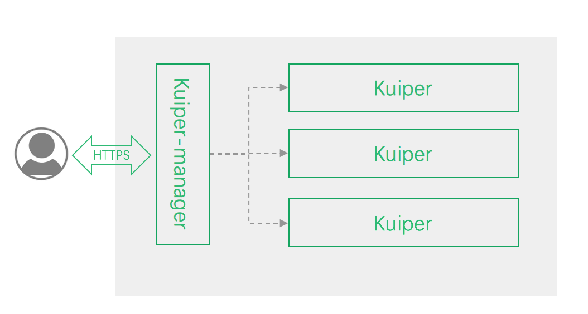
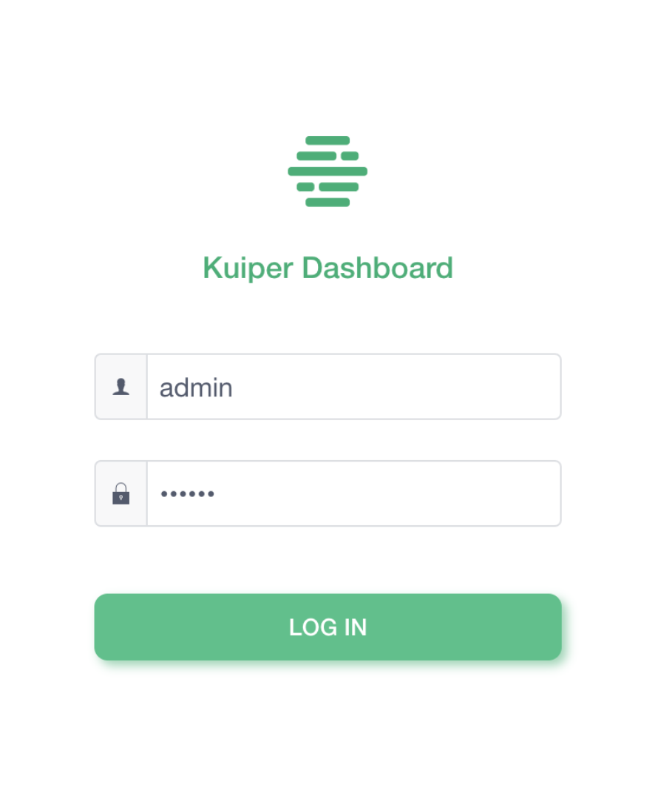
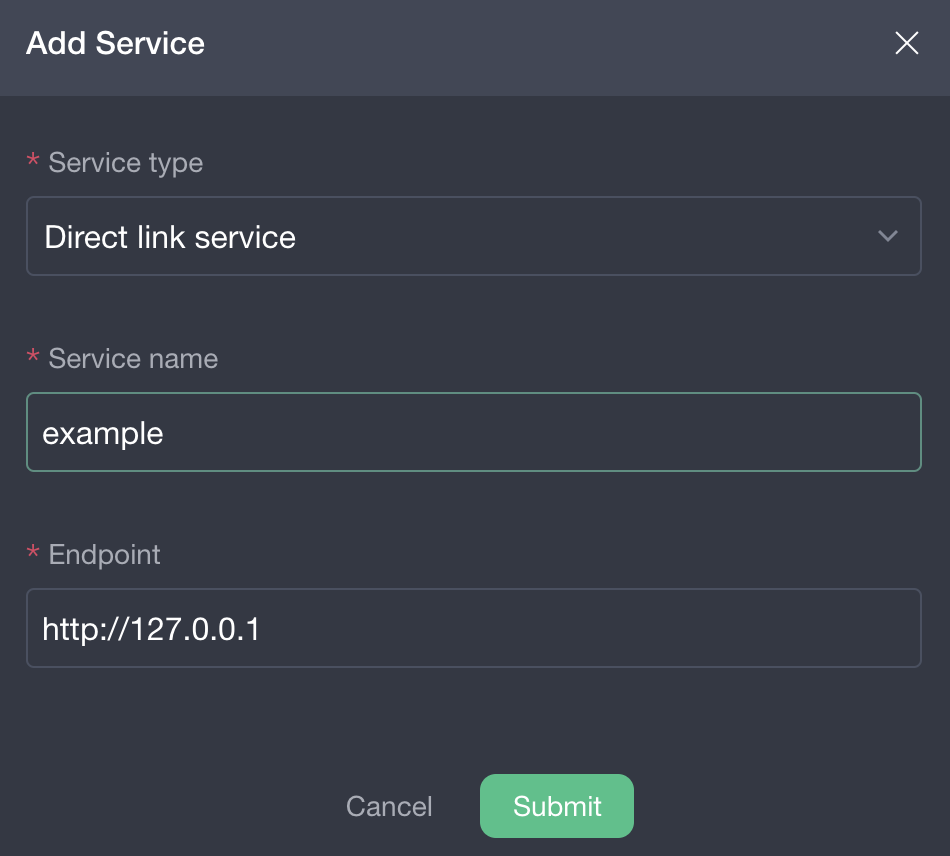
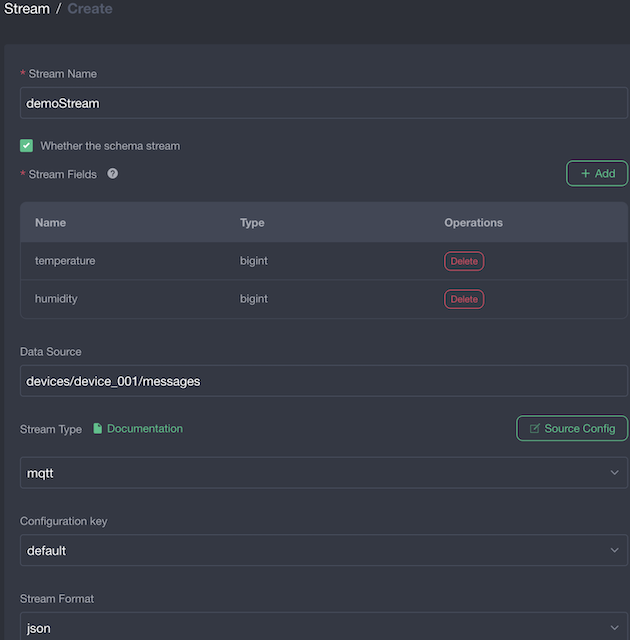
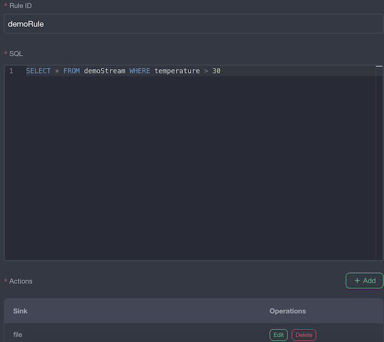
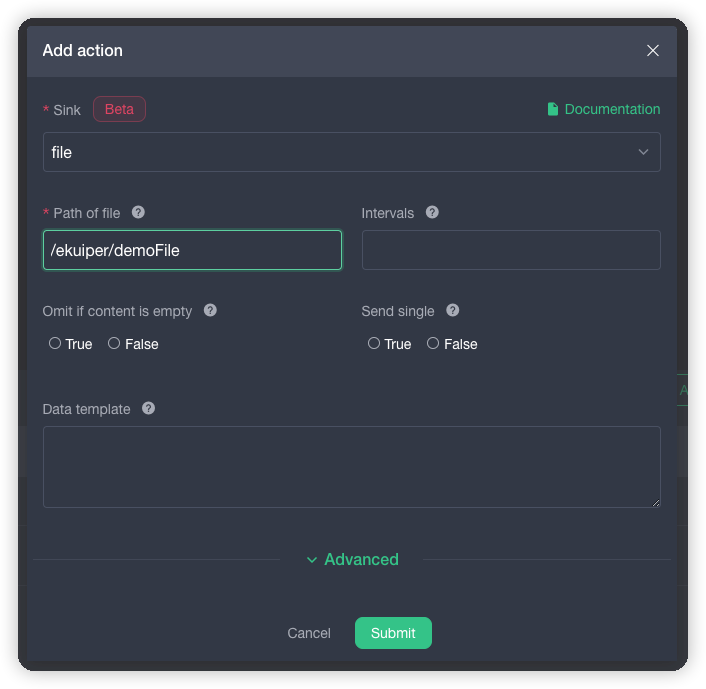
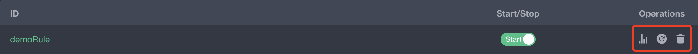

# Management Web UI

## Overview

The web management console provides a browser-based dashboard to manage rekuiper nodes, streams, rules, and plugins. This guide walks through setting up the console, connecting to a rekuiper instance, and creating an end-to-end streaming rule.

The walkthrough covers:
- Connecting the web console to a rekuiper node
- Creating a stream that ingests data from an MQTT topic:
  - Address: `tcp://127.0.0.1:1883`
  - Topic: `devices/device_001/messages`
  - Sample payload: `{"temperature": 40, "humidity": 20}`
- Creating a SQL rule to filter sensor readings and write them to a file destination

## Architecture

- **Web Browser UI**: Visual interface for rules, streams, schemas, and metrics.
- **kuiper-manager**: Lightweight HTTP reverse proxy providing user authentication and node management. Can run on the edge gateway or in the cloud.
- **rekuiper instance**: Stream processing engine exposing its REST API on port `9081`.



## Installation

### 1. Run rekuiper

Run rekuiper in Docker with ports `9081` (REST API), `20498` (NanoIPC), and `20499` (RPC/Prometheus) exposed:

```shell
docker run -d \
  --name rekuiper \
  -p 9081:9081 \
  -p 20498:20498 \
  -p 20499:20499 \
  ankurkrp/rekuiper:0.504-beta
```

Verify that rekuiper is running:

```shell
curl http://localhost:9081/ping
# Output: pong
```

### 2. Run the Management Console

Pull and start the open-source management console container:

```shell
docker run -d \
  --name ekuiper-manager \
  -p 9082:9082 \
  -e DEFAULT_EKUIPER_ENDPOINT="http://localhost:9081" \
  ankur-paan/ekuiper-manager:latest
```

## Getting started

### Login to ekuiper-manager

You need to provide the address, username, and password of kuiper-manager when logging in, which is shown below:

- Address: `http://$yourhost:9082`

- User name: `admin`

- Password: public

  

### Create a eKuiper service

When creating a eKuiper service, you need to fill in the "service type", "service name" and "endpoint URL".

- Service Type: Select `Direct Connect service` (`Huawei IEF service` is dedicated to Huawei users).

  name: self-made, this example uses `example`.

- Endpoint URL: `http://$IP:9081`, the IP acquisition command is as follows:

  ```shell
  docker inspect rekuiper | grep IPAddress
  ```

The example of creating a service is shown below. If port `9081` is exposed to the host, you can also use `http://localhost:9081`.



### Create a stream

Create a stream named `demoStream`:

- Ingest from MQTT broker at `tcp://127.0.0.1:1883`
- Topic: `devices/device_001/messages`
- Stream schema fields:
  - `temperature`: bigint
  - `humidity`: bigint



### Create a rule

Create a rule named `demoRule` to filter out records where `temperature > 30`. The SQL editor provides syntax highlighting and completion.



Click the "Add" button to configure an action destination, such as writing results to `/tmp/demoFile`. For details on the file destination, refer to the [File sink guide](../../guide/sinks/builtin/file.md).



### View execution results

Publish test sensor data using `mosquitto_pub`:

```shell
mosquitto_pub -h 127.0.0.1 -m '{"temperature": 40, "humidity": 20}' -t devices/device_001/messages
```

Inspect the rule running status, metrics, and logs in the console:

- View rule status and throughput counters
- Start, stop, or edit active rules
- Export or delete rule configurations



## Further Reading

- [Rule Processing Guide](../../guide/rules/overview.md)
- [REST API Reference](../../api/restapi/overview.md)
- [CLI Reference](../../api/cli/overview.md)
