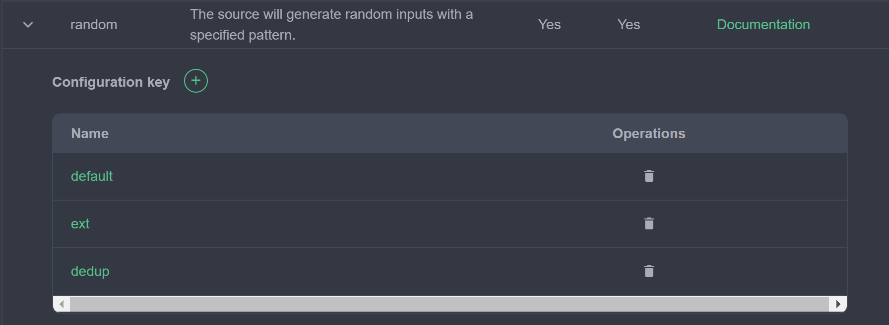
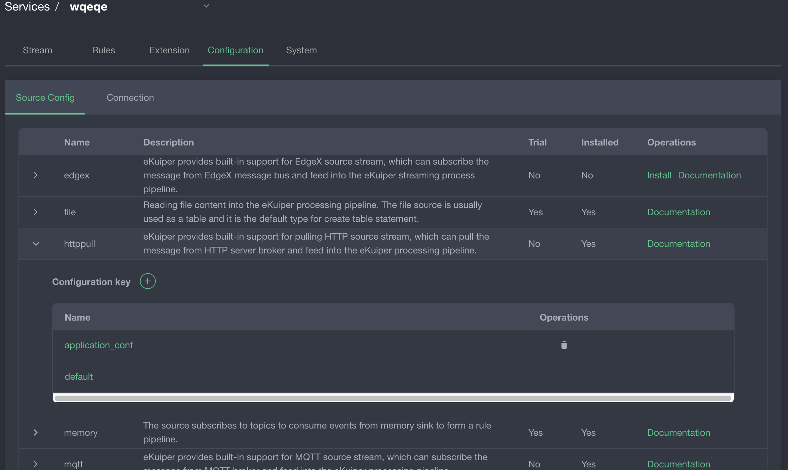
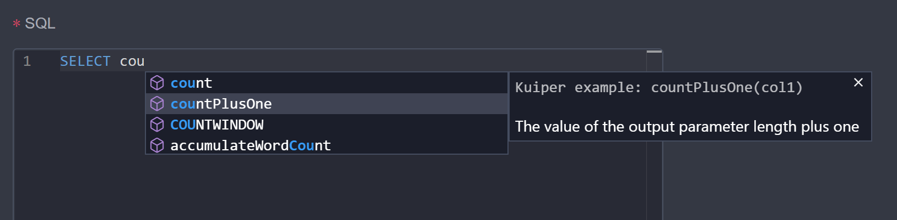

# Custom Plugins in the Management Console

> [!NOTE]
> Go C-shared native dynamic plugins (`.so`) are not supported in rekuiper. Core connectors (Kafka, SQL, Redis, and WebSocket) are compiled into the binary. Custom functions and extensions run via WebAssembly (Wasm) or external service microservices. This guide describes the metadata schema used by the management console.

The management console uses JSON metadata files to render configuration forms, help documentation links, and input field validation for plugins.

## Plugin Metadata Format

Plugin metadata files use JSON syntax. The schema varies by plugin type (`source`, `sink`, or `function`).

### Source Metadata

Source metadata defines basic author information and configuration property groups. For schema definitions, refer to [Source Metadata Specifications](../../extension/native/develop/overview.md#source-metadata-file-format).

Example metadata file:

```json
{
  "about": {
    "trial": true,
    "author": {
      "name": "yourname",
      "email": "your@email.com",
      "company": "your company",
      "website": "https://www.your.website"
    },
    "helpUrl": {
      "en_US": "https://yourwebsite/help_en_US.md",
      "zh_CN": "https://yourwebsite/help_zh_CN.md"
    },
    "description": {
      "en_US": "your description",
      "zh_CN": "描述"
    }
  },
  "properties": {
    "default": [
      {
        "name": "prop1",
        "default": 1000,
        "optional": false,
        "control": "text",
        "type": "int",
        "hint": {
          "en_US": "The description",
          "zh_CN": "参数用法描述"
        },
        "label": {
          "en_US": "prop display name",
          "zh_CN": "参数显示名称"
        }
      }
    ]
  }
}
```

The metadata contains two primary sections:

- **`about`**: Contains metadata fields, including author name, company, documentation URL, and multi-language descriptions. The console displays this information when users select the stream type.
- **`properties`**: Describes configurable parameter fields. In sources, properties are organized into configuration groups (such as `default`). Each group contains attribute metadata for UI input controls.

In the console, open the stream management interface and select **Source Configuration** to view and edit configuration groups:



Click a configuration group to edit its parameters:



### Sink Metadata

Sink metadata defines action properties configured during rule creation. For schema details, refer to [Sink Metadata Specifications](../../extension/native/develop/overview.md#sink-metadata-file-format).

- **`about`**: Matches the source metadata format. The console displays these descriptions in the rule sink selection dialog.
- **`properties`**: Defines form fields rendered in the rule editor when adding a sink action. Unlike sources, sinks do not use configuration groups.


### Function Metadata

Function metadata defines function signatures and code completion prompts for the SQL editor. Refer to [Function Metadata Specifications](../../extension/native/develop/overview.md#functions-metadata-file-format).



## Packaging Guidelines

To register custom metadata in the management console:

1. Name the metadata file to match the plugin name (for example: `mySource.json`).
2. Store the metadata JSON file in the root directory of the plugin `.zip` archive.

## Publishing to a Plugin Server (Legacy Compatibility)

Configure hosting endpoints in `etc/kuiper.yaml` under `pluginHosts`. Published archive paths must follow this directory structure:

```text
https://$host/$folder/$version/$os/$type/$plugin.zip
```

Example URL:

```text
https://127.0.0.1:9090/kuiper-plugins/1.7.1/debian/sinks/sql.zip
```

URL path variables:
- `$version`: The eKuiper compilation version string.
- `$os`: The compilation target operating system (`debian`).
- `$type`: The plugin category (`sources`, `sinks`, or `functions`).

## Compilation Constraints (Legacy)

Native Go plugins require an identical toolchain and dependency environment to the host engine binary:

- **Runtime**: Run `slim` images (for example: `1.7.1-slim`).
- **Compilation**: Compile plugins in matching development images (for example: `1.7.1-dev`).
