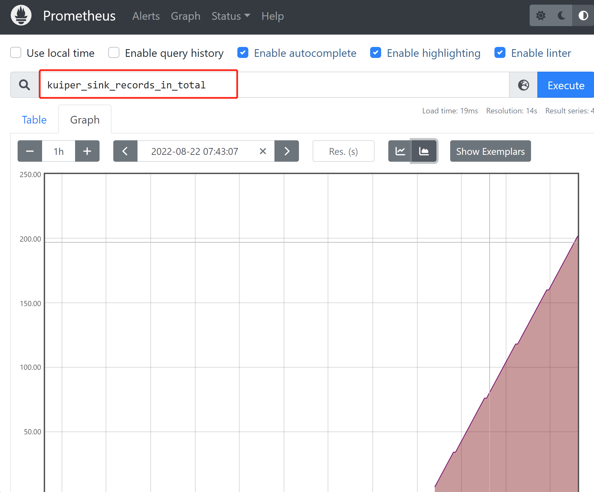
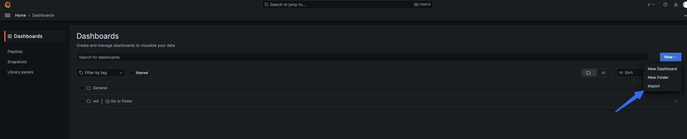
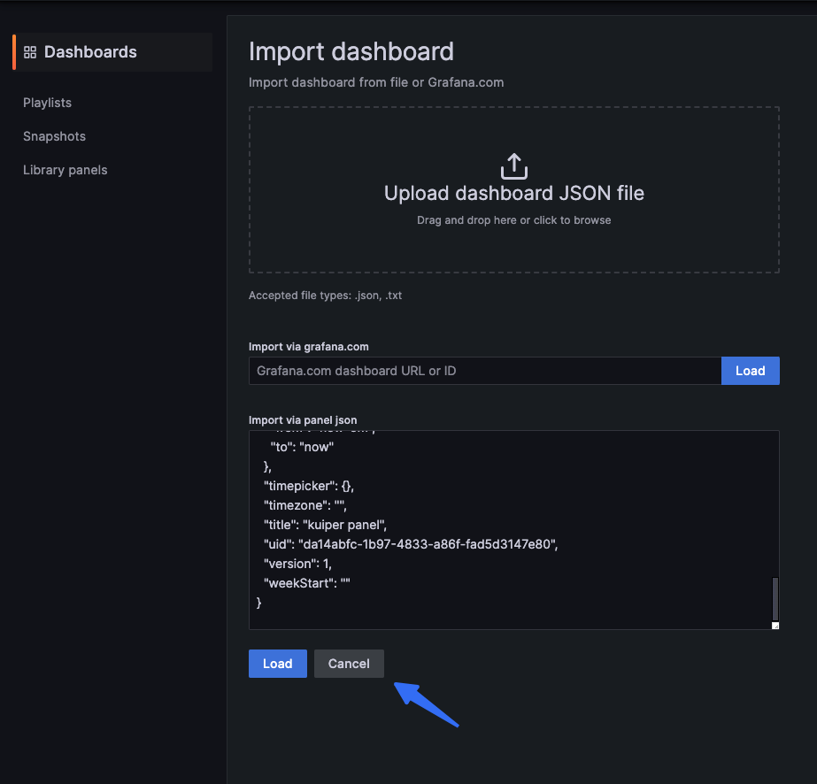
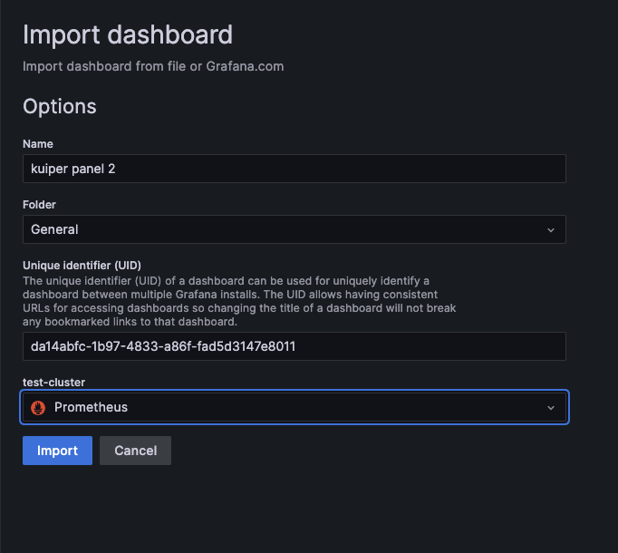
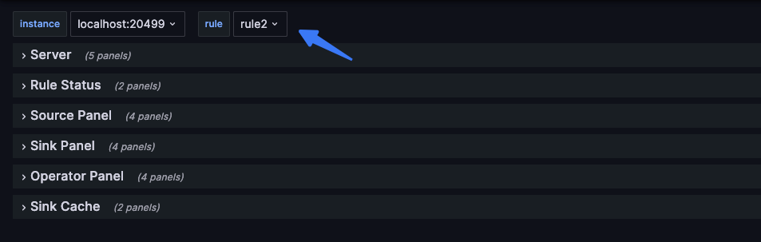
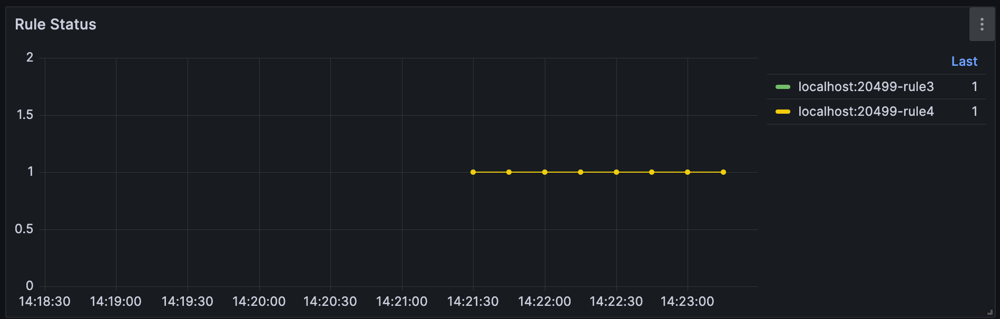
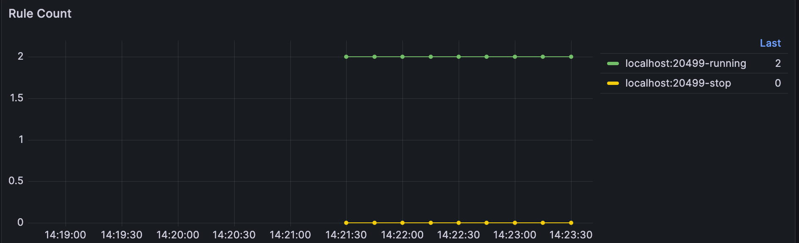

# Monitor Rule Status with Prometheus

rekuiper integrates natively with Prometheus to export streaming metrics, operator latencies, and rule health states.

## Prometheus Metrics

rekuiper exposes 32 Prometheus metric families providing comprehensive observability across rules, sources, operators, sinks, and connections:

### Rule & Global Metrics
- `kuiper_rule_status`: Operational status of each rule (`1` = running, `0` = stopped/paused, `-1` = failed).
- `kuiper_rule_count`: Total active and paused rules partitioned by `status="running"|"stopped"`.
- `kuiper_conn_status_gauge`: External connection status partitioned by connection `name`.

### Source Metrics
- `kuiper_source_records_in_total`: Total input records received at sources (`rule`, `op`, `op_instance`, `type`).
- `kuiper_source_records_out_total`: Total output records emitted by sources.
- `kuiper_source_messages_processed_total`: Total messages processed by sources.
- `kuiper_source_exceptions_total`: Total exceptions encountered by sources.
- `kuiper_source_buffer_length`: Current message buffer length for sources.
- `kuiper_source_connection_status`: Source connection state (`1` = connected, `0` = connecting, `-1` = disconnected).
- `kuiper_source_process_latency_us`: Source processing latency in microseconds.
- `kuiper_source_process_latency_us_hist_bucket`, `_hist_count`, `_hist_sum`: Source processing latency histogram buckets and aggregates.

### Operator Metrics
- `kuiper_op_records_in_total`: Total input records received by pipeline operators (`rule`, `op`, `op_instance`, `type`).
- `kuiper_op_records_out_total`: Total output records emitted by pipeline operators.
- `kuiper_op_messages_processed_total`: Total messages processed by operators.
- `kuiper_op_exceptions_total`: Total exceptions encountered by operators.
- `kuiper_op_buffer_length`: Current input buffer queue depth for operators.
- `kuiper_op_process_latency_us`: Operator processing latency in microseconds.
- `kuiper_op_process_latency_us_hist_bucket`, `_hist_count`, `_hist_sum`: Operator processing latency histogram buckets and aggregates.

### Sink Metrics
- `kuiper_sink_records_in_total`: Total records received by sinks (`rule`, `op`, `op_instance`, `type`).
- `kuiper_sink_records_out_total`: Total records successfully transmitted by sinks.
- `kuiper_sink_messages_processed_total`: Total messages handled by sinks.
- `kuiper_sink_exceptions_total`: Total sink errors and transmission exceptions.
- `kuiper_sink_buffer_length`: Current message buffer queue depth for sinks.
- `kuiper_sink_connection_status`: Target sink connection state (`1` = connected, `0` = connecting, `-1` = disconnected).
- `kuiper_sink_process_latency_us`: Sink transmission latency in microseconds.
- `kuiper_sink_process_latency_us_hist_bucket`, `_hist_count`, `_hist_sum`: Sink processing latency histogram buckets and aggregates.

> [!NOTE]
> **Compatibility & Cloud-Native Scraping Note: Single-Port Metrics**
> In legacy eKuiper, Prometheus metrics are served strictly on a dedicated port (default `20499`) and return `404 Not Found` on the standard REST API port (`9081`). `rekuiper` serves Prometheus metrics directly on the REST port (`http://<host>:9081/metrics`) as well as the configurable dedicated metrics port.
> 
> **Why we chose this difference**: In Kubernetes and containerized microservice deployments, scraping metrics directly from the primary pod service port simplifies deployment manifests, reduces firewall port surface, and eliminates multi-port ingress configuration friction.


## Rule Status Metrics

You can inspect real-time metrics for a rule through the CLI, management console, or REST API:

```http
GET http://127.0.0.1:9081/rules/rule1/status
```

Response sample:

```json
{
  "status": "running",
  "lastStartTimestamp": "1712126817659",
  "lastStopTimestamp": "0",
  "nextStopTimestamp": "0",
  "source_demo_0_records_in_total": 265,
  "source_demo_0_records_out_total": 265,
  "source_demo_0_process_latency_us": 0,
  "source_demo_0_buffer_length": 0,
  "source_demo_0_last_invocation": "2022-08-22T17:19:10.979128",
  "source_demo_0_exceptions_total": 0,
  "source_demo_0_last_exception": "",
  "source_demo_0_last_exception_time": 0,
  "op_2_project_0_records_in_total": 265,
  "op_2_project_0_records_out_total": 265,
  "op_2_project_0_process_latency_us": 0,
  "op_2_project_0_buffer_length": 0,
  "op_2_project_0_last_invocation": "2022-08-22T17:19:10.979128",
  "op_2_project_0_exceptions_total": 0,
  "op_2_project_0_last_exception": "",
  "op_2_project_0_last_exception_time": 0,
  "sink_mqtt_0_0_records_in_total": 265,
  "sink_mqtt_0_0_records_out_total": 265,
  "sink_mqtt_0_0_process_latency_us": 0,
  "sink_mqtt_0_0_buffer_length": 0,
  "sink_mqtt_0_0_last_invocation": "2022-08-22T17:19:10.979128",
  "sink_mqtt_0_0_exceptions_total": 0,
  "sink_mqtt_0_0_last_exception": "",
  "sink_mqtt_0_0_last_exception_time": 0
}
```

### Operator Metric Definitions

Every pipeline operator (sources, operators, and sinks) exports the following counters and gauges:

- `records_in_total`: Total input records received since rule initialization.
- `records_out_total`: Total output records emitted downstream after processing.
- `process_latency_us`: Execution latency of the most recent event batch in microseconds.
- `buffer_length`: Current message count waiting in the operator input buffer queue.
- `last_invocation`: Timestamp of the most recent operator execution.
- `exceptions_total`: Total recoverable errors encountered without stopping execution.
- `last_exception`: Diagnostic error message of the most recent exception.
- `last_exception_time`: Timestamp of the most recent exception.

### Connection Metric Definitions

Sources and sinks export external connection lifecycle states:

- `connection_status`: Current connection state (`1` = connected, `0` = connecting, `-1` = disconnected).
- `connection_last_connected_time`: Unix timestamp of the last successful connection.
- `connection_last_disconnected_time`: Unix timestamp of the last disconnection event.
- `connection_last_disconnected_message`: Error message recorded during the last disconnection.
- `connection_last_try_time`: Unix timestamp of the last reconnection attempt.

## Configure the Prometheus Exporter in rekuiper

Enable the Prometheus endpoint in `etc/kuiper.yaml`:

```yaml
basic:
  prometheus: true
  prometheusPort: 20499
```

When running in Docker, enable metrics using environment variables:

```shell
docker run -d \
  --name ekuiper \
  -p 9081:9081 \
  -p 20499:20499 \
  -e KUIPER__BASIC__PROMETHEUS=true \
  ankurkrp/rekuiper:0.507-beta
```

The server exposes raw Prometheus metrics on `http://localhost:20499/metrics`.

## Scrape Metrics Using Prometheus

Download and install Prometheus from the [Prometheus Download Page](https://prometheus.io/download/).

Add rekuiper to `scrape_configs` in `prometheus.yml`:

```yaml
global:
  scrape_interval: 15s
  evaluation_interval: 15s

scrape_configs:
  - job_name: 'ekuiper'
    static_configs:
      - targets: ['localhost:20499']
```

Start the Prometheus service:

```shell
./prometheus --config.file=prometheus.yml
```

Open `http://localhost:9090` to query metrics and generate line graphs:



## Visualize Metrics with Grafana

rekuiper provides preconfigured Grafana dashboard templates.

1. Verify that Grafana has Prometheus configured as an active data source.
2. Download the dashboard schema from the [Metrics Dashboard Template](https://github.com/lf-edge/ekuiper/blob/master/metrics/metrics.json).
3. In Grafana, select **Dashboards > Import**.



4. Paste the JSON template and click **Load**.



5. Select the Prometheus data source and click **Import**.



The dashboard displays instances and rule metrics:



Inspect rule health states over time using `kuiper_rule_status`:



Inspect aggregate running and paused rule counts using `kuiper_rule_count`:


