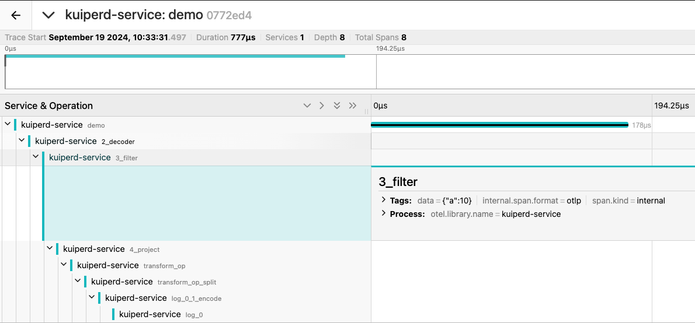
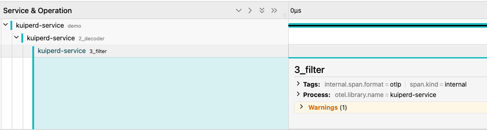

# Data Tracing with OpenTelemetry

rekuiper supports distributed data tracing using OpenTelemetry. You can trace event transformations and payload mutations across every pipeline operator.

## OpenTelemetry Configuration

Configure the OpenTelemetry agent in `etc/kuiper.yaml`:

```yaml
openTelemetry:
  serviceName: kuiperd-service
  enableRemoteCollector: false
  remoteEndpoint: localhost:4318
  localTraceCapacity: 2048
```

- `serviceName`: The service name reported in tracing spans.
- `enableRemoteCollector`: When `true`, exports spans to an OpenTelemetry Collector via OTLP/HTTP.
- `remoteEndpoint`: The destination address of the OpenTelemetry Collector.
- `localTraceCapacity`: The maximum number of traces retained in local ring buffer storage.

## Enable Rule-Level Tracing

Enable tracing for a specific rule by setting `enableRuleTracer: true` in the rule `options`. Refer to [Rule Configuration Options](../../guide/rules/overview.md#rules).

You can also toggle tracing dynamically using the [Trace REST API](../../api/restapi/trace.md#start-data-tracing-for-a-rule).

## Retrieve Trace Identifiers

Query recent Trace IDs for an active rule using the REST API:

```http
GET http://localhost:9081/trace/rule/{ruleID}
```

Refer to [View Recent Trace IDs](../../api/restapi/trace.md#view-recent-trace-ids-for-a-rule).

## Inspect Tracing Data

Query detailed span hierarchies and operator timestamps:

```http
GET http://localhost:9081/trace/{id}
```

Refer to [View Trace Span Details](../../api/restapi/trace.md#view-trace-span-details).

## Integration with OpenTelemetry Collector and Jaeger

You can forward trace spans to Jaeger through an OpenTelemetry Collector.

### 1. Collector and Jaeger Configuration (`docker-compose.yml`)

Create a `collector.yaml` file:

```yaml
receivers:
  otlp:
    protocols:
      http:
        endpoint: 0.0.0.0:4318

exporters:
  otlp:
    endpoint: jaeger:4317
    tls:
      insecure: true

processors:
  batch:

service:
  pipelines:
    traces:
      receivers: [otlp]
      processors: [batch]
      exporters: [otlp]
```

Create a `docker-compose.yml` file:

```yaml
version: '3.8'

services:
  jaeger:
    image: jaegertracing/all-in-one:latest
    ports:
      - "16686:16686"  # Jaeger UI
      - "14250:14250"  # gRPC endpoint
      - "14268:14268"  # HTTP endpoint
    networks:
      - otel-net

  otel-collector:
    image: otel/opentelemetry-collector-contrib:latest
    command: ["--config=/etc/otel-collector-config.yaml"]
    volumes:
      - ./collector.yaml:/etc/otel-collector-config.yaml
    ports:
      - "4318:4318"  # OTLP HTTP receiver
    depends_on:
      - jaeger
    networks:
      - otel-net

networks:
  otel-net:
    driver: bridge
```

Start the containers:

```shell
docker-compose up -d
```

### 2. Configure rekuiper to Export Spans

Update `etc/kuiper.yaml`:

```yaml
openTelemetry:
  serviceName: kuiperd-service
  enableRemoteCollector: true
  remoteEndpoint: localhost:4318
  localTraceCapacity: 2048
```

### 3. Inspect Spans in Jaeger

Open `http://localhost:16686` in your browser to inspect spans and call trees in the Jaeger UI.

## Debugging Rules Using Data Tracing

You can trace individual payload records to identify operator drop points or filter logic.

### 1. Create a Filter Rule

```json
{
    "id": "rule1",
    "sql": "select * from demo where a > 5",
    "actions": [
        {
            "log": {}
        }
    ]
}
```

### 2. Ingest Sample Records

Send two records: one meeting the filter criteria (`a > 5`) and one failing it:

```json
{"a": 10}
{"a": 4}
```

### 3. Inspect Spans in Jaeger

Query the Trace ID list from the REST API and open the trace in Jaeger:

- For payload `{"a": 10}`, the trace spans traverse through `decoder`, `project`, `transform_op`, and the final `sink_log` action:



- For payload `{"a": 4}`, the trace spans terminate at the filter operator, confirming that the record was dropped as expected:


