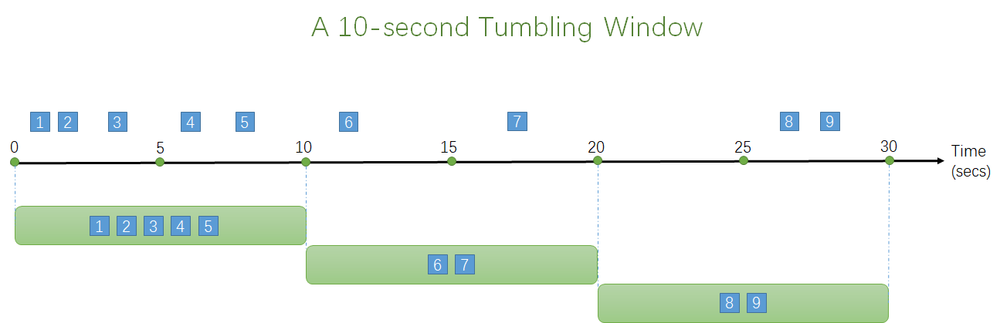
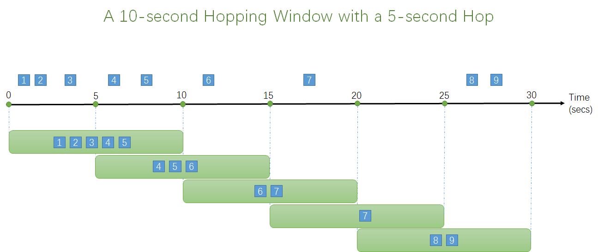
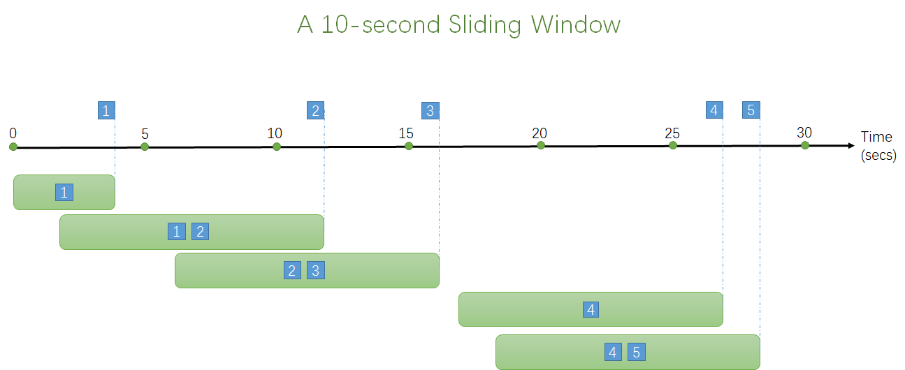
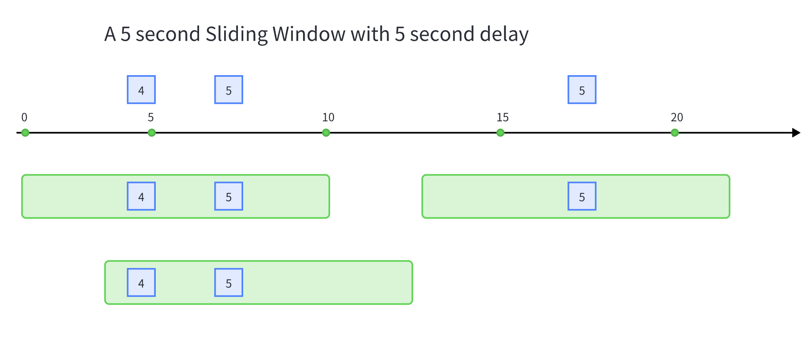
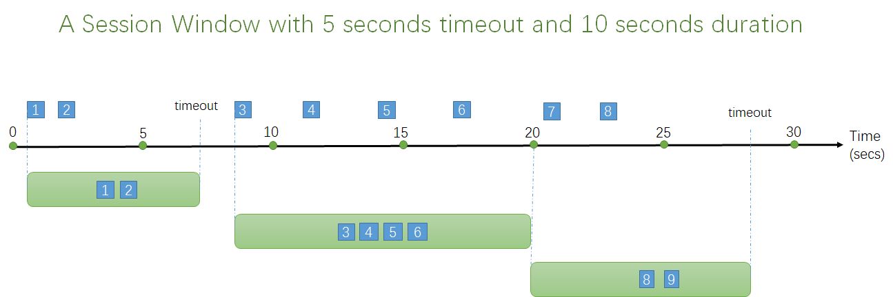
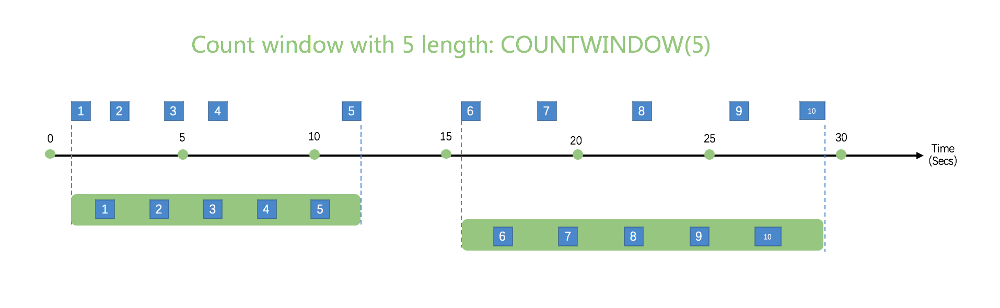
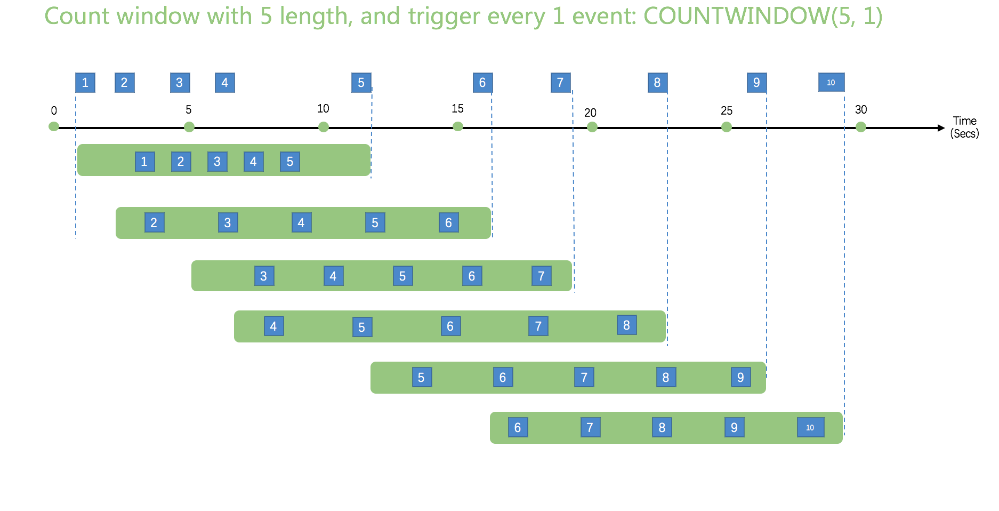
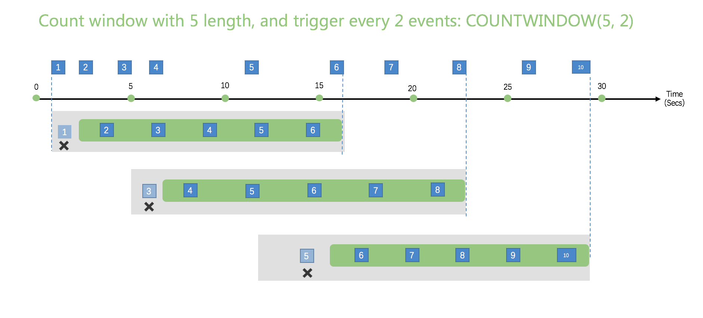

# Windows

Windowing functions partition streaming records into temporal or count-based segments for aggregation in the `GROUP BY` clause.

rekuiper supports six window types:

- [Tumbling Window](#tumbling-window)
- [Hopping Window](#hopping-window)
- [Sliding Window](#sliding-window)
- [Session Window](#session-window)
- [Conditional State Window](#conditional-state-window)
- [Count Window](#count-window)

Windowing operations emit results at the close of each window based on configured aggregate functions.

## Time Units

Temporal windows support five time unit identifiers:

- `DD`: Days
- `HH`: Hours
- `MI`: Minutes
- `SS`: Seconds
- `MS`: Milliseconds

Temporal windows align to natural clock boundaries. For example, a 10-second window closes at 10, 20, 30, 40, and 50 seconds past the minute regardless of when the rule started.

## Tumbling Window

Tumbling windows divide streams into fixed, non-overlapping, contiguous time intervals. Each event belongs to exactly one window:



```sql
SELECT count(*) FROM demo GROUP BY ID, TUMBLINGWINDOW(ss, 10);
```

## Hopping Window

Hopping windows advance forward in time by a fixed hop interval. Windows can overlap, allowing events to belong to multiple windows:



```sql
SELECT count(*) FROM demo GROUP BY ID, HOPPINGWINDOW(ss, 10, 5);
```

## Sliding Window

Sliding windows evaluate and emit results only when a new event arrives. Each window contains the events that occurred within the specified duration preceding the trigger event:



```sql
SELECT count(*) FROM demo GROUP BY ID, SLIDINGWINDOW(mi, 1);
```

### Delayed Sliding Window

Sliding windows support delayed evaluation. When configured with a delay parameter, the window evaluates after the specified delay elapses, capturing events across both forward and backward intervals:



```sql
SELECT count(*) FROM demo GROUP BY ID, SLIDINGWINDOW(ss, 5, 5);
```

## Session Window

Session windows group events that arrive close together in time and close after a period of inactivity:



```sql
SELECT count(*) FROM demo GROUP BY ID, SESSIONWINDOW(mi, 2, 1);
```

- A session starts upon arrival of the first event.
- If another event arrives within the timeout period, the window extends.
- If no events arrive within the timeout, the window closes.
- If events arrive continuously, the window closes when it reaches the configured maximum duration.

## Conditional State Window

Conditional state windows group records based on state transitions rather than clock time:

```sql
SELECT * FROM demo GROUP BY STATEWINDOW(a > 1, a > 5);
```

### Single Conditional State Window

A single-condition state window evaluates one boolean trigger condition:

```sql
SELECT * FROM demo GROUP BY STATEWINDOW(a > 1);
```

Initially, the window remains in an untriggered state and discards incoming data. When a record satisfies the condition, the window transitions to the triggered state and stores records. When a subsequent record satisfies the condition, the window emits all stored records and begins a new window.

Example with `had_changed`:

Input:

```txt
{"a": 1}
{"a": 1}
{"a": 1}
{"a": 2}
{"a": 2}
{"a": 3}
```

Output for `STATEWINDOW(had_changed(a))`:

```json
[{"a": 1}, {"a": 1}, {"a": 1}]
[{"a": 2}, {"a": 2}]
```

### State Window Partitioning

Partition state window evaluations by using the `OVER (PARTITION BY ...)` clause:

```sql
SELECT * FROM demo GROUP BY STATEWINDOW(a = 1, a = 5) OVER (PARTITION BY b);
```

Input:

```txt
{"a": 1, "b": 1}
{"a": 1, "b": 2}
{"a": 5, "b": 1}
```

Output:

```json
[{"a": 1, "b": 1}, {"a": 5, "b": 1}]
```

Partition `b = 2` did not emit output because its end condition was not satisfied.

## Count Window

Count windows segment streams based on event counts rather than time intervals.

### Tumbling Count Window

Tumbling count windows group records into fixed-size batches of events:



```sql
SELECT * FROM demo WHERE temperature > 20 GROUP BY COUNTWINDOW(5);
```

### Sliding Count Window

Sliding count windows take a window size and a trigger interval: `COUNTWINDOW(size, interval)`:

- When `interval` is `1`, every incoming event triggers a window evaluation.
- `interval` must be less than or equal to `size`.




```sql
SELECT * FROM demo
WHERE temperature > 20
GROUP BY COUNTWINDOW(5, 1)
HAVING count(*) > 2;
```

## Filter Window Inputs

Use the `FILTER(WHERE condition)` clause to filter records before they enter the window buffer:

```sql
SELECT * FROM demo
GROUP BY COUNTWINDOW(3, 1)
FILTER(WHERE revenue > 100);
```

Unlike the outer `WHERE` clause, `FILTER` evaluates before window buffering so the window size remains constant.

## Timestamp Management

Every event has an associated timestamp. By default, rekuiper assigns timestamps when records arrive at the source (processing time).

To use event time embedded in incoming payloads, declare the timestamp field in the stream definition:

```sql
CREATE STREAM demo (
    color STRING,
    size BIGINT,
    ts BIGINT
) WITH (DATASOURCE = "demo", FORMAT = "json", KEY = "ts", TIMESTAMP = "ts");
```

In event time mode, rekuiper uses watermarks to track time progress and trigger window evaluations.

## Runtime Error Handling

If a window receives an invalid record from upstream (such as a type mismatch), the error record is routed immediately to configured sinks. The window computation ignores the erroneous record and continues processing valid events.

## Sliding Window Trigger Conditions

You can restrict which events trigger sliding window evaluations by appending `OVER (WHEN condition)`:

```sql
SELECT * FROM demo
GROUP BY SLIDINGWINDOW(ss, 1)
FILTER(WHERE revenue > 100)
OVER(WHEN revenue > 200);
```

## Incremental Computation

When aggregate functions support incremental updates, rekuiper evaluates windows incrementally to reduce memory consumption. Refer to [Incremental Computation](../guide/rules/incremental.md#incremental-computation) for details.
