# ESPHome Fleet Telemetry Processing

[ESPHome](https://esphome.io/) is an open-source firmware system for ESP8266 and ESP32 microcontrollers. In smart buildings, industrial facilities, and distributed monitoring networks, thousands of ESPHome nodes continuously publish sensor readings over MQTT.

When managing hundreds or thousands of devices, central brokers can become overwhelmed by high-frequency chatter. rekuiper acts as a high-speed local stream processor between ESPHome fleets and downstream time-series databases or home automation controllers.

---

## Fleet Architecture

```mermaid
flowchart LR
    subgraph Nodes["1. ESPHome Fleet"]
        direction TB
        N1["ESP32 Climate Sensor\n(Temperature / Humidity)"]
        N2["ESP8266 Power Monitor\n(Voltage / Current / Watts)"]
        N3["ESP32 Environmental Node\n(Air Quality / CO2)"]
    end

    subgraph Edge["2. Edge Gateway (rekuiper)"]
        direction TB
        E1["MQTT Wildcard Ingestion\n(esphome/+/sensor/+/state)"]
        E2["Dynamic Topic Extraction\n(meta(topic), split)"]
        E3["Windowed Aggregation & Deadbanding\n(10s tumbling avg, filter spikes)"]
        E1 --> E2 --> E3
    end

    subgraph Downstream["3. Storage & Dashboards"]
        direction TB
        D1["Home Assistant / OpenHAB\n(Filtered state updates)"]
        D2["TimescaleDB / InfluxDB\n(Downsampled 1m averages)"]
        D3["Local Alert Webhook\n(Immediate anomaly alarms)"]
    end

    Nodes --> Edge
    E3 --> Downstream
```



---

## High-Throughput Topic Extraction with `meta(topic)`

ESPHome devices publish each sensor state to a distinct MQTT topic following the convention:

```text
esphome/<device_name>/sensor/<sensor_name>/state
```

Instead of defining individual streams for every device, rekuiper subscribes to a single wildcard topic and extracts metadata dynamically from the MQTT topic path using `meta(topic)`:

### Stream Definition

```sql
CREATE STREAM esphome_stream () WITH (
  DATASOURCE = "esphome/+/sensor/+/state",
  FORMAT = "JSON",
  TYPE = "mqtt"
);
```

### Dynamic Routing Query

```sql
SELECT
  meta(topic) AS fullTopic,
  split(meta(topic), "/")[1] AS deviceName,
  split(meta(topic), "/")[3] AS sensorType,
  cast(value, "float") AS reading,
  meta(timestamp) AS recordedAt
FROM
  esphome_stream
WHERE
  value IS NOT NULL
```

In benchmark tests running on a single CPU core, rekuiper routes and transforms **150,000 msg/s** across 10,000 distinct ESPHome topics with zero packet loss and a 4.5 MiB memory footprint.

---

## Practical Processing Rules

### 1. 1-Minute Sensor Downsampling

High-frequency sensor reports (such as temperature measured every second) generate redundant database entries. The following rule aggregates readings into 1-minute tumbling averages per device:

```sql
SELECT
  split(meta(topic), "/")[1] AS deviceName,
  AVG(cast(value, "float")) AS avgTemp,
  MIN(cast(value, "float")) AS minTemp,
  MAX(cast(value, "float")) AS maxTemp
FROM
  esphome_stream
WHERE
  meta(topic) LIKE "%/sensor/temperature/state"
GROUP BY
  split(meta(topic), "/")[1],
  TUMBLINGWINDOW(ss, 60)
```

The aggregated result is written directly to a relational database or time-series sink, cutting database disk growth by over 95%.

### 2. High Power Draw Alarm

Power-monitoring plugs (such as Sonoff POW or Shelly devices running ESPHome) report wattage continuously. This rule detects sudden power spikes exceeding a safe threshold:

```sql
SELECT
  split(meta(topic), "/")[1] AS deviceName,
  cast(value, "float") AS currentWatts
FROM
  esphome_stream
WHERE
  meta(topic) LIKE "%/sensor/power/state"
  AND cast(value, "float") > 2500.0
```

When power draw exceeds 2,500 Watts, an alert payload is dispatched immediately to a webhook:

```json
{
  "id": "power_surge_alarm",
  "sql": "SELECT split(meta(topic), \"/\")[1] AS deviceName, cast(value, \"float\") AS currentWatts FROM esphome_stream WHERE meta(topic) LIKE \"%/sensor/power/state\" AND cast(value, \"float\") > 2500.0",
  "actions": [
    {
      "rest": {
        "url": "http://127.0.0.1:8123/api/webhook/power_alert",
        "method": "POST",
        "sendSingle": true
      }
    }
  ]
}
```

---

## Performance Summary

| Metric | Upstream eKuiper (Go) | rekuiper (Rust) |
| :--- | :--- | :--- |
| **Max Loss-Free Throughput (10k topics)** | 20,000 msg/s | **150,000 msg/s** |
| **Memory Footprint** | 15 – 45 MiB | **4.5 – 5.8 MiB** |
| **Garbage Collection Jitter** | Yes (occasional channel drops) | **Zero GC (deterministic)** |

Using rekuiper as an edge aggregator allows single-board computers (like a Raspberry Pi 4 or an Odroid) to handle thousands of active ESPHome nodes without degradation.
