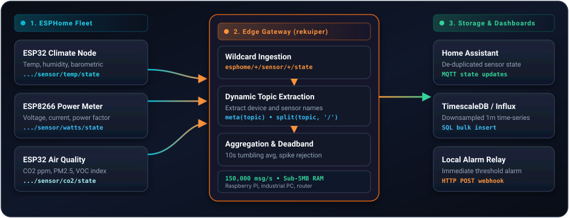

# ESPHome Fleet Telemetry Processing

[ESPHome](https://esphome.io/) is an open-source firmware system for ESP8266 and ESP32 microcontrollers. In smart building installations, industrial facilities, and distributed telemetry networks, thousands of ESPHome nodes publish sensor metrics over MQTT.

When managing large device fleets, central brokers encounter heavy transmission load. rekuiper operates as a local stream processor between ESPHome fleets and downstream time-series databases or automation controllers.

## Fleet Architecture



## High-Throughput Topic Extraction with meta(topic)

ESPHome devices publish each sensor state to a distinct MQTT topic following this convention:

```text
esphome/<device_name>/sensor/<sensor_name>/state
```

Instead of defining individual streams for every device, rekuiper subscribes to a single wildcard topic and extracts metadata dynamically from the MQTT topic path using `meta(topic)`:

### Stream Definition

```sql
CREATE STREAM esphome_stream () WITH (
  DATASOURCE = "esphome/+/sensor/+/state",
  FORMAT = "JSON",
  TYPE = "mqtt"
);
```

### Dynamic Routing Query

```sql
SELECT
  meta(topic) AS fullTopic,
  split(meta(topic), "/")[1] AS deviceName,
  split(meta(topic), "/")[3] AS sensorType,
  cast(value, "float") AS reading,
  meta(timestamp) AS recordedAt
FROM
  esphome_stream
WHERE
  value IS NOT NULL
```

In benchmark tests running on a single CPU core, rekuiper routes and transforms 150,000 msg/s across 10,000 distinct ESPHome topics with zero packet loss and a 4.5 MiB memory footprint.

## Practical Processing Rules

### 1. 1-Minute Sensor Downsampling

High-frequency sensor reports (such as temperature measurements published every second) create redundant database records. The following rule aggregates readings into 1-minute tumbling averages per device:

```sql
SELECT
  split(meta(topic), "/")[1] AS deviceName,
  AVG(cast(value, "float")) AS avgTemp,
  MIN(cast(value, "float")) AS minTemp,
  MAX(cast(value, "float")) AS maxTemp
FROM
  esphome_stream
WHERE
  meta(topic) LIKE "%/sensor/temperature/state"
GROUP BY
  split(meta(topic), "/")[1],
  TUMBLINGWINDOW(ss, 60)
```

The engine emits aggregated results to a relational database or time-series sink, reducing storage growth by over 95%.

### 2. High Power Draw Alarm

Power-monitoring smart plugs report wattage continuously. This rule detects power surges that exceed a configured safety threshold:

```sql
SELECT
  split(meta(topic), "/")[1] AS deviceName,
  cast(value, "float") AS currentWatts
FROM
  esphome_stream
WHERE
  meta(topic) LIKE "%/sensor/power/state"
  AND cast(value, "float") > 2500.0
```

When power consumption exceeds 2,500 Watts, the rule dispatches an alert payload to a REST webhook:

```json
{
  "id": "power_surge_alarm",
  "sql": "SELECT split(meta(topic), \"/\")[1] AS deviceName, cast(value, \"float\") AS currentWatts FROM esphome_stream WHERE meta(topic) LIKE \"%/sensor/power/state\" AND cast(value, \"float\") > 2500.0",
  "actions": [
    {
      "rest": {
        "url": "http://127.0.0.1:8123/api/webhook/power_alert",
        "method": "POST",
        "sendSingle": true
      }
    }
  ]
}
```

## Performance Comparison

| Operational Metric | Upstream eKuiper (Go) | rekuiper (Rust) |
| :--- | :--- | :--- |
| **Loss-Free Throughput (10k topics)** | 20,000 msg/s | **150,000 msg/s** |
| **RAM Utilization Baseline** | 15 to 45 MiB | **4.5 to 5.8 MiB** |
| **Garbage Collection Latency Jitter** | Present (periodic channel drops) | **Zero GC (deterministic)** |

Deploying rekuiper as a local edge aggregator allows single-board computers (such as a Raspberry Pi 4) to process thousands of active ESPHome nodes without degradation.
