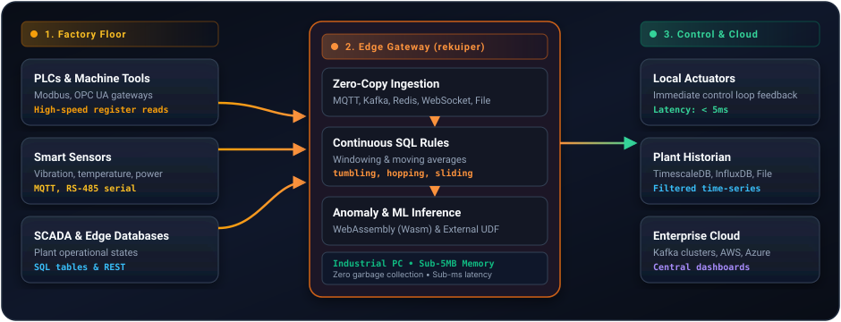

# Industrial IoT (IIoT) Stream Processing

Industrial IoT environments require deterministic data processing near physical plant equipment. In manufacturing, automated assembly lines, and power utilities, sensors and programmable logic controllers (PLCs) emit high-frequency telemetry.

rekuiper executes directly on industrial PCs, embedded gateways, and edge servers to filter noise, compute moving averages, detect anomalies, and trigger control signals with sub-millisecond latency.

## Edge Architecture for Industrial IoT

In modern industrial architectures, rekuiper operates as the local compute engine between plant controllers and enterprise systems:



## Key Industrial Capabilities

### 1. Deterministic Execution Without Garbage Collection

Edge gateways frequently run on constrained hardware (single-core ARM processors, 512 MB to 1 GB RAM). Traditional runtimes introduce garbage collection pauses that drop network packets or delay time-critical alerts. rekuiper provides deterministic execution without garbage collection pauses, operating within a sub-5MB memory baseline.

### 2. Stream SQL for Local Windowing and Filtering

Rather than streaming raw sensor events to cloud endpoints over expensive cellular connections, rekuiper computes aggregates locally:

- **Tumbling Windows**: Compute 10-second average temperatures, pressures, and vibration indexes per machine.
- **Sliding Windows**: Detect moving threshold spikes over 60-second intervals.
- **Session Windows**: Track operational states across batch processing runs.

### 3. Sub-Millisecond Anomaly Detection

Detect equipment faults immediately:
- Bearing overheating and excessive motor vibration.
- Pressure drops in pneumatic distribution systems.
- Voltage fluctuations in sub-distribution switchgear.

When a condition triggers a rule, rekuiper immediately publishes an alert to a local broker, activates a PLC digital output through a REST webhook, and logs the incident.

### 4. Edge AI and Machine Learning Inference

rekuiper interfaces with Python and WebAssembly runtimes to evaluate machine learning models in real time:
- Remaining useful life (RUL) estimation.
- Automated visual defect classification.
- Predictive maintenance scoring.

## Example: Temperature Spike Alarm

The following SQL rule monitors continuous boiler temperature readings from an MQTT stream and triggers an alert when temperature exceeds 85.0 degrees:

```sql
SELECT
  deviceId,
  temperature,
  humidity
FROM
  telemetry_stream
WHERE
  temperature > 85.0
```

The rule action routes the alert payload to both a local alarm webhook and an upstream MQTT topic:

```json
{
  "id": "boiler_overheat_alarm",
  "sql": "SELECT deviceId, temperature FROM telemetry_stream WHERE temperature > 85.0",
  "actions": [
    {
      "rest": {
        "url": "http://127.0.0.1:8080/api/v1/alarms",
        "method": "POST",
        "sendSingle": true
      }
    },
    {
      "mqtt": {
        "server": "tcp://127.0.0.1:1883",
        "topic": "factory/alarms/critical"
      }
    }
  ]
}
```

## Benefits for Industrial Deployments

- **Reduced WAN Bandwidth**: Downsamples and aggregates high-frequency telemetry before sending data upstream.
- **Offline Autonomy**: Executes rules and triggers local alerts when cloud connectivity disconnects.
- **Standardized Stream SQL**: Implements filtering, joins, and windowing using standard SQL queries without custom firmware coding.
