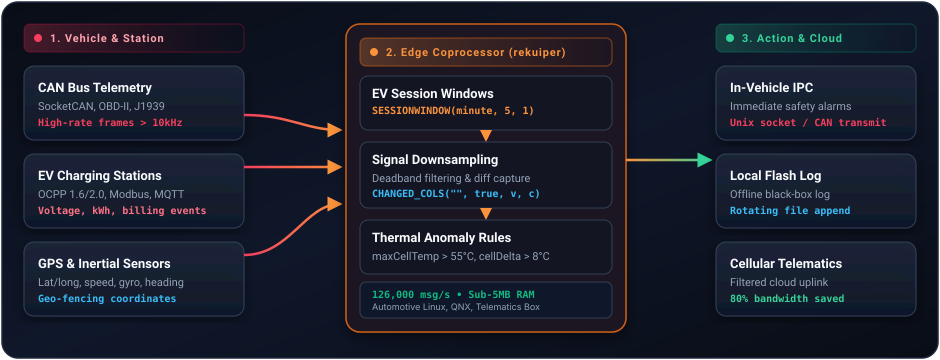

# Connected Vehicles & EV Charging Stream Processing

Connected vehicles and Electric Vehicle (EV) charging networks generate massive streams of high-frequency telemetry. Modern vehicles emit thousands of data points per second from CAN buses, battery management systems (BMS), motor controllers, and GPS units. Similarly, commercial EV charging stations monitor continuous voltage, current, temperature, and session state across hundreds of charging ports.

rekuiper deploys directly onto automotive telematics boxes (T-BOX), in-vehicle MPUs, and EV charging station controllers, processing telemetry locally with sub-millisecond latency.

---

## Edge Architecture for Connected Vehicles

In automotive and charging architectures, rekuiper runs as a local streaming coprocessor:



---

## Why rekuiper on Vehicle Hardware?

Automotive telematics control units (TCUs) and charging station controllers operate under strict resource constraints:

- **Sub-5MB Memory Footprint**: rekuiper operates comfortably in 4.4 to 6.4 MiB of RAM. It coexists with other embedded services without starving the host OS.
- **Zero Garbage Collection Pauses**: Vehicle systems cannot tolerate 15-millisecond GC sweeps that drop critical sensor frames. rekuiper provides deterministic, zero-GC processing.
- **100k+ msg/s Throughput on 1 Core**: In audited benchmarks, rekuiper reaches **126,000 msg/s** on EV charger session workloads and **150,000 msg/s** on telematics filters on a single CPU core.

---

## Key Use Cases & SQL Rules

### 1. EV Charger Session Tracking (`SESSIONWINDOW`)

EV charging management systems need to track charging sessions dynamically without polling database tables. Using SQL session windows, rekuiper groups charging telemetry into sessions separated by inactivity intervals.

```sql
SELECT
  chargerId,
  connectorId,
  COUNT(*) AS sampleCount,
  AVG(voltage) AS avgVoltage,
  MAX(current) AS maxCurrent,
  SUM(powerKw * 0.00277) AS totalEnergyKwh
FROM
  charger_stream
GROUP BY
  chargerId,
  connectorId,
  SESSIONWINDOW(ss, 30)
```

When a vehicle unplugs and no readings arrive for 30 seconds, rekuiper closes the session window, computes total energy delivered, and publishes the session receipt to the billing service.

### 2. Adaptive Downsampling with `CHANGED_COLS`

Transmitting raw sensor telemetry over cellular networks incur high SIM card data costs. Many signals (such as battery voltage during steady driving or ambient temperature) rarely fluctuate rapidly.

rekuiper filters out redundant readings, sending updates only when signals meaningfully change:

```sql
SELECT
  deviceId,
  CHANGED_COLS("", true, batteryVoltage, cabinTemp, tirePressure)
FROM
  telematics_stream
```

This reduces cellular network consumption by 60% to 80% while retaining full fidelity on anomalies.

### 3. Immediate Battery Safety Alerts

Detect abnormal cell temperatures or over-voltage conditions locally on the vehicle, triggering immediate cooling or alarms without waiting for a cloud round-trip:

```sql
SELECT
  vehicleId,
  maxCellTemp,
  minCellTemp,
  (maxCellTemp - minCellTemp) AS cellDelta
FROM
  bms_stream
WHERE
  maxCellTemp > 55.0 OR (maxCellTemp - minCellTemp) > 8.0
```

The output action dispatches an alert directly to the in-vehicle IPC socket and sends an urgent notification over MQTT:

```json
{
  "id": "bms_thermal_alert",
  "sql": "SELECT vehicleId, maxCellTemp, (maxCellTemp - minCellTemp) AS cellDelta FROM bms_stream WHERE maxCellTemp > 55.0 OR (maxCellTemp - minCellTemp) > 8.0",
  "actions": [
    {
      "mqtt": {
        "server": "tcp://127.0.0.1:1883",
        "topic": "vehicle/alerts/critical"
      }
    },
    {
      "file": {
        "path": "/var/log/vehicle/safety_events.log"
      }
    }
  ]
}
```

### 4. Geo-Fencing & Speed Boundary Checks

Correlate GPS coordinates and vehicle speed in real time:

```sql
SELECT
  vehicleId,
  speed,
  latitude,
  longitude
FROM
  gps_stream
WHERE
  speed > 110.0
```

---

## Summary

By combining a sub-5MB memory footprint, zero garbage collection pauses, and standard SQL windowing, rekuiper delivers an ideal stream runtime for automotive computers, telematics gateways, and EV charging infrastructure.
