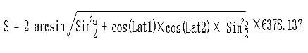
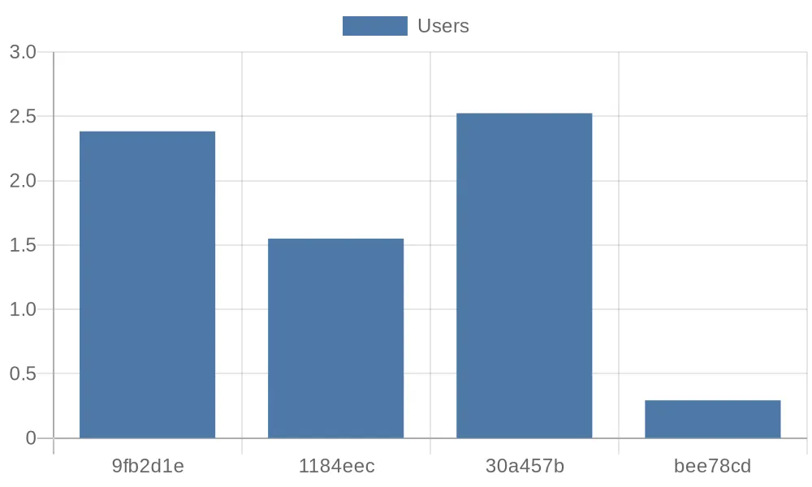

# Public Data Analysis with rekuiper

Public data platforms provide datasets that organizations can analyze to extract valuable operational insights. This tutorial describes how to ingest, transform, and analyze public open data feeds using rekuiper SQL without writing custom application code.

## Walkthrough Scenario

This tutorial processes bike-sharing trip data from the Shenzhen Open Data Platform:

- Ingest data periodically from an HTTP REST API using the [HTTP Pull Source](../guide/sources/builtin/http_pull.md).
- Create streams and processing rules using the rekuiper REST API.
- Flatten nested JSON arrays using `UNNEST` and chain computation rules into a pipeline using in-memory channels.
- Calculate travel distance, duration, and velocity using built-in mathematical SQL functions.
- Store output records in InfluxDB and generate visualization charts.

## Data Ingestion

The open data platform provides a REST endpoint returning daily trip records:

```text
http://opendata.sz.gov.cn/api/29200_00403627/1/service.xhtml?page=1&rows=100&appKey=<token>
```

### 1. Configure the HTTP Pull Source

Update the HTTP pull configuration in `etc/sources/httppull.yaml`:

```yaml
default:
  url: 'https://opendata.sz.gov.cn/api/29200_00403627/1/service.xhtml?page=1&rows=2&appKey=<token>'
  method: get
  interval: 3600000
  timeout: 5000
  incremental: false
  body: ''
  bodyType: json
  insecureSkipVerify: true
  headers:
    Accept: application/json
  responseType: code
```

### 2. Create the Source Stream

Create an input stream matching the nested JSON structure:

```http
POST http://localhost:9081/streams
Content-Type: application/json

{
  "sql": "CREATE STREAM pubdata(data array(struct(START_TIME string, START_LAT string, END_TIME string, END_LNG string, USER_ID string, START_LNG string, END_LAT string, COM_ID string))) WITH (TYPE=\"httppull\")"
}
```

## Data Transformation Pipeline

The HTTP endpoint returns trip records inside a top-level array named `data`:

```json
{
  "total": 223838214,
  "data": [
    {
      "START_TIME": "2021-01-30 13:19:32",
      "START_LAT": "22.6364092900",
      "END_TIME": "2021-01-30 13:23:18",
      "END_LNG": "114.0155348300",
      "USER_ID": "9fb2d1ec6142ace4d7405b**********",
      "START_LNG": "114.0133088800",
      "END_LAT": "22.6320290800",
      "COM_ID": "0755**"
    }
  ]
}
```

### Step 1: Flatten Nested Array Records

Use [`UNNEST`](../sqls/functions/multi_row_functions.md#unnest) to expand array elements into individual stream rows and forward them to an in-memory topic (`channel/data`):

```http
POST http://localhost:9081/rules
Content-Type: application/json

{
  "id": "demo_rule_1",
  "sql": "SELECT unnest(data) FROM pubdata",
  "actions": [
    {
      "log": {}
    },
    {
      "memory": {
        "topic": "channel/data"
      }
    }
  ]
}
```

### Step 2: Calculate Travel Distance and Duration

Define a downstream stream consuming from the memory topic:

```http
POST http://localhost:9081/streams
Content-Type: application/json

{
  "sql": "CREATE STREAM pubdata2 () WITH (DATASOURCE=\"channel/data\", FORMAT=\"JSON\", TYPE=\"memory\")"
}
```

Apply the Haversine distance formula based on GPS coordinates:



Create a rule to calculate trip distance in meters and elapsed duration in seconds:

```http
POST http://localhost:9081/rules
Content-Type: application/json

{
  "id": "demo_rule_2",
  "sql": "SELECT 6378.138 * 2 * ASIN(SQRT(POW(SIN((cast(START_LAT,\"float\") * PI() / 180 - cast(END_LAT,\"float\") * PI() / 180) / 2), 2) + COS(cast(START_LAT,\"float\") * PI() / 180) * COS(cast(END_LAT,\"float\") * PI() / 180) * POW(SIN((cast(START_LNG,\"float\") * PI() / 180 - cast(END_LNG,\"float\") * PI() / 180) / 2), 2))) * 1000 AS distance, (to_seconds(END_TIME) - to_seconds(START_TIME)) AS duration FROM pubdata2",
  "actions": [
    {
      "memory": {
        "topic": "channel/data2"
      }
    }
  ]
}
```

### Step 3: Compute Velocity

Define the third stream to consume calculated distance and duration metrics:

```http
POST http://localhost:9081/streams
Content-Type: application/json

{
  "sql": "CREATE STREAM pubdata3 () WITH (DATASOURCE=\"channel/data2\", FORMAT=\"JSON\", TYPE=\"memory\")"
}
```

Create a rule to compute travel velocity in meters per second:

```http
POST http://localhost:9081/rules
Content-Type: application/json

{
  "id": "demo_rule_3",
  "sql": "SELECT (distance / duration) AS velocity FROM pubdata3",
  "actions": [
    {
      "log": {}
    },
    {
      "influx2": {
        "addr": "http://influx.db:8086",
        "token": "token",
        "org": "admin",
        "measurement": "test",
        "bucket": "pubdata",
        "tagKey": "tagKey",
        "tagValue": "tagValue",
        "fields": ["velocity", "user_id"]
      }
    }
  ]
}
```

Log output:

```text
time="2023-07-14 06:51:09" level=info msg="sink result for rule demo_rule_3: [{\"velocity\":2.52405571799467}]" file="sink/log_sink.go:32" rule=demo_rule_3
```

## Visualize Data

Query velocity values from InfluxDB using a Python client script and render charts with QuickChart:

```python
from influxdb_client import InfluxDBClient

url = "http://influx.db:8086"
token = "token"
org = "admin"
bucket = "pubdata"

client = InfluxDBClient(url=url, token=token)
query = f'from(bucket: "{bucket}") |> range(start: 0, stop: now()) |> filter(fn: (r) => r._measurement == "test") |> limit(n: 4)'
result = client.query_api().query(query)

client.close()
```

The resulting chart visualizes user travel velocities:


